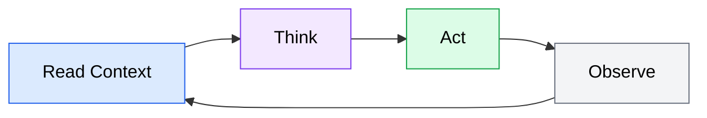

# Agent Academy Content Style Guide

This style guide defines the standards for all content across Agent Academy's 9 modules. Every module -- whether authored by a human or AI -- must follow these guidelines to ensure a consistent, high-quality learning experience.

**Applies to**: All module content, landing pages, and supplementary documentation within the Agent Academy site.

**Source**: Spec Section 13.3, US-011 (Section 5.3)

---

## Table of Contents

- [Tone and Voice](#tone-and-voice)
- [Terminology Conventions](#terminology-conventions)
- [Module Structure](#module-structure)
- [Heading Structure](#heading-structure)
- [Code Example Standards](#code-example-standards)
- [Diagram Guidelines](#diagram-guidelines)
- [Exercise Format](#exercise-format)
- [Agent-Specific Content](#agent-specific-content)
- [File and Directory Naming Conventions](#file-and-directory-naming-conventions)

---

## Tone and Voice

### Overall Tone

Agent Academy content is **educational but not condescending**. We assume the reader is a competent developer who knows how to write code but may have little or no experience with AI coding agents.

### Guiding Principles

- **Respect the reader's intelligence.** Do not over-explain programming fundamentals (variables, functions, git basics). Do explain AI agent concepts thoroughly since that is why they are here.
- **Be direct.** State what the reader needs to know, then explain why. Avoid filler phrases like "In this section, we will explore..." -- just start explaining.
- **Use active voice.** Write "the agent reads your context file" rather than "the context file is read by the agent."
- **Be concrete.** Prefer specific examples over abstract descriptions. Show what a good prompt looks like rather than only describing its qualities.
- **Acknowledge uncertainty honestly.** When behavior varies across tools or versions, say so. Do not present tool-specific quirks as universal truths.

### What to Avoid

- **Hype and marketing language.** Do not describe AI coding agents as "revolutionary" or "magical." Present capabilities and limitations factually.
- **Jargon without context.** The first use of any technical term specific to AI agents should include a brief inline explanation or link to the glossary.
- **Talking down.** Phrases like "simply do X" or "just run this command" imply the step is trivial. If it were trivial, you would not need to document it.
- **Excessive hedging.** Avoid stacking qualifiers ("it might possibly sometimes help to consider..."). Be direct about what works and when.

### Person and Tense

- Address the reader as **"you"** (second person).
- Refer to the collective project voice as **"we"** only when describing Agent Academy's conventions or decisions (e.g., "we use Mermaid for diagrams").
- Use **present tense** for descriptions ("the agent reads the file") and **imperative mood** for instructions ("run the following command").

---

## Terminology Conventions

Use the following terms consistently throughout all modules. These terms are defined in the project glossary (Spec Section 13.1). When a term first appears in a module, provide a brief inline definition or link to the glossary.

### Required Terms

| Use This | Not This | Notes |
|----------|----------|-------|
| AI coding agent | AI assistant, copilot, AI helper, coding bot | The canonical term for tools like OpenCode and Codex |
| agent loop | agentic loop, agent cycle | The Read-Think-Act-Observe cycle |
| context engineering | context setup, context configuration | The practice of providing project-level information to agents |
| MCP (Model Context Protocol) | MCP protocol (redundant) | Spell out on first use in each module, abbreviate thereafter |
| subagent | sub-agent, child agent | A secondary agent spawned for a delegated subtask |
| skill | plugin, extension, add-on | A reusable capability module for an agent |
| OpenCode | opencode, open-code, Open Code | Always capitalize as a proper noun, one word |
| Codex | codex, CODEX | OpenAI's cloud-based AI coding agent; capitalize as proper noun |
| Starlight | starlight | The Astro-based documentation framework |
| Pagefind | pagefind, PageFind | Client-side search library; capitalize as proper noun |

### General Terminology Rules

- **Spell out acronyms on first use** within each module. Example: "Model Context Protocol (MCP)" on first mention, then "MCP" thereafter.
- **Do not invent new terms** when a glossary term exists. If you need a term not in the glossary, propose it for addition rather than using it ad hoc.
- **Be precise about tool categories.** Use "terminal-based agent" (not "CLI agent" or "local agent"), "cloud-based agent" (not "hosted agent" or "remote agent"), and "IDE-integrated agent" (not "editor plugin").
- **Avoid anthropomorphizing agents excessively.** Saying "the agent reads the file" is fine. Saying "the agent wants to help you" is not.

### Glossary Reference

The full glossary is maintained in the project spec (Section 13.1). All terms listed there are authoritative. If a module introduces a concept not in the glossary, flag it for addition during content review.

---

## Module Structure

Every module follows a standard template structure. This ensures readers develop a predictable mental model of how content is organized, regardless of which module they are reading.

### Standard Sections (in order)

1. **Title and Introduction** -- Module title (h1), a one-paragraph overview of what the module covers and who it is for, and a list of learning outcomes.
2. **Topic Sections** -- The core educational content, organized into logical subsections (h2 headings). Each topic section may contain prose, code examples, diagrams, and callouts.
3. **Practical Exercises** -- Hands-on activities the reader can complete in their own environment. See [Exercise Format](#exercise-format) for structure.
4. **Key Takeaways** -- A bulleted summary of the most important points from the module (5-8 items).
5. **Further Reading** -- Links to official documentation, related modules, and external resources.

### Adapting for Module Type

Modules vary in their balance of conceptual vs. hands-on content. The template accommodates both:

**Conceptual modules** (e.g., Module 1: Introduction to AI Coding Agents):
- Topic sections are primarily prose with diagrams.
- Code examples are illustrative (showing what agent output looks like) rather than instructional (telling the reader to run commands).
- Exercises focus on reflection and exploration (e.g., "identify a recent task where an agent would have helped") rather than step-by-step procedures.

**Hands-on modules** (e.g., Module 2: Setting Up Your Agent Environment):
- Topic sections include step-by-step procedures with code blocks.
- Code examples are commands the reader will run.
- Each procedural section ends with a verification step so the reader can confirm their setup works.
- Exercises are practical and produce tangible results (e.g., "configure your agent and run a test task").

**Hybrid modules** (e.g., Module 3: Prompt Engineering for Coding Agents):
- Mix of conceptual explanation and practical technique.
- Use the conceptual style for background sections and the hands-on style for technique sections.
- Exercises bridge both styles: understand the concept, then apply it.

---

## Heading Structure

Follow semantic heading hierarchy throughout all content. This is required for accessibility (WCAG 2.1 AA) and ensures screen readers and automated tools can parse document structure correctly.

### Rules

- **h1**: Module title only. One per page, at the very top.
- **h2**: Major topic sections within the module.
- **h3**: Subsections within a topic.
- **h4**: Sub-subsections, used sparingly. If you need h4 frequently, consider restructuring the content.
- **Never skip levels.** Do not jump from h2 to h4. Every heading must be exactly one level deeper than its parent.
- **Headings are not sentences.** Use title case or sentence case consistently (sentence case preferred: "Setting up your environment" not "Setting Up Your Environment"). Pick one and apply it across all modules.
- **Headings do not end with punctuation.** No periods, colons, or question marks in headings (exceptions for genuine questions used as section titles, e.g., "What is an AI coding agent?").

### Heading Case Convention

Use **sentence case** for all headings:
- "Setting up your agent environment" (correct)
- "Setting Up Your Agent Environment" (incorrect)
- Exception: proper nouns retain capitalization ("Configuring OpenCode")

---

## Code Example Standards

Code examples are central to Agent Academy's educational mission. Every code block must be clear, accurate, and self-contained enough for the reader to understand without external context.

### Formatting Requirements

- **Always specify the language tag.** Every fenced code block must have a language identifier for syntax highlighting.

  ````markdown
  ```bash
  opencode --version
  ```
  ````

- **Use the correct language tag** for the content:
  - `bash` or `sh` for shell commands
  - `json` for JSON configuration
  - `yaml` for YAML configuration
  - `markdown` for Markdown content
  - `typescript`, `javascript`, `python`, etc. for source code
  - `text` or `plaintext` for unformatted output

- **Include comments for non-obvious lines.** If a line does something that is not immediately clear from the code itself, add an inline comment explaining it.

  ```bash
  # Configure the proxy endpoint for your model provider
  export OPENCODE_PROXY_URL="https://your-gateway.example.com/v1"

  # Verify the agent can reach the provider
  opencode doctor  # Runs connectivity and configuration checks
  ```

- **Show expected output** when it helps the reader verify their work. Use a separate code block with a `text` language tag, preceded by a label like "Expected output:".

  ```bash
  opencode --version
  ```

  Expected output:

  ```text
  opencode v0.1.0
  ```

### Content Guidelines

- **Keep examples minimal.** Show the minimum code needed to illustrate the concept. Omit unrelated boilerplate.
- **Use realistic values.** Avoid `foo`, `bar`, and `example.com` when a realistic placeholder is clearer. Use `your-project`, `your-api-key`, and similar descriptive placeholders.
- **Mark placeholders explicitly.** Use angle brackets or a consistent format: `<your-api-key>`, `<project-name>`.
- **Provide complete, runnable examples** when the example is something the reader will execute. Do not show fragments that would fail if pasted into a terminal.
- **Use diff syntax** when showing before/after changes to files:

  ```diff
  - "model": "gpt-4"
  + "model": "claude-sonnet-4-20250514"
  ```

### Code Block Ordering

When a section includes multiple related code blocks (e.g., creating a file then running a command), present them in execution order with brief connecting prose between each block.

---

## Diagram Guidelines

Diagrams help readers understand complex concepts visually. Agent Academy uses two types of diagrams, each for specific purposes.

### When to Use Diagrams

- **Flowcharts**: Processes with decision points (e.g., the agent loop, task delegation flow)
- **Architecture diagrams**: System components and their relationships (e.g., MCP architecture, agent-tool connectivity)
- **Sequence diagrams**: Interactions between entities over time (e.g., agent-server communication, subagent delegation)
- **Comparison layouts**: Side-by-side conceptual comparisons

### Mermaid Diagrams

Use Mermaid for all structured diagrams: flowcharts, architecture diagrams, and sequence diagrams. Mermaid diagrams are version-controlled alongside content and render at build time.

#### Styling Rules

All Mermaid diagrams must follow these styling rules for readability and consistency:

- **Dark text on all nodes.** Use `color:#000` (black text) on every node style. Never use light text on light backgrounds.
- **Use `classDef` for consistent styling.** Define reusable style classes rather than inline styling individual nodes.
- **Use the standard color palette.** The following `classDef` definitions should be used across all modules:

  ```mermaid
  classDef primary fill:#dbeafe,stroke:#2563eb,color:#000
  classDef secondary fill:#f3e8ff,stroke:#7c3aed,color:#000
  classDef success fill:#dcfce7,stroke:#16a34a,color:#000
  classDef warning fill:#fef3c7,stroke:#d97706,color:#000
  classDef danger fill:#fee2e2,stroke:#dc2626,color:#000
  classDef neutral fill:#f3f4f6,stroke:#6b7280,color:#000
  ```

- **Apply classes to nodes** using the `:::className` syntax:

  ```mermaid
  flowchart LR
      A[Read Context]:::primary --> B[Think]:::secondary
      B --> C[Act]:::success
      C --> D[Observe]:::neutral
      D --> A
  ```

- **Keep diagrams focused.** A single diagram should illustrate one concept. If a diagram has more than 10-12 nodes, consider splitting it into multiple diagrams.
- **Use clear, concise node labels.** Labels should be 1-4 words. Use the surrounding prose for detailed explanations.
- **Prefer left-to-right (`LR`) or top-to-bottom (`TB`) layout** depending on which better fits the concept. Use `LR` for processes and pipelines, `TB` for hierarchies.

#### Mermaid Example



### Static Images

Use static images (PNG or SVG) only when Mermaid cannot adequately represent the concept:

- Custom illustrations with non-standard shapes or icons
- Screenshots of tool interfaces
- Complex visual metaphors

Static image requirements:
- Store images in the module's asset directory (e.g., `src/assets/modules/module-1/`)
- Use SVG for vector graphics, PNG for raster images
- Optimize file size (compress PNGs, minify SVGs)
- Images are version-controlled alongside content -- never use external image hosting

### Alt Text

**Every diagram and image must have descriptive alt text.** This is required for WCAG 2.1 AA accessibility compliance.

- Alt text should describe **what the diagram shows**, not just its title.
- Good: `"Flowchart showing the agent loop cycle: Read context, Think about the task, Act by using tools, Observe the results, then repeat"`
- Bad: `"Agent loop diagram"`
- For Mermaid diagrams rendered via markdown, wrap in a figure element or use the framework's image/figure component with alt text.
- For static images, use standard markdown image syntax with alt text: ``

---

## Exercise Format

Practical exercises reinforce learning by giving readers hands-on tasks to complete in their own development environment. Every module should include at least one exercise.

### Standard Exercise Structure

Each exercise follows this format:

```markdown
### Exercise: <Title>

**Objective**: <One sentence describing what the reader will accomplish>

**Prerequisites**: <What the reader needs before starting (tools installed, files created, etc.)>

**Steps**:

1. <First action the reader takes>
2. <Second action>
3. <Continue until the exercise is complete>

**Verification**: <How the reader confirms they completed the exercise correctly>

**Stretch goal** (optional): <An additional challenge for readers who want to go further>
```

### Exercise Guidelines

- **Exercises must be self-contained.** A reader should be able to complete the exercise using only the information in the current module and the prerequisites listed.
- **State prerequisites explicitly.** If the exercise requires a working OpenCode installation, say so. Do not assume the reader completed a previous module.
- **Include a verification step.** Every exercise should end with a way for the reader to confirm success (expected output, a file that should exist, behavior to observe).
- **Keep exercises focused.** One exercise, one concept. If an exercise spans multiple concepts, split it into separate exercises.
- **Provide expected output or results** when applicable. This lets readers self-check without needing external validation.

### Adapting Exercises by Module Type

**Conceptual modules** (e.g., Module 1):
- Exercises are exploratory: "Identify three tasks from your recent work where an AI coding agent could have helped. For each, describe what you would have delegated and what you would have done yourself."
- Verification is self-assessment rather than a specific output.

**Hands-on modules** (e.g., Module 2):
- Exercises are procedural: "Install OpenCode, configure your API key, and run the doctor command to verify your setup."
- Verification produces specific output the reader can compare against.

**Hybrid modules** (e.g., Module 3):
- Exercises combine understanding and application: "Write a prompt for the following task, then run it with your agent and evaluate the output against the criteria you specified."

---

## Agent-Specific Content

Agent Academy covers two primary AI coding agents: **OpenCode** (terminal-based, interactive) and **Codex** (cloud-based, asynchronous). When content applies to both agents, present it in a structured way that avoids confusion.

### When Content Applies to Both Agents

If a concept applies equally to both agents (e.g., prompt engineering fundamentals, context engineering principles), write it once in a tool-agnostic way. Do not duplicate content unnecessarily.

### When Content Diverges

When instructions, configuration, or behavior differ between OpenCode and Codex, use **clearly labeled subsections** under a shared parent heading. Do not interleave instructions for different tools within the same paragraph or step list.

#### Structure for Tool-Specific Sections

Use h3 subsections under the relevant h2 topic, with the tool name in the heading:

```markdown
## Setting up your environment

General setup context that applies to both tools...

### OpenCode setup

OpenCode-specific instructions here. Complete and self-contained
so the reader does not need to cross-reference the Codex section.

1. Step one for OpenCode
2. Step two for OpenCode

### Codex setup

Codex-specific instructions here. Also complete and self-contained.

1. Step one for Codex
2. Step two for Codex
```

#### Rules for Tool-Specific Sections

- **Each tool section must be self-contained.** A reader following only the OpenCode path should not need to read the Codex section (and vice versa).
- **Use the same section ordering** for both tools when covering parallel topics (e.g., installation, configuration, verification). This makes it easy to compare approaches.
- **Do not interleave.** Never alternate between tools within a single section. Complete all content for one tool before starting the other.
- **Use consistent phrasing** when introducing tool-specific sections: "The following instructions are specific to OpenCode." or "If you are using Codex, follow these steps instead."
- **When Starlight tab components are available**, prefer tabs over subsections for short, parallel content (e.g., a single configuration snippet that differs by tool). Use subsections for longer, multi-step procedures.

### Tool-Specific Labels

When referencing tools inline, use parenthetical labels for clarity:

- "Configure your agent's context file (CLAUDE.md for OpenCode, AGENTS.md for Codex)."
- "Run the verification command (`opencode doctor` for OpenCode, or check the task status in the Codex dashboard)."

---

## File and Directory Naming Conventions

Consistent naming makes the project navigable and reduces friction when adding new content.

### File Names

- Use **kebab-case** for all content files: `setting-up-your-environment.md`, not `SettingUpYourEnvironment.md` or `setting_up_your_environment.md`.
- Module content files are numbered to reflect module order: `01-introduction.md`, `02-setup.md`, etc.
- Supplementary files within a module use descriptive names: `opencode-config-example.json`, `agent-loop-diagram.svg`.

### Directory Structure

Content follows the Starlight docs structure:

```
src/content/docs/
  modules/
    01-introduction/
      index.md          # Main module content
    02-setup/
      index.md
    03-prompting/
      index.md
    ...
  guides/               # Cross-cutting guides (if needed)
  reference/            # Reference material (glossary, etc.)
```

### Asset Directories

- Store module-specific images and assets alongside content or in a parallel assets directory.
- Prefer `src/assets/modules/<module-name>/` for images referenced by modules.
- Use descriptive file names for assets: `agent-loop-flowchart.svg`, not `diagram1.svg`.

### Internal Project Documentation

Project-internal documents (this style guide, specs, planning materials) live outside the site source:

```
docs/                   # Project-internal documentation
  content-style-guide.md
internal/
  specs/                # Product specifications
  prompts/              # Curriculum and planning prompts
```

---

## Quick Reference Checklist

Use this checklist when reviewing module content for style guide compliance:

- [ ] Tone is educational, direct, and not condescending
- [ ] All glossary terms used correctly (see [Terminology Conventions](#terminology-conventions))
- [ ] Heading hierarchy is semantic (h1 > h2 > h3, no skipped levels)
- [ ] All code blocks have language tags
- [ ] Non-obvious code lines have explanatory comments
- [ ] All Mermaid diagrams use `classDef` with `color:#000` on every class
- [ ] All diagrams and images have descriptive alt text
- [ ] Agent-specific content uses labeled subsections, not interleaved instructions
- [ ] Exercises follow the standard format with objective, steps, and verification
- [ ] File names use kebab-case
- [ ] First use of each technical term includes inline explanation or glossary link
