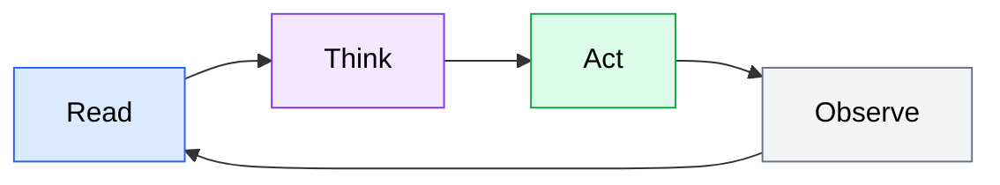

# Module Content Template

This template defines the standard structure for all 9 Agent Academy modules. Copy this file as a starting point when authoring a new module, then replace placeholder text with actual content.

**Applies to**: All module pages under `src/content/docs/modules/`

**Source**: Spec Section 5.3 (US-011), Content Style Guide

---

## How to use this template

1. Copy the template section below into a new file at the appropriate module path (e.g., `src/content/docs/modules/01-introduction/index.md`).
2. Replace all `{PLACEHOLDER}` values and instructional comments with actual content.
3. Remove any optional sections that do not apply to the module.
4. Review against the content style guide (`docs/content-style-guide.md`) before finalizing.

---

## Template

````markdown
---
title: "{MODULE_TITLE}"
description: "{A concise description of the module's content, 150-160 characters. This appears in search results and social previews.}"
sidebar:
  order: {MODULE_NUMBER}
  label: "{MODULE_NUMBER}. {SHORT_TITLE}"
---

{Write a one-paragraph overview of what this module covers and who it is for.
Be direct -- state the topic, explain why it matters, and set expectations
for what the reader will learn. Address the reader as "you." Avoid filler
phrases like "In this module, we will explore..." -- jump straight into the
substance.

For conceptual modules: focus on the mental models and understanding the reader
will gain. For hands-on modules: mention what the reader will build or
configure by the end.}

## What you will learn

{List 4-8 learning outcomes as a bulleted list. Each outcome should start with
an action verb (understand, configure, write, identify, apply, evaluate) and
describe a concrete skill or understanding the reader will gain. These should
match the curriculum outcomes defined for this module.}

- {Outcome 1: e.g., "Understand the agent loop and how AI coding agents differ from chat assistants"}
- {Outcome 2: e.g., "Identify when to use an agent versus coding by hand"}
- {Outcome 3}
- {Outcome 4}

## Prerequisites

{List what the reader needs before starting this module. Be explicit -- do not
assume the reader completed previous modules. If there are no prerequisites
beyond general programming experience, state that.}

- {Prerequisite 1: e.g., "A working terminal (macOS, Linux, or WSL on Windows)"}
- {Prerequisite 2: e.g., "Familiarity with Git and version control basics"}
- {Prerequisite 3 (optional): e.g., "Completed Module 2 (Setting Up Your Agent Environment) or an existing OpenCode/Codex installation"}

---

{--- TOPIC SECTIONS ---}

{The core educational content of the module goes here. Organize into logical
sections using h2 headings. Each h2 represents a major topic within the module.

Guidelines:
- Use h2 for major topics, h3 for subtopics, h4 sparingly for sub-subtopics.
- Never skip heading levels (h2 -> h4 is not allowed).
- Use sentence case for all headings.
- Each section should be self-contained enough to be useful on its own.
- Include code examples, diagrams, and callouts where they aid understanding.}

## {Topic 1 title}

{Explain the concept or procedure. Be direct and concrete. Use active voice
and present tense for descriptions ("the agent reads the file"), imperative
mood for instructions ("run the following command").

For conceptual content: explain the what and why, then illustrate with
examples or diagrams.

For procedural content: provide step-by-step instructions with code blocks
and verification steps.}

{Include a code example where relevant. Every code block must have a language
tag. Add comments for non-obvious lines:}

```bash
# Install the agent using npm
npm install -g opencode

# Verify the installation succeeded
opencode --version
```

{Show expected output when it helps the reader verify their work:}

Expected output:

```text
opencode v0.1.0
```

{Include a Mermaid diagram when a visual would clarify the concept. Every
diagram needs descriptive alt text for accessibility. Use the standard color
palette defined in the style guide:}

{Alt text: "Flowchart showing the agent loop: Read context, Think about the task, Act by using tools, Observe the results, then repeat the cycle"}



## {Topic 2 title}

{Continue with the next major topic. Follow the same patterns as Topic 1.}

### {Subtopic under Topic 2}

{Use h3 for subtopics within a major section.}

{--- AGENT-SPECIFIC CONTENT (optional) ---}

{When content diverges between OpenCode and Codex, use clearly labeled h3
subsections under the relevant h2. Each tool section must be self-contained.
Delete this pattern if the module does not have tool-specific content.}

## {Topic with agent-specific instructions}

{General context that applies to both OpenCode and Codex.}

### OpenCode

{OpenCode-specific instructions. Complete and self-contained so the reader
does not need to cross-reference the Codex section.}

```bash
# OpenCode-specific command example
opencode config set proxy_url "https://your-gateway.example.com/v1"
```

### Codex

{Codex-specific instructions. Also complete and self-contained.}

```bash
# Codex-specific command example
codex --connect <your-repo-url>
```

{--- END AGENT-SPECIFIC CONTENT ---}

## {Additional topic sections as needed}

{Add as many h2 topic sections as the module requires. Aim for 3-6 major
sections per module, depending on the depth of the content.}

---

## Practical exercises

{Every module includes at least one hands-on exercise. Follow the standard
exercise format from the style guide. Include more exercises for hands-on
modules, fewer for conceptual modules.}

### Exercise: {Exercise title}

**Objective**: {One sentence describing what the reader will accomplish.}

**Prerequisites**: {What the reader needs before starting (tools installed, files created, etc.).}

**Steps**:

1. {First action the reader takes.}
2. {Second action.}
3. {Continue until the exercise is complete.}

**Verification**: {How the reader confirms they completed the exercise correctly. Include expected output or observable behavior.}

**Stretch goal** (optional): {An additional challenge for readers who want to go further.}

{Add additional exercises as needed, each following the same format.}

---

## Key takeaways

{Summarize the 5-8 most important points from the module. Each takeaway should
be a single sentence or short phrase that captures a core concept. The reader
should be able to scan this list and recall the essential ideas from the module.}

- {Takeaway 1: e.g., "AI coding agents follow a Read-Think-Act-Observe loop, not a simple request-response pattern."}
- {Takeaway 2}
- {Takeaway 3}
- {Takeaway 4}
- {Takeaway 5}

## Next steps

{Point the reader toward related content and further learning. Include:
- The suggested next module (if applicable)
- Links to official documentation for tools covered in this module
- Links to related modules that cover adjacent topics
- External resources for deeper exploration}

- **Next module**: [{Next Module Title}](/modules/{next-module-slug}/) -- {One sentence describing what the next module covers.}
- **Official docs**: [{Tool or concept name} documentation]({URL})
- **Related**: [{Related Module Title}](/modules/{related-module-slug}/) -- {Brief description of how it relates.}
````

---

## Section reference

The table below summarizes each template section, its purpose, and whether it is required or optional.

| Section | Purpose | Required |
|---------|---------|----------|
| Frontmatter | Starlight metadata: title, description, sidebar order/label | Yes |
| Introduction paragraph | Module overview and audience | Yes |
| What you will learn | Bulleted learning outcomes matching curriculum | Yes |
| Prerequisites | What the reader needs before starting | Yes |
| Topic sections (h2) | Core educational content organized by topic | Yes |
| Code examples | Syntax-highlighted blocks with language tags and comments | Yes (at least one) |
| Diagrams | Mermaid diagrams with alt text and standard palette | Recommended |
| Agent-specific content | OpenCode/Codex subsections for divergent instructions | Optional |
| Practical exercises | Hands-on activities following the standard exercise format | Yes (at least one) |
| Key takeaways | 5-8 bullet summary of main points | Yes |
| Next steps | Suggested next module, docs, and further reading | Yes |

## Adapting for module types

### Conceptual modules (e.g., Module 1)

- Topic sections are primarily prose with diagrams.
- Code examples are illustrative (showing what agent output looks like) rather than commands the reader runs.
- Exercises are exploratory and reflective.
- The agent-specific subsection pattern is less likely to be needed.

### Hands-on modules (e.g., Module 2)

- Topic sections include step-by-step procedures with code blocks.
- Every procedural section ends with a verification step.
- Exercises are procedural and produce specific, verifiable output.
- Agent-specific subsections are likely needed for parallel setup instructions.

### Hybrid modules (e.g., Module 3)

- Mix conceptual background sections with practical technique sections.
- Exercises combine understanding and application.
- Use the conceptual style for "why" sections and the hands-on style for "how" sections.
