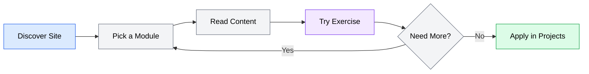

# agent-academy PRD

**Version**: 1.0
**Author**: Stephen Sequenzia
**Date**: 2026-03-15
**Status**: Draft
**Spec Type**: New Product
**Spec Depth**: Detailed Specifications
**Description**: A static documentation site teaching developers how to work effectively with AI coding agents, covering 8 progressive modules from fundamentals through security.

---

## 1. Executive Summary

Agent Academy is a static documentation site that provides structured, end-to-end education on working with AI coding agents. It addresses the gap in comprehensive learning resources for tools like OpenCode and Codex, targeting developers ranging from complete beginners to casual users looking to deepen their skills. The MVP delivers 8 independent modules covering the full lifecycle of agent-assisted development.

## 2. Problem Statement

### 2.1 The Problem

Developers and teams lack structured learning resources for AI coding agents. Knowledge about effective agent workflows is scattered across tool documentation, blog posts, social media threads, and tribal knowledge within teams. This makes it difficult for developers to adopt AI coding agents systematically and effectively.

### 2.2 Current State

- Tool-specific documentation exists but focuses on features, not workflows or mental models
- Blog posts and tutorials cover individual techniques but lack progression and structure
- Teams struggle to adopt agent workflows because there is no standard curriculum for onboarding
- Developers waste time discovering best practices through trial and error rather than structured learning

### 2.3 Impact Analysis

Without structured education, developers either:
- Underuse AI coding agents, missing productivity gains
- Misuse agents through poor prompting, lack of context engineering, or unsafe practices
- Give up on agents after initial frustrating experiences
- Develop inconsistent practices within teams, reducing the value of shared tooling

### 2.4 Business Value

- AI coding agents have reached sufficient maturity to teach structured workflows around
- Growing developer demand for agent education as tool adoption accelerates
- Establishing Agent Academy as a go-to resource positions it as a reference in the agent education space
- Reducing the learning curve for agent adoption helps the broader developer ecosystem

## 3. Goals & Success Metrics

### 3.1 Primary Goals

1. Publish all 8 modules with high-quality, accurate content covering AI coding agent workflows
2. Create a site that is independently navigable — any developer can start at any module
3. Provide practical, hands-on education that goes beyond documentation into real workflow skills

### 3.2 Success Metrics

| Metric | Target | Measurement Method |
|--------|--------|-------------------|
| Module completion | All 8 modules published | Content audit |
| Content quality | Each module reviewed and accurate | Author review pass |
| Site functionality | Search, dark mode, code copy all working | Manual QA |
| Accessibility | WCAG 2.1 AA compliance | Lighthouse audit + manual check |

### 3.3 Non-Goals

- Building a learning management system with progress tracking
- Covering every AI coding agent on the market (MVP focuses on OpenCode and Codex)
- Creating interactive code playgrounds or live execution environments
- Building community features (forums, comments, discussions)
- Monetization or gating content behind accounts

## 4. User Research

### 4.1 Target Users

#### Primary Persona: The Agent Newcomer

- **Role/Description**: A developer who has heard about AI coding agents but hasn't used one meaningfully. May have tried chat-based AI assistants (ChatGPT, Claude) but hasn't worked with terminal-based or cloud-based coding agents.
- **Goals**: Understand what AI coding agents are, get one set up, and complete a real task with it
- **Pain Points**: Overwhelmed by tool options, unclear where to start, no structured path from zero to productive
- **Context**: Working on personal or professional projects, looking for an efficient way to learn

#### Secondary Persona: The Casual Agent User

- **Role/Description**: A developer who has used an AI coding agent a few times but isn't getting consistent value from it. Knows the basics but hasn't invested in prompting techniques, context engineering, or advanced workflows.
- **Goals**: Level up from basic usage to effective workflows — better prompts, proper context files, skill/MCP integration
- **Pain Points**: Inconsistent results from agents, unaware of features like context files or MCP servers, not sure how to structure tasks for delegation
- **Context**: Already has an agent installed, uses it occasionally, wants to use it daily with confidence

### 4.2 User Journey Map

Users arrive at the site, pick the module most relevant to their current need (no enforced order), read the content with embedded code examples and diagrams, try the practical exercises in their own environment, and return to explore additional modules as needed.

## 5. Functional Requirements

### 5.1 Feature: Content Modules

**Priority**: P0 (Critical)

Eight independent learning modules, each covering a distinct aspect of working with AI coding agents. All modules target OpenCode and Codex as the primary agents.

#### Module 1: Introduction to AI Coding Agents

**US-001**: As a developer new to AI coding agents, I want to understand what they are and how they differ from chat assistants and autocomplete tools, so that I can decide whether to invest in learning them.

**Acceptance Criteria**:
- [ ] Explains the agent loop (Read, Think, Act, Observe) with a diagram
- [ ] Compares agent categories: terminal agents, IDE-integrated agents, cloud agents
- [ ] Covers when to use an agent vs. coding by hand
- [ ] Addresses the mental model shift from writing code to directing an agent
- [ ] Includes learning outcomes matching the curriculum

---

#### Module 2: Setting Up Your Agent Environment

**US-002**: As a developer ready to try AI coding agents, I want step-by-step setup instructions for OpenCode and Codex, so that I can get a working environment quickly.

**Acceptance Criteria**:
- [ ] OpenCode: installation, provider configuration, proxy endpoint setup, workspace config, verification
- [ ] Codex: account setup, cloud execution model explanation, repo connection, autonomy levels, first task
- [ ] Environment essentials: terminal setup, git hygiene for agent workflows, sandbox project setup
- [ ] Each setup section includes a verification step so users know it works
- [ ] Includes learning outcomes matching the curriculum

---

#### Module 3: Prompt Engineering for Coding Agents

**US-003**: As a developer using AI coding agents, I want to learn how to write effective prompts that produce predictable results, so that I get consistent value from agents.

**Acceptance Criteria**:
- [ ] Covers fundamentals: why agent prompting differs from chat prompting, anatomy of a good prompt
- [ ] Practical techniques: task decomposition, providing context, constraint setting, iterative refinement
- [ ] Common pitfalls: vague prompts, over/under-constraining, context assumptions, token awareness
- [ ] Agent-specific sections for OpenCode (interactive) and Codex (async) prompting styles
- [ ] Includes practical exercises for prompt writing
- [ ] Includes learning outcomes matching the curriculum

---

#### Module 4: Context Engineering

**US-004**: As a developer working with AI coding agents, I want to learn how to set up project-level context so that my agent produces code that matches my project's standards without repeated instructions.

**Acceptance Criteria**:
- [ ] Explains what context engineering is and why agents need project context
- [ ] Covers context file formats: CLAUDE.md/AGENTS.md, rules files, README as implicit context
- [ ] Writing effective context files: architecture, conventions, stack, patterns, testing expectations
- [ ] Context hierarchy: global vs. project vs. directory-level, conflict resolution
- [ ] Practical workshop: auditing a project, writing a context file, before/after comparison
- [ ] Includes templates and starter examples
- [ ] Includes learning outcomes matching the curriculum

---

#### Module 5: Agent Skills

**US-005**: As a developer using AI coding agents, I want to understand how to use and create reusable skills, so that I can extend my agent's capabilities and reduce repetitive instruction.

**Acceptance Criteria**:
- [ ] Explains skills as reusable capability modules and how they differ from prompts
- [ ] Covers skill anatomy: SKILL.md, trigger descriptions, input/output contracts, supporting files
- [ ] Using existing skills: discovery, installation, configuration, customization
- [ ] Creating custom skills: identifying candidates, writing instructions, testing, organization
- [ ] Design patterns: single-purpose vs. multi-step, tool-invoking skills, progressive disclosure
- [ ] Includes learning outcomes matching the curriculum

---

#### Module 6: MCP Servers

**US-006**: As a developer using AI coding agents, I want to understand how to connect my agent to external tools and services via MCP, so that I can expand what my agent can do beyond file editing.

**Acceptance Criteria**:
- [ ] Explains MCP architecture: clients, servers, tools, resources
- [ ] Discovering and evaluating MCP servers: registries, quality assessment, security posture
- [ ] Configuration: formats, locations, authentication, credential management, per-project vs. global
- [ ] Practical usage: common dev workflow servers, chaining tools, debugging connections
- [ ] Security considerations: access granted, least privilege, auditing permissions
- [ ] Includes learning outcomes matching the curriculum

---

#### Module 7: Subagents and Task Delegation

**US-007**: As a developer using AI coding agents, I want to understand how agents orchestrate complex work through subagent delegation, so that I can tackle larger tasks effectively.

**Acceptance Criteria**:
- [ ] Explains subagent concepts: delegation, specialization, when single agents aren't enough
- [ ] Covers patterns: fan-out/fan-in, pipeline, supervisor, specialist
- [ ] Practical workflows: parallel code gen + testing, documentation delegation, multi-file refactoring, validation subagents
- [ ] Limitations: token cost multiplication, context loss, complexity vs. value, debugging multi-agent failures
- [ ] Includes learning outcomes matching the curriculum

---

#### Module 8: Security, Guardrails, and Safe Automation

**US-008**: As a developer using AI coding agents, I want to understand the security risks and how to mitigate them, so that I can use agents without compromising my codebase or credentials.

**Acceptance Criteria**:
- [ ] Threat model: unintended modifications, credential exposure, destructive operations, prompt injection, supply chain risks
- [ ] Permissions and sandboxing: permission models, file system boundaries, network controls, containerization
- [ ] Credential management: no secrets in context files, environment variables, secret managers, output auditing, key rotation
- [ ] Code review practices: treating agent output as code contributions, automated checks, git workflow, diff review
- [ ] Operational safety: undo/rollback, rate limiting, cost controls, monitoring, recognizing loops/hallucinations
- [ ] Includes learning outcomes matching the curriculum

---

### 5.2 Feature: Site Infrastructure

**Priority**: P0 (Critical)

The static site framework, build pipeline, and deployment that hosts the content.

**US-009**: As a site visitor, I want the documentation site to load quickly, be searchable, and support dark mode, so that I can comfortably find and read content.

**Acceptance Criteria**:
- [ ] Site built with Astro Starlight (or equivalent SSG if alternative chosen)
- [ ] Full-text search across all documentation content (Pagefind or equivalent)
- [ ] Dark mode toggle with system preference detection
- [ ] Code blocks have syntax highlighting with language tags and copy buttons
- [ ] Sidebar navigation following module order with expandable topic sections
- [ ] Responsive layout usable on desktop and tablet

**US-010**: As the site maintainer, I want an automated deployment pipeline, so that content changes go live without manual steps.

**Acceptance Criteria**:
- [ ] Site deploys to GitLab Pages via CI/CD pipeline
- [ ] Pipeline triggers on push to main branch
- [ ] Build step compiles Markdown content into static HTML
- [ ] Failed builds do not deploy (build validation gate)

---

### 5.3 Feature: Content Quality System

**Priority**: P1 (High)

A content style guide and module template structure to ensure consistency across AI-authored content.

**US-011**: As the content author/reviewer, I want a style guide and module template, so that AI-authored content is consistent in tone, structure, and quality across all 8 modules.

**Acceptance Criteria**:
- [ ] Content style guide document defining: tone/voice, terminology conventions, code example standards, heading structure
- [ ] Module template with standard sections (introduction, topics, code examples, exercises, learning outcomes, key takeaways)
- [ ] Naming conventions for files and directories
- [ ] Guidelines for diagram creation (Mermaid for structured diagrams, static images for custom illustrations)
- [ ] Guidelines for practical exercises format

**Edge Cases**:
- Module topics vary significantly in depth: style guide should accommodate both conceptual modules (Module 1) and hands-on modules (Module 2)
- Tool-specific content (OpenCode vs. Codex): guide should define how to structure split sections

---

### 5.4 Feature: Diagrams and Visual Content

**Priority**: P1 (High)

Visual aids embedded throughout modules to illustrate concepts, architectures, and workflows.

**US-012**: As a learner, I want diagrams and visual aids within the content, so that I can understand complex concepts like the agent loop, MCP architecture, and subagent patterns visually.

**Acceptance Criteria**:
- [ ] Mermaid diagrams used for flowcharts, architecture diagrams, and process flows
- [ ] Static images (PNG/SVG) used for custom illustrations where Mermaid is insufficient
- [ ] All diagrams have alt text for accessibility
- [ ] Mermaid diagrams follow styling rules: dark text (`color:#000`), `classDef` for consistent styling
- [ ] Diagrams are version-controlled alongside content (no external image hosting)

## 6. Non-Functional Requirements

### 6.1 Performance

- Pages should achieve Lighthouse performance score of 90+ (static site, so this should be achievable by default)
- Full-text search should return results in under 500ms (client-side Pagefind handles this natively)
- No JavaScript-heavy features that block initial render

### 6.2 Security

- No user authentication or data collection — static site with no backend
- No third-party analytics or tracking scripts in MVP
- Content served over HTTPS via GitLab Pages

### 6.3 Scalability

- Static site — scales to any traffic level via CDN/GitLab Pages
- No database, no server-side processing
- Content growth handled by adding Markdown files (no architectural changes needed)

### 6.4 Accessibility

- Target WCAG 2.1 AA compliance
- All images and diagrams must have descriptive alt text
- Semantic heading hierarchy (h1 → h2 → h3, no skipped levels)
- Keyboard navigable — all interactive elements reachable via keyboard
- Sufficient color contrast ratios (4.5:1 for normal text, 3:1 for large text)
- Starlight's built-in accessibility features leveraged as baseline

## 7. Technical Considerations

### 7.1 Architecture Overview

Agent Academy is a static documentation site with no backend, no database, and no server-side logic. Content is authored in Markdown, compiled to static HTML at build time, and served via GitLab Pages.

### 7.2 Tech Stack

- **Framework**: Astro Starlight (preferred — provides search, dark mode, code copy, sidebar out of the box)
- **Content**: Markdown with frontmatter metadata
- **Diagrams**: Mermaid (rendered at build time) + static PNG/SVG
- **Deployment**: GitLab Pages via GitLab CI/CD
- **Package Manager**: npm (Astro ecosystem standard)

### 7.3 Integration Points

| System | Integration Type | Purpose |
|--------|-----------------|---------|
| GitLab CI/CD | Build pipeline | Automated build and deployment |
| GitLab Pages | Hosting | Static site serving |
| Pagefind | Build-time indexing | Client-side full-text search |

### 7.4 Technical Constraints

- All content must be static — no server-side rendering or API calls at runtime
- Mermaid diagrams must render at build time or client-side (Starlight supports this via remark plugin)
- Site must function without JavaScript for core content reading (progressive enhancement for search, dark mode toggle)

## 8. Scope Definition

### 8.1 In Scope

- 8 content modules as defined in the curriculum outline
- Astro Starlight site with search, dark mode, code copy buttons
- Sidebar navigation with expandable module sections
- Mermaid diagrams and static images for visual content
- Practical exercises within module content
- Content style guide and module template
- GitLab CI/CD pipeline for automated deployment
- WCAG 2.1 AA accessibility compliance
- Coverage of OpenCode and Codex as target agents

### 8.2 Out of Scope

- **User accounts and authentication**: No login, registration, or personalization — MVP is a public static site
- **Interactive code execution**: No embedded playgrounds, REPLs, or sandboxes — exercises are follow-along in the user's own environment
- **Community features**: No comments, forums, discussions, or user-generated content
- **Post-MVP modules**: Agentic workflow patterns, cost management, building MCP servers, agent-driven testing, CI/CD integration, team workflows, evaluating output quality, migrating between agents
- **Analytics and tracking**: No third-party analytics scripts in MVP
- **Monetization**: No paywalls, ads, or premium tiers

### 8.3 Future Considerations

- Post-MVP modules as outlined in the curriculum's "Future Expansion" section
- Analytics integration for understanding content usage patterns
- Community contribution workflow (PRs for content corrections/additions)
- Multi-language support (i18n)
- Version-specific content for different agent releases

## 9. Implementation Plan

### 9.1 Phase 1: Foundation

**Completion Criteria**: Site infrastructure is live with a landing page and one complete module deployed to GitLab Pages.

| Deliverable | Description | Dependencies |
|-------------|-------------|--------------|
| Project scaffolding | Initialize Astro Starlight project, configure build, set up GitLab CI/CD | None |
| Content style guide | Define tone, terminology, code example conventions, module template | None |
| Module template | Create standardized Markdown template for all modules | Content style guide |
| Landing page | Site homepage with project overview and module index | Project scaffolding |
| Module 1: Introduction | Complete content for "Introduction to AI Coding Agents" | Module template |
| GitLab Pages deployment | CI/CD pipeline deploying to GitLab Pages on push to main | Project scaffolding |

**Checkpoint Gate**: Review site infrastructure, style guide, and Module 1 content quality before proceeding to batch content creation.

---

### 9.2 Phase 2: Core Content (Modules 2-5)

**Completion Criteria**: Modules 2 through 5 published with all content formats (prose, code, diagrams, exercises).

| Deliverable | Description | Dependencies |
|-------------|-------------|--------------|
| Module 2: Setup | "Setting Up Your Agent Environment" — OpenCode + Codex setup guides | Phase 1 complete |
| Module 3: Prompting | "Prompt Engineering for Coding Agents" — techniques and exercises | Phase 1 complete |
| Module 4: Context | "Context Engineering" — context files, hierarchy, workshop | Phase 1 complete |
| Module 5: Skills | "Agent Skills" — using and creating skills | Phase 1 complete |
| Diagrams pass | Mermaid diagrams and static images for Modules 1-5 | Module content drafted |
| Review pass | Content accuracy and style guide compliance check for Modules 1-5 | All Module 1-5 content |

**Checkpoint Gate**: Review all Modules 1-5 for content quality, accuracy, consistency, and accessibility before proceeding.

---

### 9.3 Phase 3: Advanced Content (Modules 6-8)

**Completion Criteria**: Modules 6 through 8 published. All 8 modules live and accessible.

| Deliverable | Description | Dependencies |
|-------------|-------------|--------------|
| Module 6: MCP | "MCP Servers" — protocol, configuration, security | Phase 2 complete |
| Module 7: Subagents | "Subagents and Task Delegation" — patterns and workflows | Phase 2 complete |
| Module 8: Security | "Security, Guardrails, and Safe Automation" — threat model, practices | Phase 2 complete |
| Diagrams pass | Mermaid diagrams and static images for Modules 6-8 | Module content drafted |
| Review pass | Content accuracy and style guide compliance check for Modules 6-8 | All Module 6-8 content |

**Checkpoint Gate**: Review all 8 modules for completeness and cross-module consistency.

---

### 9.4 Phase 4: Polish and Launch

**Completion Criteria**: Site passes accessibility audit, all content reviewed, ready for public sharing.

| Deliverable | Description | Dependencies |
|-------------|-------------|--------------|
| Accessibility audit | Lighthouse audit + manual keyboard/screen reader testing | All content published |
| Cross-module review | Check navigation, cross-references, terminology consistency | All content published |
| Landing page finalization | Update with complete module listing and site description | All content published |
| Final QA | Test search, dark mode, code copy, responsive layout, all links | All content published |

## 10. Dependencies

### 10.1 Technical Dependencies

| Dependency | Status | Risk if Delayed |
|------------|--------|-----------------|
| Astro Starlight framework | Available (stable) | Low — well-maintained OSS project |
| GitLab Pages | Available | Low — standard GitLab feature |
| Pagefind search | Bundled with Starlight | Low — included by default |
| Mermaid rendering | Plugin available | Low — supported via remark/rehype plugins |

### 10.2 External Dependencies

| Dependency | Description | Risk |
|------------|-------------|------|
| OpenCode documentation | Needed for accurate Module 2 setup instructions | Medium — tool may update during development |
| Codex documentation | Needed for accurate Module 2 setup instructions | Medium — tool may update during development |
| MCP specification | Referenced in Module 6 | Low — protocol is relatively stable |

## 11. Risks & Mitigations

| Risk | Impact | Likelihood | Mitigation Strategy |
|------|--------|------------|---------------------|
| Content accuracy — AI-authored content contains errors or outdated information | High | Medium | Review pass on every module; cross-reference with official tool documentation; use Context7 for latest docs during authoring |
| Tool changes — OpenCode or Codex APIs/features change during development | Medium | Medium | Write content at the conceptual level where possible; isolate tool-specific details into clearly marked sections for easy updates |
| Scope creep — temptation to add features or modules beyond MVP | Medium | Medium | Strict adherence to this spec's scope definition; post-MVP items stay in the roadmap |
| Content consistency — modules authored across different sessions read differently | Medium | Medium | Content style guide and module template enforced before authoring begins; review pass checks for consistency |
| Starlight limitations — framework doesn't support a needed feature | Low | Low | Starlight is extensible via Astro integrations; alternative SSGs (Docusaurus, MkDocs) as fallback |

## 12. Open Questions

| # | Question | Resolution |
|---|----------|------------|
| 1 | Final SSG choice — Astro Starlight is preferred but not fully committed. Evaluate during Phase 1 scaffolding. | To be resolved in Phase 1 |

## 13. Appendix

### 13.1 Glossary

| Term | Definition |
|------|------------|
| AI Coding Agent | A software tool that uses large language models to autonomously read, understand, and modify code based on natural language instructions |
| Agent Loop | The core cycle agents follow: Read context, Think about the task, Act by using tools, Observe the results |
| Context Engineering | The practice of providing project-level information (conventions, architecture, patterns) to an AI coding agent to improve its output quality |
| MCP | Model Context Protocol — an open protocol for connecting AI agents to external tools and data sources |
| Subagent | A secondary agent spawned by a primary agent to handle a delegated subtask |
| Skill | A reusable, self-contained capability module that extends what an AI coding agent can do |
| OpenCode | An open-source terminal-based AI coding agent |
| Codex | OpenAI's cloud-based AI coding agent that executes tasks asynchronously against connected repositories |
| Starlight | An Astro-based documentation site framework with built-in search, navigation, and theming |
| Pagefind | A client-side search library that indexes static sites at build time for fast, offline-capable search |
| WCAG | Web Content Accessibility Guidelines — international standards for web accessibility |

### 13.2 References

- [Astro Starlight Documentation](https://starlight.astro.build/)
- [Pagefind Documentation](https://pagefind.app/)
- [Mermaid Diagram Syntax](https://mermaid.js.org/)
- [WCAG 2.1 Guidelines](https://www.w3.org/TR/WCAG21/)
- [GitLab Pages Documentation](https://docs.gitlab.com/ee/user/project/pages/)
- Agent Academy Curriculum Outline: `internal/prompts/agent-academy-curriculum.md`

### 13.3 Content Style Guide Requirements

The following should be defined in a separate style guide document during Phase 1:

- **Tone**: Educational but not condescending; assumes programming knowledge but not AI agent experience
- **Terminology**: Consistent use of terms defined in the glossary; prefer "AI coding agent" over "AI assistant" or "copilot"
- **Code examples**: Syntax-highlighted, language-tagged, with copy buttons; include comments explaining non-obvious lines
- **Module structure**: Standard template with introduction, topic sections, code examples, exercises, learning outcomes, key takeaways
- **Diagrams**: Mermaid for structured diagrams (flowcharts, architecture, sequences); static images for custom illustrations; all with alt text
- **Exercise format**: To be defined during Phase 1 based on content needs
- **Agent-specific content**: When covering both OpenCode and Codex, use clearly labeled subsections or tabs; avoid interleaving instructions

---

*Document generated by SDD Tools*
