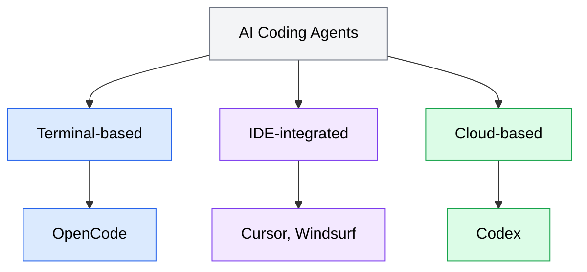

AI coding agents come in three broad categories, each with a different interface, execution model, and set of tradeoffs. Understanding these categories helps you choose the right tool for your workflow and recognize how the concepts in this curriculum apply across different agents.

## The three categories

*Diagram showing the three categories of AI coding agents: terminal-based (like OpenCode), IDE-integrated (like Cursor and Windsurf), and cloud-based (like Codex).*

### Terminal-based agents

Terminal-based agents run in your terminal alongside the tools you already use. You interact with them through a command-line interface, typing natural language prompts and receiving responses in the same environment where you run `git`, your build tools, and your test suite.

**How they work**: You launch the agent in your project directory. It has access to your file system and can read files, write files, and execute shell commands. The agent loop runs interactively -- you see each action as it happens, and you can approve, reject, or redirect the agent at any point.

**Strengths**:
- Full access to your local development environment (file system, shell, installed tools)
- Fast feedback loop since everything runs on your machine
- Integrates naturally with terminal-based workflows
- You maintain direct control over what the agent does

**Limitations**:
- Requires a working local development environment
- Execution is synchronous -- you wait while the agent works
- Model inference uses your API key and incurs costs in real time

**Example**: OpenCode is an open-source terminal-based AI coding agent. You install it locally, configure it to use a model provider, and interact with it directly in your terminal. OpenCode is one of the two agents this curriculum focuses on.

### IDE-integrated agents

IDE-integrated agents run inside a code editor such as VS Code or a specialized IDE fork. They combine agent capabilities with the visual editing experience you are already familiar with: file trees, syntax-highlighted editors, inline diffs, and integrated terminals.

**How they work**: The agent is embedded in your editor as an extension or built into a custom editor. You interact with it through a chat panel, inline commands, or keyboard shortcuts. The agent can read your open files, make edits that appear as diffs in the editor, and run commands in the integrated terminal.

**Strengths**:
- Rich visual interface for reviewing changes (inline diffs, syntax highlighting)
- Tight integration with editor features (code navigation, debugging, extensions)
- Lower barrier to entry for developers who prefer graphical interfaces
- Can leverage editor context (open files, cursor position, selections)

**Limitations**:
- Tied to a specific editor or editor fork
- May abstract away what the agent is doing, making it harder to debug
- Some tools require switching from your preferred editor

**Examples**: Cursor (a VS Code fork with built-in agent capabilities) and Windsurf are IDE-integrated agents. While this curriculum does not focus on these tools, the concepts covered here -- prompt engineering, context engineering, and agent workflows -- apply directly to them.

### Cloud-based agents

Cloud-based agents run on remote infrastructure rather than your local machine. You submit tasks through a web interface or API, and the agent executes them asynchronously in an isolated cloud environment. You check back later for results.

**How they work**: You connect a repository to the cloud agent, then submit tasks as natural language descriptions. The agent clones or accesses your repository in a sandboxed environment, makes changes, and presents the results as a pull request, branch, or task completion report. The execution is asynchronous -- the agent works independently while you do other things.

**Strengths**:
- Asynchronous execution frees you to work on other tasks
- Sandboxed environment isolates agent actions from your local machine
- No local compute or API key costs for inference (subscription or per-task pricing)
- Can handle long-running tasks without tying up your terminal

**Limitations**:
- Slower feedback loop since execution is asynchronous
- Less control over the agent's actions during execution
- Requires the repository to be accessible by the cloud service
- Network dependency for all interactions

**Example**: Codex is OpenAI's cloud-based AI coding agent. You connect it to a GitHub repository, submit tasks through its web interface, and receive results as pull requests. Codex is the second agent this curriculum focuses on.

## Comparison table

| Feature | Terminal-based (OpenCode) | IDE-integrated (Cursor) | Cloud-based (Codex) |
|---------|--------------------------|-------------------------|---------------------|
| **Interface** | Command line | Code editor | Web UI / API |
| **Execution** | Local, synchronous | Local, synchronous | Remote, asynchronous |
| **File access** | Full local file system | Editor workspace | Connected repository |
| **Tool access** | Shell commands, MCP | Editor extensions, shell | Sandboxed environment |
| **Feedback speed** | Immediate | Immediate | Minutes to hours |
| **User control** | High (approve each action) | Medium (inline diffs) | Low (review after completion) |
| **Setup effort** | Install CLI + configure API | Install editor + extension | Connect repository + subscribe |
| **Best for** | Iterative tasks, debugging | Visual editing, refactoring | Batch tasks, async work |

## Where OpenCode and Codex fit

This curriculum focuses on two agents that represent different ends of the spectrum:

**OpenCode** is a terminal-based agent. It runs locally, gives you direct control over each step, and integrates with your existing command-line workflow. When this curriculum covers interactive prompting, real-time iteration, and local tool usage, OpenCode is the reference agent.

**Codex** is a cloud-based agent. It runs asynchronously on remote infrastructure, works against connected repositories, and delivers results when complete. When this curriculum covers asynchronous task delegation, task framing for autonomous execution, and reviewing agent-generated code, Codex is the reference agent.

The concepts taught in this curriculum -- prompt engineering, context engineering, skills, Model Context Protocol (MCP), subagents, and security practices -- apply to all three categories. The specifics of how you apply them differ by tool, and the curriculum calls out those differences where they matter.

## Choosing a category

There is no single best category. Your choice depends on how you work and what you are trying to accomplish.

- **Choose a terminal-based agent** if you prefer working in a terminal, want direct control over the agent's actions, and are comfortable managing API keys and local configuration.
- **Choose an IDE-integrated agent** if you prefer a visual editing experience and want agent capabilities integrated into the editor you already use.
- **Choose a cloud-based agent** if you want to delegate tasks asynchronously, prefer not to set up local infrastructure, or need to hand off work and come back to the results later.

Many developers use more than one category. A common pattern is using a terminal-based agent for interactive development and a cloud-based agent for batch tasks or tasks you want completed while you focus on something else.
