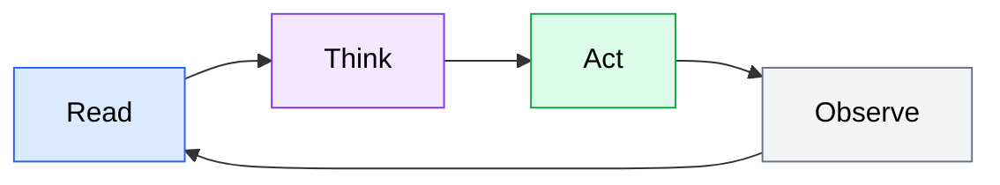

Every AI coding agent follows the same fundamental cycle: **Read** context, **Think** about what to do, **Act** by using tools, and **Observe** the results. This cycle -- the agent loop -- repeats until the agent determines the task is complete or it needs your input.

Understanding the agent loop is the foundation for everything else in this curriculum. When you know how an agent operates internally, you can provide better instructions, anticipate where things might go wrong, and collaborate with the agent more effectively.

## How the agent loop works

The agent loop has four phases that execute in sequence, then repeat.

*Flowchart showing the agent loop cycle: Read context, Think about the task, Act by using tools, Observe the results, then repeat.*

### Read

The agent gathers information about the current state of the task. On the first iteration, this means reading your prompt, examining relevant files in your codebase, and loading any project context you have provided (such as a `CLAUDE.md` or `AGENTS.md` file). On subsequent iterations, the agent reads the output from its previous actions -- compiler errors, test results, file contents it just modified.

What the agent reads directly shapes what it does next. This is why context engineering (covered in [Module 4](/04-context-engineering/overview/)) matters so much: the quality of the agent's input determines the quality of its output.

### Think

The agent reasons about the information it has gathered and decides on a plan. This phase happens inside the language model and involves:

- **Interpreting the task**: What are you asking it to do?
- **Assessing the current state**: What exists in the codebase? What has already been done?
- **Planning the next step**: What specific action will move the task forward?
- **Evaluating tradeoffs**: Should it edit a file, run a command, read more code, or ask for clarification?

The Think phase is where the agent's reasoning ability matters most. A well-crafted prompt (covered in [Module 3](/03-prompt-engineering/overview/)) gives the agent clear constraints and goals to reason about, leading to better decisions.

### Act

The agent executes a concrete action using its available tools. Typical actions include:

- **Reading files** to gather more context
- **Writing or editing files** to implement changes
- **Running shell commands** such as tests, linters, or build scripts
- **Searching the codebase** for patterns, function definitions, or references
- **Using external tools** via MCP servers (covered in [Module 6](/06-mcp-servers/overview/))

Each action is discrete and observable. The agent does one thing at a time, then moves to the Observe phase to check the result.

### Observe

The agent examines the result of its action and updates its understanding of the task state. If a test passed, the agent knows that part of the implementation is correct. If a compiler error appeared, the agent reads the error message and plans a fix. If a file search returned unexpected results, the agent adjusts its mental model of the codebase.

The Observe phase closes the loop by feeding new information back into the Read phase. The agent then decides whether the task is complete or another iteration is needed.

## A concrete example

Consider asking an agent to "add input validation to the signup form." Here is how the loop might play out:

| Iteration | Read | Think | Act | Observe |
|-----------|------|-------|-----|---------|
| 1 | Reads your prompt and the signup form component file | Identifies the form fields that need validation; plans to add email format and password length checks | Edits the form component to add validation logic | Sees the file was written successfully |
| 2 | Reads the updated form file | Considers whether tests exist for the form; decides to check | Searches for test files related to the signup form | Finds an existing test file with no validation tests |
| 3 | Reads the existing test file | Plans new test cases for the validation rules it added | Writes validation test cases into the test file | Sees the test file was updated |
| 4 | Reads the test file it just wrote | Decides to run the tests to verify they pass | Executes the test suite | All tests pass; determines the task is complete |

Notice how each iteration builds on the previous one. The agent did not try to do everything in a single step. It read, thought, acted, observed, and repeated -- just like a developer working through a task, but faster.

## Why the loop matters for you

Understanding the agent loop helps you in three practical ways:

1. **Better prompts.** When you know the agent starts by reading your prompt and available context, you learn to front-load the most important information. Vague prompts lead to poor Read phases, which cascade into poor decisions throughout the loop.

2. **Diagnosing problems.** When an agent produces incorrect output, you can trace the failure to a specific phase. Did it misread the codebase (Read problem)? Did it make a bad plan (Think problem)? Did it use the wrong tool (Act problem)? Did it misinterpret an error message (Observe problem)?

3. **Knowing when to intervene.** Agents sometimes get stuck in unproductive loops -- repeating the same fix for the same error, or reading files that are not relevant. Recognizing the loop pattern helps you spot these situations and redirect the agent with a better prompt or additional context.

## The agent loop versus request-response

If you have used a chat assistant like ChatGPT or Claude for coding questions, you are familiar with the request-response pattern: you ask a question, the model responds, and the conversation is over (or continues with your next question). The key difference with AI coding agents is that **the agent drives the loop, not you.**

| | Chat assistant | AI coding agent |
|---|---|---|
| **Who drives the loop** | You ask each question | The agent decides the next step |
| **Access to tools** | Limited (copy-paste code) | Direct (reads/writes files, runs commands) |
| **Iterations** | One per message you send | Multiple per task, automatically |
| **Context** | Your conversation history | Your codebase, project files, tool output |
| **Completion** | You decide when you are done | The agent determines when the task is done |

This distinction has practical implications. With a chat assistant, you are the loop controller -- you read the output, think about the next step, copy code into your editor, run tests yourself, and come back with follow-up questions. With an AI coding agent, you delegate the entire loop. Your job shifts from executing each step to framing the task well and reviewing the result.

This shift in responsibility is what makes agent-assisted development powerful -- and it is also what makes the skills taught in the rest of this curriculum important. The better you are at setting up the agent's context, writing clear prompts, and reviewing agent output, the more effectively the loop runs.
