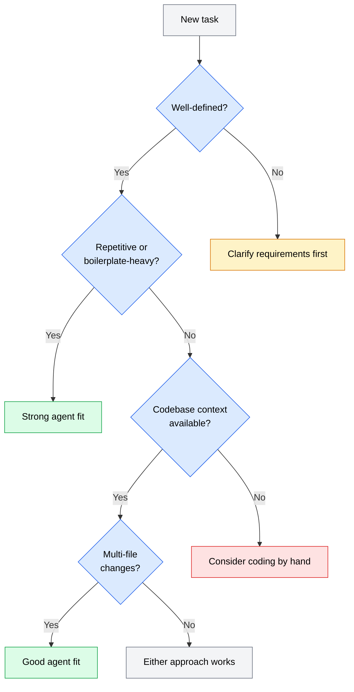

AI coding agents are not a replacement for knowing how to code. They are a tool -- and like any tool, they are effective in some situations and counterproductive in others. Knowing when to reach for an agent and when to code by hand is a skill that develops with experience, but a clear framework helps you start making good decisions from day one.

## The decision framework

Use this framework when deciding whether to use an AI coding agent for a task. The more factors that point toward "use an agent," the more likely the agent will save you time and produce good results.

*Flowchart showing a decision tree: start with whether the task is well-defined, then check if it is repetitive, whether codebase context is available, and whether it requires multi-file changes, leading to a recommendation of agent use, hand coding, or either approach.*

### Factors that favor using an agent

**The task is well-defined.** Agents work best when you can describe the desired outcome clearly. "Add input validation to the signup form that rejects emails without an @ symbol and passwords shorter than 8 characters" gives the agent a clear target. "Make the form better" does not.

**The task involves boilerplate or repetition.** Writing CRUD endpoints, generating test scaffolding, adding similar validation across multiple forms, migrating a set of files to a new pattern -- these tasks follow predictable structures that agents handle well.

**The codebase has good context.** If your project has a context file (like `CLAUDE.md` or `AGENTS.md`), consistent coding patterns, and a well-organized structure, the agent can produce code that fits naturally. Projects with no documentation and inconsistent patterns make the agent's job harder.

**The change spans multiple files.** Agents are good at coordinated changes across files -- updating an interface, its implementations, and its tests in one pass. This is where agents save the most time compared to doing it by hand.

**You can verify the result easily.** If the task has a clear success criterion (tests pass, the app compiles, the feature works as described), you can quickly confirm whether the agent did a good job. Vague success criteria make it harder to review agent output.

### Factors that favor coding by hand

**You are exploring or prototyping.** When you are not sure what you want to build, writing code by hand helps you think through the problem. Agents need clear instructions; exploration requires ambiguity.

**The task requires deep domain knowledge.** If the correct implementation depends on understanding business rules, regulatory requirements, or complex system interactions that are not documented in the codebase, you are better positioned to make those judgment calls than an agent.

**The change is small and fast.** Fixing a typo, adjusting a CSS value, or adding a log statement takes less time to do by hand than to describe to an agent, review the output, and approve the change.

**Security-critical code needs careful review.** Agents can write authentication logic, encryption code, or access control, but you must review it meticulously. For high-risk code paths, writing it by hand and having a human review it may be safer than delegating to an agent and hoping the review catches everything.

**You need to learn the underlying system.** If you are working with a new framework, library, or codebase and your goal is to understand how it works, using an agent to generate the code bypasses the learning. Write it by hand first, then use an agent once you understand the patterns.

## Practical examples

These examples illustrate how the framework applies to common development tasks.

| Task | Agent? | Reasoning |
|------|--------|-----------|
| Add a new REST endpoint following an existing pattern | Yes | Well-defined, follows existing patterns, agent can reference similar endpoints |
| Write unit tests for an existing module | Yes | Repetitive structure, clear verification (tests pass), agent reads the module for context |
| Debug a race condition in async code | No | Requires deep understanding of execution flow, hard to describe the fix without diagnosis |
| Rename a function across 30 files | Yes | Repetitive, well-defined, spans multiple files |
| Design a database schema for a new feature | Mixed | Start by hand to think through relationships, then use an agent to generate migrations |
| Fix a CSS layout issue on one page | No | Small change, faster to do by hand, visual verification is hard for agents |
| Refactor a module to use dependency injection | Yes | Well-defined pattern, multi-file changes, clear before/after structure |
| Write a first draft of API documentation | Yes | Repetitive format, agent reads the code for context, human reviews for accuracy |
| Implement a custom cryptographic algorithm | No | Security-critical, requires domain expertise, high cost of subtle errors |
| Migrate 50 React class components to hooks | Yes | Repetitive, well-defined pattern, agent applies the same transformation repeatedly |

## The delegation spectrum

Deciding to use an agent is not binary. In practice, most tasks fall on a spectrum between full manual work and full delegation.

**Full manual**: You write every line yourself. Best for learning, small fixes, and security-critical code.

**Agent-assisted**: You start the work by hand and use the agent for specific subtasks. For example, you design the API contract yourself, then ask the agent to implement the endpoint and write tests. This is a common pattern for tasks that need human judgment for the "what" but benefit from agent speed for the "how."

**Full delegation**: You describe the task and let the agent handle it end to end. Best for well-defined, repeatable tasks with clear verification criteria. Cloud-based agents like Codex are designed for this mode.

As you gain experience with agents and build up project context (context files, coding patterns, test suites), more of your work can shift toward the delegation end of the spectrum. The rest of this curriculum teaches the skills that make that shift effective.
