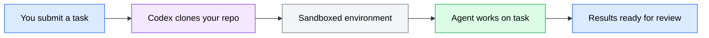

Codex is OpenAI's cloud-based AI coding agent. Unlike OpenCode, which runs in your terminal, Codex runs on remote infrastructure and processes tasks asynchronously. You submit a task, Codex works on it in a sandboxed cloud environment, and you review the results when it finishes. This model works well for tasks you want to delegate and come back to later -- feature implementation, bug fixes, test writing, and documentation.

This section walks you through creating a Codex account, understanding how cloud execution works, connecting a repository, configuring autonomy levels, and running your first task.

## Account setup

Codex is accessed through the OpenAI platform. You need an OpenAI account with API access to use it.

### Creating your account

1. Go to [codex.openai.com](https://codex.openai.com) and sign in with your OpenAI account. If you do not have one, create an account first at [platform.openai.com](https://platform.openai.com).

2. Once signed in, you will see the Codex dashboard. This is where you manage repositories, submit tasks, and review results.

3. Make sure your OpenAI account has API credits or an active billing plan. Codex tasks consume API credits based on the complexity and duration of the work.

### Installing the CLI (optional)

Codex also provides a command-line interface for submitting tasks from your terminal:

```bash
npm install -g @openai/codex
```

Verify the installation:

```bash
codex --version
```

Expected output:

```text
codex v0.1.x
```

Authenticate the CLI with your OpenAI account:

```bash
codex auth login
```

This opens a browser window for authentication. After completing the flow, the CLI stores your credentials locally.

### Verification: account setup

Confirm your account is active and the CLI is authenticated:

```bash
codex whoami
```

Expected output:

```text
Logged in as: <your-email>
Organization: <your-org>
```

If this fails, re-run `codex auth login` and make sure you complete the browser authentication flow.

---

## The cloud execution model

Codex processes tasks differently from terminal-based agents. Understanding this model helps you use it effectively.



*Flowchart showing the Codex cloud execution model: you submit a task, Codex clones your repo into a sandboxed environment, the agent works on the task, and results are ready for your review.*

### How it works

1. **Task submission**: You describe what you want done -- in the web dashboard or via the CLI. The task description is your prompt.
2. **Environment setup**: Codex clones your repository into a sandboxed cloud environment. It installs dependencies and sets up the project based on your repository's configuration.
3. **Execution**: The agent reads your codebase, plans its approach, and makes changes. It can read files, write files, and run commands within the sandbox -- but it cannot access the internet or external services during execution.
4. **Review**: When the task completes, Codex presents the changes as a diff. You review the changes, and if they look correct, apply them to your repository as a pull request or commit.

### Key differences from terminal agents

| Aspect | Terminal agents (OpenCode) | Cloud agents (Codex) |
|--------|---------------------------|----------------------|
| Execution location | Your local machine | Remote sandboxed environment |
| Interaction model | Interactive, real-time | Asynchronous, submit and review |
| Network access | Full (your machine's network) | Restricted (no internet during execution) |
| File access | Your full filesystem | Only the cloned repository |
| Session length | As long as your terminal is open | Minutes to hours per task |
| Feedback loop | Immediate -- you see output live | Delayed -- you review when done |

### When to use Codex

Codex works best for:

- **Self-contained tasks**: Bug fixes, feature implementations, and refactors where the task and its context are fully captured in the repository and prompt
- **Parallel work**: Submit multiple tasks and review results in batch, instead of working through them sequentially in a terminal
- **Delegated work**: Tasks you want to hand off while you focus on something else
- **Review-based workflows**: Teams that prefer reviewing agent output through pull requests

Codex works less well for:

- **Exploratory work**: When you do not know exactly what you want and need to iterate interactively
- **Tasks requiring external services**: If the agent needs to call APIs, access databases, or reach external resources during execution
- **Real-time collaboration**: When you want to steer the agent mid-task

---

## Repository connection

Codex needs access to your code repository to work on it. You connect repositories through the dashboard or CLI.

### Connecting via the dashboard

1. Open the Codex dashboard at [codex.openai.com](https://codex.openai.com).
2. Navigate to **Repositories** and select **Connect repository**.
3. Choose your Git provider (GitHub, GitLab, or Bitbucket) and authorize Codex to access your account.
4. Select the specific repositories you want Codex to access. Grant access only to the repositories you intend to use -- follow the principle of least privilege.

### Connecting via the CLI

```bash
# List available repositories
codex repo list

# Connect a specific repository
codex repo connect <owner>/<repo-name>
```

### Repository requirements

For Codex to work effectively with your repository:

- The repository must have a clear project structure with a recognizable build system (package.json, Cargo.toml, pyproject.toml, etc.)
- Dependencies should be defined in a lockfile so the sandboxed environment can reproduce your setup exactly
- Include setup instructions in a README or AGENTS.md file so Codex knows how to build and test your project

### Verification: repository connection

Confirm Codex can access your repository:

```bash
codex repo status <owner>/<repo-name>
```

Expected output:

```text
Repository: <owner>/<repo-name>
Status:     connected
Branch:     main
Last sync:  <timestamp>
```

If the status shows `disconnected` or `error`, check that:
- Your Git provider authorization is still valid
- The repository exists and you have access to it
- The repository is not empty (Codex needs at least one commit)

---

## Autonomy levels

Codex supports different autonomy levels that control how much the agent can do without human approval. Choosing the right level depends on your trust in the task scope and the risk of unintended changes.

### Available levels

| Level | What the agent can do | When to use |
|-------|----------------------|-------------|
| **Suggest** | Proposes changes but does not apply them. You review and approve every change. | First time using Codex with a repository, or for high-risk changes |
| **Auto-edit** | Writes and edits files automatically, but requires approval for running commands. | Routine development tasks in familiar repositories |
| **Full auto** | Reads, writes, and runs commands without approval. | Low-risk tasks in sandboxed environments, or when you trust the task scope completely |

### Setting the autonomy level

In the dashboard, set the autonomy level when creating a task. Via the CLI:

```bash
# Submit a task with a specific autonomy level
codex task create \
  --repo <owner>/<repo-name> \
  --autonomy suggest \
  --prompt "Add input validation to the user registration endpoint"
```

### Start with suggest

Begin with the `suggest` level for your first tasks. This lets you observe how Codex interprets your prompts and what kinds of changes it makes. As you build confidence in how the agent handles your codebase, you can increase the autonomy level.

:::caution
The `full auto` level gives the agent permission to run arbitrary commands in the sandboxed environment. While the sandbox limits the blast radius, always review the changes Codex produces before merging them into your repository.
:::

---

## Running your first task

With your account set up and a repository connected, you are ready to submit your first task.

### Submitting a task via the CLI

```bash
codex task create \
  --repo <owner>/<repo-name> \
  --autonomy suggest \
  --prompt "Create a file called hello.txt with the text 'Hello from Codex'"
```

### Submitting via the dashboard

1. Open the Codex dashboard.
2. Select your connected repository.
3. Enter your task prompt: `Create a file called hello.txt with the text 'Hello from Codex'`
4. Set the autonomy level to **Suggest**.
5. Submit the task.

### Monitoring task progress

Track the task status from the CLI:

```bash
codex task status <task-id>
```

Or watch it in the dashboard, where you can see real-time logs of what the agent is doing.

Task states:

| State | Meaning |
|-------|---------|
| `queued` | Task is waiting to start |
| `running` | Agent is actively working |
| `review` | Agent finished; changes are ready for your review |
| `completed` | You approved and applied the changes |
| `failed` | Something went wrong; check the logs |

### Reviewing results

When the task reaches the `review` state, examine the proposed changes:

```bash
codex task diff <task-id>
```

This shows the changes the agent made as a unified diff. Review the diff carefully -- check that the changes match your intent and do not introduce unintended side effects.

If the changes look correct, apply them:

```bash
codex task apply <task-id>
```

This creates a commit or pull request in your repository with the agent's changes.

### Verification: first task

After applying the changes, verify them in your repository:

```bash
cd <your-project>
git pull
cat hello.txt
```

Expected output:

```text
Hello from Codex
```

If you see the expected content, your Codex setup is complete. Clean up the test file:

```bash
git rm hello.txt
git commit -m "chore: remove Codex test file"
git push
```

### Troubleshooting first tasks

| Symptom | Likely cause | Fix |
|---------|-------------|-----|
| Task stays `queued` for a long time | High demand or account limits | Check your account status and API credit balance |
| Task fails immediately | Repository setup issues | Verify the repo has a valid project structure and dependencies are defined |
| Changes do not match your intent | Prompt was too vague | Write a more specific prompt with explicit requirements (see Module 3) |
| Agent cannot build the project | Missing or outdated lockfile | Commit an up-to-date lockfile (`package-lock.json`, `Cargo.lock`, etc.) |

---

## Codex setup summary

At this point you should have:

1. An active OpenAI account with API access
2. The Codex CLI installed and authenticated (optional but recommended)
3. At least one repository connected
4. An understanding of autonomy levels and when to use each
5. A completed first task to confirm everything works

You now have a cloud-based AI coding agent ready to handle tasks asynchronously. The next section covers environment essentials that apply regardless of which agent you use.
