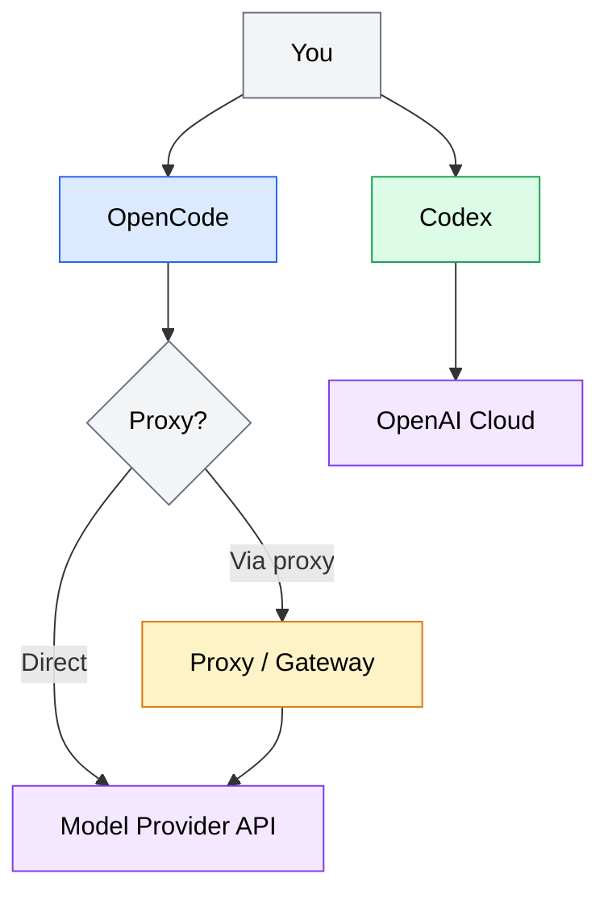

Before you can start working with an AI coding agent, you need a properly configured environment. This module walks you through installing and configuring two agents -- OpenCode (a terminal-based agent you run locally) and Codex (a cloud-based agent that runs tasks asynchronously). You will also set up the supporting tools that make agent workflows smooth: a capable terminal, clean git practices, and a sandbox project for safe experimentation.

By the end of this module, you will have at least one working agent and the environment to use it effectively.

## What you will learn

- Install and configure OpenCode for local, interactive agent workflows
- Set up Codex for cloud-based, asynchronous task execution
- Configure provider credentials and proxy endpoints for model access
- Prepare your terminal environment for agent-assisted development
- Apply git hygiene practices that work well with AI coding agents
- Create a sandbox project for safe experimentation
- Verify each tool is working before moving on

## Prerequisites

- A working terminal (macOS Terminal/iTerm2, or a Linux terminal emulator)
- Git installed and configured with your identity (`git config --global user.name` and `user.email`)
- A code editor you are comfortable with (VS Code, Neovim, etc.)
- An API key or account for at least one model provider (Anthropic, OpenAI, or a proxy gateway)
- Node.js 18+ and npm (for OpenCode installation)

:::note
You do not need both agents to proceed. Pick the one that fits your workflow -- OpenCode for interactive terminal use, Codex for asynchronous cloud tasks -- and follow that section. You can always set up the other agent later.
:::

---

## How agents connect to providers

Both OpenCode and Codex need access to a large language model to function. The connection path differs depending on whether the agent runs locally or in the cloud, and whether your organization uses a proxy or gateway for model access.

*Architecture diagram showing how agents connect to model providers. OpenCode connects either directly to a model provider API or through an optional proxy gateway. Codex connects to the OpenAI cloud infrastructure.*

## Module structure

This module is organized into three sections, each with its own page:

1. **[OpenCode setup](/02-setup/opencode-setup/)** -- Install OpenCode, configure your model provider and proxy endpoint, set up workspace configuration, and verify the installation.
2. **[Codex setup](/02-setup/codex-setup/)** -- Create your Codex account, understand the cloud execution model, connect a repository, configure autonomy levels, and run your first task.
3. **[Environment essentials](/02-setup/environment-essentials/)** -- Configure your terminal for agent workflows, establish git hygiene practices, and create a sandbox project for safe experimentation.

Each section includes verification steps so you can confirm your setup works before moving on.

---

## Key takeaways

- A working agent environment requires three things: the agent itself, valid model provider credentials, and a project to work in
- OpenCode runs locally in your terminal and gives you interactive, real-time control over the agent
- Codex runs in the cloud and processes tasks asynchronously against connected repositories
- Every setup step in this module includes a verification check -- do not skip these
- Git hygiene is more important with agents because they generate commits and modify files at a pace that demands clean history practices
- A sandbox project gives you a safe space to experiment without risking production code

## Next steps

- **Next section**: [OpenCode setup](/02-setup/opencode-setup/) -- Install and configure your first terminal-based AI coding agent.
- **After this module**: [Prompt engineering for coding agents](/03-prompt-engineering/overview/) -- Learn how to write effective prompts that produce predictable results.
