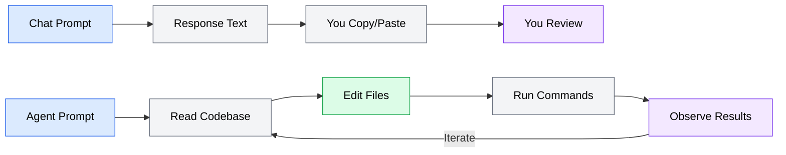
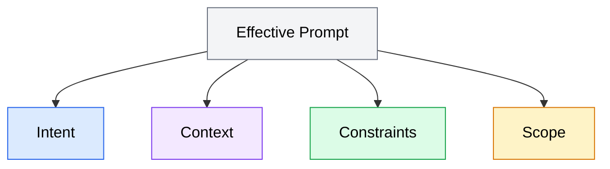

Before diving into specific techniques, you need to understand what makes prompting an AI coding agent fundamentally different from prompting a chat assistant. This distinction shapes everything that follows in this module.

## Why agent prompting differs from chat prompting

When you type a question into a chat assistant, you get a response. If the response is wrong, you ask again. The assistant has no ability to act on your codebase -- it can only generate text for you to copy, review, and paste.

An AI coding agent operates differently. When you give it a prompt, it enters the agent loop: it reads your codebase, thinks about what needs to change, acts by editing files and running commands, and observes the results. Then it repeats that cycle until the task is done or it gets stuck. Your prompt is not starting a conversation -- it is launching autonomous work.

This difference has three practical implications for how you write prompts:

**Your prompt is a work order, not a question.** A chat prompt like "How do I add input validation to this form?" produces an explanation. An agent prompt like "Add input validation to the registration form in `src/components/RegisterForm.tsx` -- validate email format, require passwords of at least 8 characters, and show inline error messages below each field" produces code changes in your project.

**The agent makes decisions you do not see.** A chat assistant shows you its reasoning and waits for approval. An agent decides which files to read, which approach to take, and how to structure the implementation. If your prompt is ambiguous, the agent fills in the gaps with its own judgment -- and that judgment may not match your intent.

**Mistakes compound.** When a chat assistant gives a bad answer, you ignore it. When an agent makes a bad decision during step 3 of a 10-step task, all subsequent steps build on that mistake. A clear, well-scoped prompt reduces the chances of early missteps cascading through the work.



*Comparison of chat prompting versus agent prompting. A chat prompt produces response text that you copy, paste, and review. An agent prompt triggers the agent to read the codebase, edit files, run commands, observe results, and iterate autonomously.*

## Anatomy of a good prompt

Effective agent prompts share four components. Not every prompt needs all four in equal measure, but understanding each one helps you decide what to include.



*Diagram showing the four components of an effective agent prompt: Intent (what to accomplish), Context (relevant information), Constraints (boundaries on approach), and Scope (what to change and what to leave alone).*

### Intent

The intent is what you want the agent to accomplish. It answers: "When this task is done, what has changed?"

A strong intent statement is specific and outcome-oriented:

```text
Bad:  "Fix the login"
Good: "Fix the bug where users who log in with Google OAuth are redirected to
       a 404 page instead of the dashboard"
```

The bad version leaves the agent guessing about which login problem to fix. The good version identifies the exact bug, the trigger condition (Google OAuth login), the symptom (404 redirect), and the expected behavior (dashboard redirect).

### Context

Context is the information the agent needs to make good decisions. This includes file paths, relevant architecture details, existing conventions, and anything the agent cannot easily infer from the codebase alone.

```text
Bad:  "Add a caching layer"
Good: "Add Redis caching to the product catalog API. The API is in
       src/api/products.ts and uses the repository pattern defined in
       src/repositories/base.ts. Cache product listings for 5 minutes.
       We already have a Redis client configured in src/lib/redis.ts."
```

The bad version forces the agent to search for the right files, guess the caching technology, and decide on cache duration. The good version points the agent directly at the relevant files, names the technology, specifies the TTL, and highlights existing infrastructure to reuse.

### Constraints

Constraints are boundaries on how the agent should (or should not) implement the solution. They prevent the agent from making valid but unwanted choices.

```text
Bad:  "Write tests for the payment module"
Good: "Write unit tests for the payment module in src/services/payment.ts.
       Use the existing Vitest setup in __tests__/. Mock the Stripe API
       using the patterns already in __tests__/mocks/stripe.ts. Do not
       add new dependencies."
```

Without constraints, the agent might install a different test framework, create real API calls, or restructure the test directory. Constraints guide it toward the approach that fits your project.

### Scope

Scope defines the boundaries of what the agent should and should not change. This is especially important for larger tasks where the agent might "helpfully" refactor adjacent code or modify files you did not intend it to touch.

```text
Bad:  "Refactor the user module"
Good: "Refactor the UserService class in src/services/user.ts to extract
       the email notification logic into a separate NotificationService.
       Only modify files in src/services/ and the corresponding tests in
       __tests__/services/. Do not change the API routes or database schema."
```

The scope statement tells the agent exactly which files are in play and explicitly marks what is off-limits.

## Putting the components together

Here is a realistic prompt that combines all four components:

```text
Add rate limiting to the POST /api/auth/login endpoint.

Context:
- The auth routes are in src/routes/auth.ts
- We use Express with middleware defined in src/middleware/
- There is no existing rate limiting in the project
- We use Redis (client in src/lib/redis.ts) for session storage

Constraints:
- Use express-rate-limit with the Redis store (rate-limit-redis)
- Limit to 5 attempts per IP per 15-minute window
- Return a 429 response with a JSON body: { "error": "Too many login attempts" }
- Add the rate limiter as route-specific middleware, not app-wide

Scope:
- Create the rate limit middleware in src/middleware/rate-limit.ts
- Modify src/routes/auth.ts to apply it to the login route
- Add tests in __tests__/middleware/rate-limit.test.ts
- Do not modify other routes or middleware
```

This prompt gives the agent a clear target, points it at the relevant code, specifies the technology choices and configuration values, and draws boundaries around the change. The agent still has room to make implementation decisions (how to structure the middleware file, how to write the tests), but those decisions are guided by the constraints and scope you provided.

## How much detail is enough

There is no universal rule for prompt length. The right level of detail depends on three factors:

**Task complexity.** A one-line bug fix needs less prompting than a multi-file feature implementation. Match your prompt detail to the scope of the work.

**Codebase familiarity.** If the agent has access to well-structured code with clear patterns, it needs less hand-holding. If the codebase has inconsistent conventions or unusual architecture, provide more context.

**Risk tolerance.** For low-risk changes (formatting, documentation, simple refactors), a brief prompt is fine. For high-risk changes (authentication, payment processing, data migrations), invest in a detailed prompt with explicit constraints.

A practical test: if you would need to explain the same information to a senior developer joining your team for their first day, include it in the prompt. If a senior developer could figure it out from reading the code, you can probably omit it.
