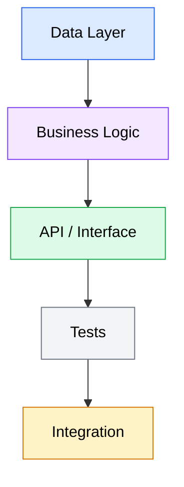
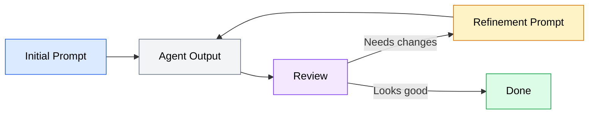

The fundamentals page covered what makes a good prompt. This page covers how to build one. These four techniques -- task decomposition, providing context, constraint setting, and iterative refinement -- form the core toolkit for writing effective prompts for AI coding agents.

## Task decomposition

The single most impactful prompting technique is breaking large tasks into smaller ones. AI coding agents handle focused, well-defined tasks far better than sprawling, multi-concern work.

### Why decomposition matters

When you give an agent a large task, several things can go wrong:

- The agent makes a poor decision early on, and all subsequent work builds on that mistake
- The agent loses track of requirements partway through and delivers an incomplete result
- The agent runs into a token limit and stops mid-implementation
- The output is too large to review effectively, so bugs slip through

Breaking a large task into smaller prompts avoids these problems. Each prompt produces a reviewable chunk of work. If one step goes wrong, you catch it before the next step begins.

### How to decompose a task

Think about the task in layers. Most coding tasks follow a natural order:



*Flowchart showing the natural task decomposition order: Data Layer, then Business Logic, then API or Interface, then Tests, then Integration. Each layer builds on the previous one.*

**Example: Adding a user profile feature**

Instead of one prompt:

```text
Add a user profile feature with an avatar upload, bio field, and social links.
Allow users to edit their profile from a settings page.
```

Decompose it into focused prompts, each building on the previous result:

**Prompt 1 -- Data layer:**
```text
Add a UserProfile model to src/models/user-profile.ts with fields: userId
(string, required), bio (string, max 500 chars), avatarUrl (string, optional),
and socialLinks (array of { platform: string, url: string }). Add a
corresponding database migration in src/migrations/.
```

**Prompt 2 -- Business logic:**
```text
Create a ProfileService in src/services/profile.ts that handles CRUD
operations for UserProfile. Use the repository pattern from
src/repositories/base.ts. Include validation: bio must be <= 500 characters,
socialLinks limited to 5 entries, avatarUrl must be a valid URL.
```

**Prompt 3 -- API layer:**
```text
Add REST endpoints for user profiles in src/routes/profile.ts:
GET /api/profile/:userId, PUT /api/profile (authenticated, updates own
profile). Use the ProfileService from step 2. Apply the auth middleware
from src/middleware/auth.ts to the PUT endpoint.
```

**Prompt 4 -- Tests:**
```text
Write unit tests for ProfileService in __tests__/services/profile.test.ts.
Cover: creating a profile, updating bio with valid/invalid length, adding
social links up to the limit, and rejecting invalid avatar URLs. Mock the
repository layer.
```

Each prompt is focused enough for the agent to handle well, and you can verify each result before moving on.

### When to keep tasks together

Not every task needs decomposition. Keep a task as a single prompt when:

- The change is confined to one file
- The logic is straightforward and low-risk
- Breaking it up would create artificial seams (e.g., "write the function" then "write the return statement")
- The task is a bug fix with a clear root cause

Use your judgment. If you can describe the task in 2-3 sentences and it touches fewer than 3 files, a single prompt is usually fine.

## Providing context

AI coding agents can read your codebase, but they do not know your intent, your conventions, or your priorities unless you tell them. Providing the right context is the difference between code that works and code that fits your project.

### What context to include

**File paths.** Point the agent at the files it needs to read or modify. Do not assume the agent will find the right file on its own -- projects often have similarly named files in different directories.

```text
Weak: "Update the config parser"
Better: "Update the config parser in src/config/parser.ts"
```

**Architecture decisions.** If your project uses a specific pattern (repository pattern, service layer, event-driven), mention it. The agent will match the pattern if it knows about it.

```text
"We use the mediator pattern for command handling. Commands are defined in
src/commands/ and handlers in src/handlers/. Each handler implements the
ICommandHandler interface from src/interfaces/command-handler.ts."
```

**Existing conventions.** If your project has conventions that are not obvious from the code (naming patterns, error handling approaches, logging format), state them.

```text
"All API errors follow the format { error: string, code: string, details?: object }.
Error codes are defined in src/constants/error-codes.ts."
```

**What not to include.** Do not provide context the agent can easily discover by reading the code. If your project has clear imports, well-named functions, and consistent patterns, the agent will pick up on those. Focus on what is not obvious from the code itself.

### Using context files effectively

Rather than repeating the same context in every prompt, configure your agent's context file (CLAUDE.md for OpenCode, AGENTS.md for Codex) with project-level information. This is covered in depth in Module 4: Context Engineering. For now, know that a well-configured context file reduces how much context you need to include in individual prompts.

The rule of thumb: put stable context (architecture, conventions, tech stack) in context files. Put task-specific context (which files to modify, specific requirements) in the prompt.

## Constraint setting

Constraints prevent the agent from making valid but unwanted decisions. Without constraints, the agent will choose the most "obvious" approach -- which may not align with your project's conventions, dependencies, or preferences.

### Types of constraints

**Technology constraints** specify what libraries, frameworks, or tools to use (or avoid):

```text
"Use date-fns for date formatting, not moment.js."
"Do not add new npm dependencies."
"Use the built-in fetch API, not axios."
```

**Pattern constraints** specify how to structure the implementation:

```text
"Follow the existing error handling pattern in src/middleware/error-handler.ts."
"Use named exports, not default exports."
"Write the SQL query directly; do not use the query builder for this case."
```

**Behavioral constraints** specify what the output should and should not do:

```text
"Return a 404 with an empty body if the resource is not found; do not return
a JSON error object."
"Log failed authentication attempts at the warn level, not error."
"Preserve the existing API response format; do not add new fields."
```

**Scope constraints** specify boundaries around the change:

```text
"Only modify files in src/services/ and __tests__/services/."
"Do not refactor existing code; only add the new feature."
"Do not modify the database schema."
```

### How many constraints are enough

The goal is to eliminate ambiguity on decisions that matter while leaving the agent room to work on decisions that do not. A prompt with 20 constraints is hard to follow and suggests the task should be decomposed further. A prompt with zero constraints works only for trivial tasks.

Use constraints for decisions where:
- Your project has a convention the agent might not follow by default
- The wrong choice would require significant rework
- You have a specific preference that is not obvious from the codebase

Skip constraints for decisions where:
- The choice does not meaningfully affect the outcome
- The agent can infer the right approach from existing code
- You are genuinely indifferent to how the agent implements it

## Iterative refinement

Not every prompt produces a perfect result on the first try. Iterative refinement is the process of reviewing agent output and issuing follow-up prompts to adjust the result. This is a normal part of working with an agent, not a sign that your initial prompt was bad.



*Flowchart showing the iterative refinement cycle: start with an initial prompt, review the agent output, then either issue a refinement prompt for another round or accept the result when it looks good.*

### How to refine effectively

**Be specific about what to change.** Do not re-state the entire task. Point the agent at the specific problem and describe the fix.

```text
Instead of: "The authentication isn't working right, try again"

Say: "The loginUser function in src/services/auth.ts is not hashing the
password before comparing. Use bcrypt.compare() instead of the direct
string comparison on line 47."
```

**Reference the agent's own output.** When the agent made a choice you want to change, reference it directly.

```text
"You created the validation as a separate middleware, but I'd prefer it
inline in the route handler. Move the validation logic from
src/middleware/validate-profile.ts into the PUT handler in
src/routes/profile.ts, then delete the middleware file."
```

**Ask for targeted changes, not full rewrites.** Asking the agent to "redo" a task from scratch wastes tokens and may lose correct work. Instead, ask for the specific modifications you need.

### The refinement cycle

Most tasks follow a pattern of diminishing refinement:

1. **Initial prompt** -- produces 70-90% of the correct result
2. **First refinement** -- fixes structural issues or wrong approaches
3. **Second refinement** -- adjusts details, edge cases, or styling
4. **Done** -- the result matches your expectations

If you find yourself on refinement 4 or 5, the original task was likely too large or too ambiguous. Step back, decompose it, and try again with more focused prompts.

### Knowing when to start over

Sometimes refinement is not the right approach. Start over with a new prompt when:

- The agent took a fundamentally wrong approach (wrong architecture, wrong pattern)
- The accumulated changes from refinements have made the code messy
- The agent seems confused by contradictory instructions from multiple refinements
- You realize the original prompt was asking for the wrong thing

Starting over is cheaper than trying to patch a broken implementation through successive refinements.
