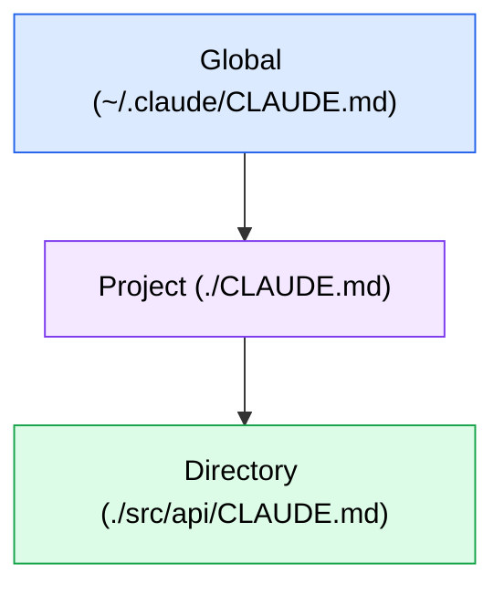
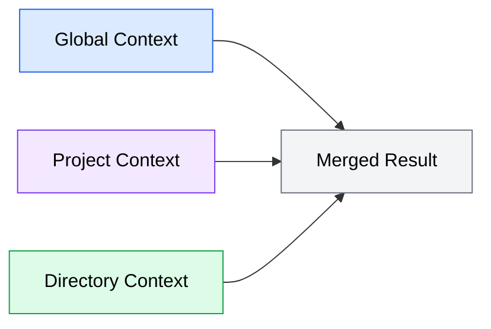

Most developers start with a single context file at the project root. This works well for small projects, but as projects grow -- or when you work across multiple repositories -- a single file becomes limiting. Context hierarchy lets you layer context at multiple levels, from global preferences that apply everywhere to directory-specific overrides for specialized parts of your codebase.

## The three context levels

Context files can exist at three levels, each with a different scope:



*Diagram showing the three context levels in order of specificity: Global context at the top (applies to all projects), Project context in the middle (applies to this repository), and Directory context at the bottom (applies to a specific subdirectory).*

### Global context

**Location**: `~/.claude/CLAUDE.md` (in your home directory)

Global context applies to every project you work on with this agent. It captures your personal preferences and tools that stay consistent regardless of which repository you are in.

Good candidates for global context:

```markdown
# Global Preferences

## Environment
- macOS with zsh shell
- Homebrew for system packages
- Check what's installed before suggesting new tools

## Personal Conventions
- Format Python with Ruff (not Black)
- Package management with uv (not pip or Poetry)
- Type hints on all Python functions
- Test with pytest

## Communication
- Be direct and concise
- Ask before making architectural decisions
- Confirm before deleting files or force-pushing
```

Notice what this file contains: preferences that are *yours*, not any specific project's. Your preferred Python formatter, your package manager, your communication style. These apply whether you are working on a web app, a CLI tool, or a data pipeline.

### Project context

**Location**: `CLAUDE.md` or `AGENTS.md` in the repository root

Project context is the most common and most important level. It contains everything specific to this repository: the tech stack, architecture, conventions, and testing patterns. The examples throughout this module have focused on project-level context files.

```markdown
# Project: Invoice API

## Stack
- Python 3.12, Django 5.1, DRF
- PostgreSQL 16, Redis for caching
- Celery for async tasks
- pytest with Factory Boy

## Architecture
- apps/ directory with one Django app per domain
- services.py for business logic, not views
- All cross-app communication through events system
```

### Directory context

**Location**: `CLAUDE.md` in any subdirectory

Directory context applies when the agent is working within that directory or its children. This is useful for parts of your codebase that have different conventions from the project as a whole.

Common uses for directory-level context:

**Monorepo packages with different tech stacks**:

```markdown
# packages/frontend/CLAUDE.md

## Stack
- React 19 with TypeScript
- Tailwind CSS for styling
- React Query for server state
- Vitest with React Testing Library

## Conventions
- Functional components only, no class components
- Custom hooks in `hooks/` directory with `use` prefix
- Components use PascalCase filenames (UserProfile.tsx)
```

**API directories with strict patterns**:

```markdown
# src/api/CLAUDE.md

## API Conventions
- Every endpoint has a Zod schema for request validation
- Response shape: { data, error, meta }
- Use the asyncHandler wrapper on all route handlers
- Rate limiting applied via middleware, not per-handler
```

**Test directories with specific patterns**:

```markdown
# tests/integration/CLAUDE.md

## Integration Test Conventions
- Each test file gets a fresh database via the `testDb` fixture
- Use `createTestUser()` and `createTestInvoice()` factories, not raw SQL
- Assertions use snapshot testing for response bodies
- Tests run sequentially (not in parallel) due to shared database state
```

## How layers combine

When multiple context levels apply, the agent reads all of them and merges the information. The merging follows a predictable pattern: more specific context takes precedence over more general context.

### The merge order



*Diagram showing how context from all three levels -- Global, Project, and Directory -- merges into a single combined result that the agent uses for code generation.*

The agent reads context from broadest to most specific:

1. **Global** context loads first -- your personal preferences
2. **Project** context loads next -- this repository's conventions
3. **Directory** context loads last -- overrides for this specific area

Information at each level *adds to* what the previous levels provided. When information at a more specific level contradicts a more general level, the more specific level wins.

### Additive merging

When context levels provide non-overlapping information, the agent combines everything:

**Global**: "Format Python with Ruff"
**Project**: "Use pytest with Factory Boy fixtures"
**Directory** (`tests/`): "Integration tests run sequentially"

The agent in this scenario knows to format with Ruff, test with pytest and Factory Boy, and run integration tests sequentially. No conflicts, no ambiguity.

### Override merging

When context levels provide contradicting information, the most specific level takes precedence:

**Global**: "Use 2-space indentation"
**Project**: "Use 4-space indentation (PEP 8 standard)"

The agent uses 4-space indentation for this project because the project-level context overrides the global preference.

**Project**: "Use Vitest for testing"
**Directory** (`packages/legacy/`): "Use Jest for testing (legacy package, not yet migrated)"

The agent uses Jest when working in the legacy package and Vitest everywhere else.

## Conflict resolution

Most conflicts resolve naturally through the precedence rules -- more specific wins. But some conflicts are ambiguous or unintentional. Here is how to handle them.

### Intentional overrides

Some conflicts are deliberate. A monorepo might have a project-level rule to use TypeScript strict mode, but a legacy package that cannot enable strict mode yet. Handle this with an explicit note in the directory context:

```markdown
# packages/legacy-auth/CLAUDE.md

## TypeScript
- This package does NOT use strict mode (overriding project default)
- Reason: migrating gradually, strict mode will be enabled in Q3
- Do not add strict-mode-only patterns (no non-null assertions needed)
```

The explicit "overriding project default" note makes the intent clear and prevents the agent from trying to reconcile conflicting instructions.

### Accidental conflicts

If your global context says "use named exports" and your project context says "use default exports," the agent may not know which to follow. The most specific level wins (project over global), but the conflict introduces uncertainty.

To avoid accidental conflicts:

1. **Keep global context minimal.** Only include personal preferences that truly apply everywhere. The fewer global rules you have, the fewer opportunities for conflicts.
2. **Review your context stack periodically.** When you change project conventions, check whether they conflict with your global context.
3. **Be explicit about overrides.** If a lower level intentionally contradicts a higher level, say so.

### When multiple levels disagree

Occasionally you may encounter a situation where all three levels have an opinion:

**Global**: "Prefer functional programming patterns"
**Project**: "Use OOP with class-based services"
**Directory** (`src/utils/`): "Pure functions only, no classes"

The resolution:
- In `src/utils/`: Pure functions (directory context wins)
- In `src/services/`: OOP with class-based services (project context wins)
- In other directories: OOP with class-based services (project context applies as default)

The global preference for functional programming is overridden by the project's OOP choice, except in the `utils/` directory where the directory context explicitly restores functional patterns.

## Starting from scratch

If your project has no context files at all, here is how to approach building your hierarchy:

### Step 1: Start with project context only

Create a single `CLAUDE.md` (or `AGENTS.md`) at the project root. Include your stack, conventions, architecture, and testing patterns. Use this file for at least a week before adding other levels.

### Step 2: Add global context for personal preferences

After you notice yourself adding the same preferences to multiple project files ("use Ruff," "use pytest," "be concise"), extract those into a global context file.

### Step 3: Add directory context only when needed

Directory context is justified when a specific part of your codebase has conventions that differ from the project norm. Common triggers:

- A monorepo where packages use different languages or frameworks
- A legacy directory with different patterns from the rest of the project
- A test directory with specialized setup requirements
- A generated code directory where the agent should not modify files

### When not to use directory context

Not every directory needs its own context file. Avoid creating directory-level files for:

- Directories that follow the project-level conventions without exception
- Temporary overrides (just mention them in your prompt instead)
- Information that applies to only one file (include it as a code comment instead)

The goal is to have the *minimum number of context files* that cover all your conventions. Each additional file adds maintenance burden, so add them only when they reduce agent errors more than the maintenance costs.

## Practical guidelines

### Keep context files version-controlled

Context files should live in your repository and go through the same review process as code changes. This ensures:

- Team members get the same context when they use agents
- Changes to conventions are tracked in git history
- Pull requests that change conventions also update the context file

### Review context files during major changes

When you adopt a new framework, change your testing strategy, or reorganize your directory structure, update your context files as part of the same change. Stale context is worse than no context because it actively misleads the agent.

### Document the context hierarchy

For teams, add a brief note in your project's contributing guide or README explaining which context files exist and their purpose:

```markdown
## Agent context files

- `CLAUDE.md` (root) - Project-wide conventions and architecture
- `packages/frontend/CLAUDE.md` - Frontend-specific conventions (React, Tailwind)
- `packages/api/CLAUDE.md` - API-specific conventions (Fastify, Drizzle)
```

This helps team members understand the context structure and know which file to update when conventions change.
