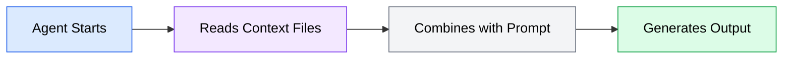

When you onboard a new developer, you do not hand them a blank editor and say "write code." You show them the project structure, explain your conventions, point out the testing patterns, and describe the architecture decisions that shaped the codebase. Without this context, even a skilled developer produces code that technically works but does not fit your project.

AI coding agents have the same problem, amplified. Every conversation starts from zero. The agent reads the files you reference and uses its training data to fill in the gaps, but it does not know your project's specific choices unless you tell it. Context engineering is the practice of telling it -- once, in a structured file that the agent reads automatically.

## The problem context engineering solves

Without project context, agents make reasonable but generic decisions. Consider what happens when you ask an agent to "add input validation to the user registration endpoint":

**Without context**, the agent might:
- Use `Joi` for validation when your project uses `zod`
- Write tests with `jest` when your project uses `vitest`
- Format error messages as plain strings when your API returns structured `{ error: { code, message } }` objects
- Use `camelCase` for database fields when your schema uses `snake_case`
- Skip the custom error middleware your project uses for consistent error handling

Each of these decisions is individually reasonable. The agent is not wrong -- it is uninformed. You end up making corrections that add up to more time than writing the code yourself would have taken.

**With context**, the same agent reads your context file first and learns:
- Validation uses `zod` schemas defined in `src/schemas/`
- Tests use `vitest` with the factory pattern in `tests/factories/`
- Errors follow the structured format through `AppError` class in `src/lib/errors.ts`
- Database columns use `snake_case`, TypeScript interfaces use `camelCase`
- All request handlers pass errors to `next()` for the error middleware to handle

Now the agent produces code that fits your project on the first attempt.

## How context files work

A context file is a document (typically Markdown) placed in a location your agent knows to look for. When the agent starts a session, it reads any context files it finds and treats their content as persistent instructions that apply to all interactions in that session.

The mechanism varies by agent, but the core idea is the same:

*Flowchart showing how context files work: the agent starts, reads context files, combines them with your prompt, and generates output informed by your project's conventions.*

Context files are not prompts. They do not ask the agent to do something -- they inform it about your project so it can do everything better. Think of them as the difference between giving someone directions to your house ("turn left at the light, then right at the gas station") versus giving them a map of the whole neighborhood.

## Why agents need context you provide

AI coding agents have access to massive training data that includes millions of code repositories. This gives them strong general knowledge about programming languages, frameworks, and common patterns. But this general knowledge creates a specific problem: for every decision, there are multiple valid approaches, and the agent defaults to the most common one from its training data.

Your project, however, is not a median of all projects. It has specific choices that were made for specific reasons:

| Decision Area | Generic Default | Your Project (Example) |
|---------------|----------------|----------------------|
| Testing framework | Jest (most common) | Vitest (your choice) |
| Formatting | Prettier defaults | Ruff with custom config |
| Error handling | try/catch per function | Centralized error middleware |
| State management | Redux | Zustand with slices pattern |
| File structure | Feature folders | Domain-driven with barrel exports |
| Import style | Relative paths | Path aliases (`@/lib/...`) |

Without context, the agent uses the generic default. With context, it uses your choice. The compounding effect is significant: a project with 20 such decisions means the agent gets something wrong in almost every substantial code generation task.

## The compounding value of context

Context files have a multiplying effect on agent productivity. The investment is front-loaded -- you spend 30-60 minutes writing a good context file -- but the return compounds across every interaction:

**First interaction**: The agent reads your conventions and produces correctly formatted, correctly structured code.

**Tenth interaction**: You have avoided correcting the same patterns 10 times. Time saved: roughly 5-10 minutes per interaction, or 50-100 minutes total.

**Hundredth interaction**: Your context file has saved hours of correction time. Team members who join the project benefit immediately because the agent already knows the conventions.

The math is straightforward: any instruction you find yourself repeating more than twice in prompts belongs in a context file instead.

## What belongs in a context file

Not everything about your project belongs in a context file. The best context files focus on information the agent cannot reliably infer from your code alone:

**Include**:
- Technology stack and versions (the agent may guess wrong from package.json alone)
- Coding conventions that differ from language defaults
- Architecture patterns and where things live in the directory structure
- Testing patterns and frameworks
- Build and development commands
- Error handling approach
- Naming conventions that are not obvious from existing code

**Exclude**:
- Information the agent can read directly from configuration files (tsconfig.json, .eslintrc, etc.)
- Implementation details of specific features (too detailed, too volatile)
- Business logic documentation (belongs in separate docs, not agent instructions)
- Obvious language conventions (no need to tell the agent to use semicolons in Java)

The next sections cover the specific file formats agents use, how to write effective content for these files, and how to layer context at different levels of your project.
