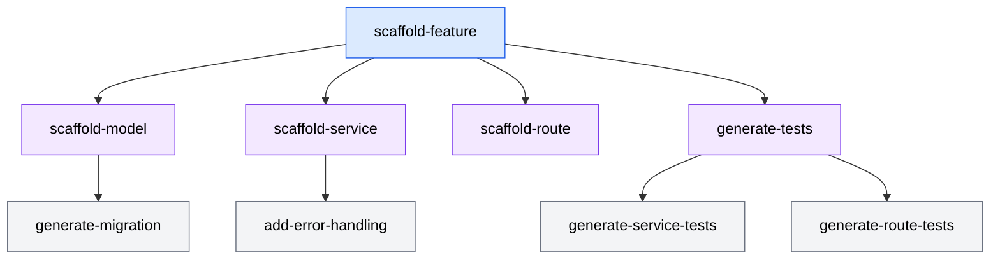

As you build more skills, patterns emerge in how effective skills are structured. These design patterns help you write skills that are reliable, maintainable, and easy to compose. This section covers the most useful patterns and when to apply each one.

## Single-purpose skills

A single-purpose skill does one thing and does it well. It has a narrow scope, clear inputs, and predictable output.

### When to use single-purpose skills

Use a single-purpose skill when:

- The workflow has a clear beginning and end
- The output is predictable given the inputs
- Other skills might want to invoke this workflow as a building block
- Different teams or projects can use the skill with minimal customization

### Example: generate changelog entry

```markdown
# Generate Changelog Entry

Add a new entry to the project changelog.

## Trigger

Invoke this skill when the user asks to:
- Add a changelog entry
- Document a change in the changelog
- Update CHANGELOG.md

## Inputs

- `type` (required): The change type (added, changed, fixed, removed, deprecated, security)
- `description` (required): A one-line description of the change
- `issue` (optional): Related issue or ticket number

## Instructions

1. Read `CHANGELOG.md` to identify the current format and the "Unreleased" section
2. Add a new entry under the appropriate type heading in the "Unreleased" section
3. Format the entry as: `- {description} ([#{issue}](link))` if an issue is provided,
   or `- {description}` if no issue is provided
4. Preserve the existing ordering of type headings (Added, Changed, Fixed, etc.)

## Output

- Updated `CHANGELOG.md` with the new entry under "Unreleased"

## Constraints

- Do not modify existing entries
- Do not create a new version heading (that is the release skill's job)
- Use sentence case for the description
- Entry descriptions must not end with a period
```

This skill is narrowly focused: one input, one output, one file modified. It does not try to handle version bumping, git tagging, or release notes -- those are separate concerns handled by separate skills.

### Benefits of single-purpose design

- **Predictable.** Fewer moving parts means fewer surprises.
- **Testable.** One clear output makes verification straightforward.
- **Composable.** Other skills can invoke this skill as a building block (see multi-step skills below).
- **Maintainable.** Changes to one workflow do not ripple into unrelated skills.

## Multi-step skills

A multi-step skill orchestrates a complex workflow that involves several coordinated actions. It is essentially a runbook encoded as a skill.

### When to use multi-step skills

Use a multi-step skill when:

- The workflow involves creating or modifying multiple files
- Steps must execute in a specific order
- The output of one step feeds into the next step
- The workflow is too complex to describe in a single prompt but too routine to think through every time

### Example: scaffold full feature

```markdown
# Scaffold Feature

Create a complete feature with route, service, model, and tests.

## Trigger

Invoke this skill when the user asks to:
- Create a new feature
- Scaffold a full feature with all layers
- Add a new resource with CRUD operations

## Inputs

- `name` (required): Feature name in singular form (e.g., "invoice")
- `fields` (required): List of fields with types (e.g., "amount:number, status:string, customerId:string")
- `operations` (optional): CRUD operations to include. Defaults to all (create, read, update, delete).

## Instructions

1. Parse the `fields` input into a structured list of field names and types
2. Create the model file at `src/models/{name}.model.ts`:
   - Define a TypeScript interface with the specified fields
   - Add an `id` field (string) and `createdAt`/`updatedAt` fields (Date)
   - Export the interface and a Zod validation schema
3. Create the service file at `src/services/{name}.service.ts`:
   - Implement functions for each operation in `operations`
   - Import the model interface and validation schema
   - Follow the error handling pattern from existing services in `src/services/`
4. Create the route file at `src/routes/{name}.routes.ts`:
   - Create route handlers for each operation
   - Apply validation using the Zod schema from step 2
   - Apply `authMiddleware` to all routes
5. Register the routes in `src/routes/index.ts`
6. Create test files:
   - `src/services/__tests__/{name}.service.test.ts` for service logic
   - `src/routes/__tests__/{name}.routes.test.ts` for route handlers
7. Run `npm test` to verify all tests pass
8. Run `npm run lint` to verify code style compliance

## Output

- Model: `src/models/{name}.model.ts`
- Service: `src/services/{name}.service.ts`
- Routes: `src/routes/{name}.routes.ts`
- Service tests: `src/services/__tests__/{name}.service.test.ts`
- Route tests: `src/routes/__tests__/{name}.routes.test.ts`
- Updated route registry: `src/routes/index.ts`

## Constraints

- Follow existing patterns in each layer directory (read before writing)
- Do not modify existing models, services, or routes
- All generated code must pass linting and tests before the skill completes
```

### Managing complexity in multi-step skills

Multi-step skills risk becoming unwieldy. Keep them manageable with these strategies:

**Number every step.** Numbered steps make it clear what order things happen in and make it easy to reference specific steps when debugging.

**Group related steps.** If steps 2-4 all relate to "creating the data layer," say so with a comment or grouping. This helps both the agent and humans reading the skill.

**Include checkpoints.** Add verification steps at natural boundaries: "Run tests after creating the service but before creating the routes." Early checkpoints catch errors before they cascade.

**Set a maximum step count.** If your skill has more than 12-15 steps, consider breaking it into smaller skills that you compose together. A skill that does 20 things is really a workflow engine, not a skill.

## Tool-invoking skills

Tool-invoking skills explicitly instruct the agent to use specific tools -- running shell commands, executing scripts, invoking linters, or calling build tools -- as part of the workflow.

### When to use tool-invoking skills

Use tool-invoking skills when:

- The workflow requires running external commands (build, test, lint, deploy)
- The workflow involves tools that produce output the agent needs to interpret
- Verification requires executing something, not just inspecting files

### Example: run pre-commit checks

```markdown
# Pre-commit Check

Run the full suite of pre-commit checks and fix any issues.

## Trigger

Invoke this skill when the user asks to:
- Run pre-commit checks
- Prepare code for committing
- Fix linting and formatting issues

## Instructions

1. Run `npm run lint` and capture the output
2. If lint errors are found:
   a. Run `npm run lint:fix` to auto-fix what is possible
   b. For remaining errors, read each error and fix it manually
   c. Re-run `npm run lint` to confirm all errors are resolved
3. Run `npm run typecheck` (or `npx tsc --noEmit`) to check types
4. If type errors are found, read each error and fix the type issue
5. Run `npm test` to verify all tests pass
6. If tests fail, read the failure output and fix the failing tests
7. Run `npm run format:check` to verify formatting
8. If formatting issues exist, run `npm run format` to fix them

## Output

- All lint rules pass
- All types check
- All tests pass
- All formatting is correct

## Constraints

- Do not disable lint rules to make errors go away
- Do not skip failing tests with `.skip`
- Do not modify test assertions to match incorrect behavior
- If a test failure reveals a real bug in the code (not the test), fix the bug
```

### Handling tool output

When a skill invokes tools, include instructions for how the agent should interpret the output:

- **Success output.** Tell the agent what success looks like: "The lint command exits with code 0 and produces no output."
- **Error output.** Tell the agent how to read errors: "Lint errors are formatted as `file:line:column: rule-name: message`. Fix the error at the indicated location."
- **Ambiguous output.** If a tool's output is hard to interpret, include examples: "A test failure looks like `FAIL src/services/user.test.ts` followed by the assertion that failed."

## Progressive disclosure

Progressive disclosure is a pattern where a skill presents a simple interface for common use cases while making advanced options available for users who need them. The skill does not overwhelm the user with options they rarely need, but the options are there when required.

### How it works

The skill defines required inputs for the common case and optional inputs for advanced use:

```markdown
## Inputs

### Required
- `name` (required): Component name (e.g., "UserProfile")

### Optional (advanced)
- `style` (optional): Styling approach. Options: "css-modules", "styled-components", "tailwind". Defaults to the project's detected style approach.
- `state` (optional): State management. Options: "none", "local", "redux", "zustand". Defaults to "local".
- `tests` (optional): Test coverage level. Options: "basic", "full", "none". Defaults to "basic".
- `storybook` (optional): Generate a Storybook story. Defaults to true if Storybook is detected in the project.
```

For the common case, the user invokes the skill with just the name:

```text
/scaffold-component name=UserProfile
```

The skill uses sensible defaults for everything else. For the advanced case, the user provides overrides:

```text
/scaffold-component name=UserProfile style=tailwind state=zustand tests=full storybook=false
```

### Implementing progressive disclosure

Build progressive disclosure into your skills with these techniques:

**Use sensible defaults.** Every optional input should have a default that works for the most common case. Document the default in the input description.

**Detect project conventions.** Instead of hard-coding defaults, instruct the agent to detect the project's conventions:

```markdown
3. Determine the styling approach:
   - If `style` input is provided, use it
   - Otherwise, check `package.json` for "tailwindcss", "styled-components", or "css-modules"
   - If none detected, default to CSS modules
```

**Layer complexity.** Structure the instructions so that the common case uses steps 1-5 and advanced features add steps 6-10. The agent skips the advanced steps when the optional inputs are not provided.

### Example: scaffold component with progressive disclosure

```markdown
# Scaffold Component

Create a new React component with configurable options for styling,
state management, and test coverage.

## Trigger

Invoke this skill when the user asks to:
- Create a new component
- Scaffold a React component
- Add a component to the project

## Inputs

- `name` (required): Component name in PascalCase (e.g., "UserProfile")
- `style` (optional): Styling approach. Defaults to auto-detected project convention.
- `state` (optional): State management approach. Defaults to "local" (useState).
- `tests` (optional): "basic" (render test only), "full" (render + interaction + edge cases), or "none". Defaults to "basic".

## Instructions

### Core steps (always run)

1. Read `src/components/` to identify the existing component structure and naming pattern
2. Create `src/components/{name}/` directory
3. Create `src/components/{name}/{name}.tsx`:
   - Use the functional component pattern matching existing components
   - Accept props as a typed interface `{name}Props`
   - Export as a named export

### Styling (conditional)

4. Determine the styling approach:
   - Use the `style` input if provided
   - Otherwise, detect from `package.json` dependencies
5. Create the appropriate style file:
   - CSS Modules: `{name}.module.css`
   - Styled Components: inline in the component file
   - Tailwind: use className with Tailwind utilities inline

### Testing (conditional)

6. If `tests` is not "none":
   - Create `src/components/{name}/{name}.test.tsx`
   - For "basic": include a render test that verifies the component mounts without errors
   - For "full": include render test, interaction tests for any buttons or inputs,
     and edge case tests for empty or missing props
7. Run `npx vitest run --testPathPattern={name}` to verify tests pass

### State management (conditional)

8. If `state` is not "none" or "local":
   - Add the appropriate state management import and hook
   - Include a comment indicating where state logic should be added

### Finalization

9. Export the component from `src/components/index.ts` (create file if it does not exist)
10. Run `npm run lint -- --fix` to ensure the generated code passes linting
```

## Composing skills

Skills become more powerful when they work together. Composition lets you build complex workflows from simple building blocks.

### Referencing other skills

A multi-step skill can reference other skills in its instructions:

```markdown
## Instructions

1. Invoke the `scaffold-component` skill with name={name} and tests="full"
2. Invoke the `generate-storybook-story` skill for the created component
3. Invoke the `add-to-component-library` skill to register the component in the library index
```

This approach keeps each skill focused on one thing while enabling complex workflows through composition. Changes to the component scaffolding skill automatically improve every workflow that uses it.

### Building a skill library

A well-designed skill library has skills at multiple levels of granularity:



*Diagram showing a skill composition hierarchy. A high-level "scaffold-feature" skill composes lower-level skills for models, services, routes, and tests. Each lower-level skill can also be invoked independently.*

High-level skills (like `scaffold-feature`) compose lower-level skills. Lower-level skills (like `generate-migration`) can also be invoked directly when you need just one piece of the workflow.

## Anti-patterns to avoid

### The kitchen-sink skill

A skill that tries to handle every possible scenario becomes impossible to maintain and unreliable to use:

```markdown
# Bad: too many responsibilities
# Generate Full-Stack Feature with Auth, Caching, Monitoring, Documentation,
# Database Migration, API Client, Admin Panel, and Deployment Configuration
```

If a skill name needs the word "and" or a long list of nouns, it is doing too much. Split it into focused skills and compose them.

### The magic skill

A skill with vague instructions that relies on the agent to fill in the gaps:

```markdown
# Bad: too vague
## Instructions
1. Create the component following best practices
2. Add appropriate tests
3. Make sure everything works
```

"Best practices" and "appropriate" are not instructions -- they are hopes. Be specific about what the agent should do.

### The rigid skill

A skill that hard-codes values instead of reading from the project:

```markdown
# Bad: hard-coded assumptions
## Instructions
1. Create the component in `src/components/`
2. Use CSS Modules for styling
3. Use Jest for testing
```

What if the project uses `app/components/`, Tailwind, and Vitest? A better approach reads the project first:

```markdown
# Good: reads the project
## Instructions
1. Read `src/` or `app/` to identify the components directory
2. Determine the styling approach from `package.json` dependencies
3. Determine the test framework from `package.json` devDependencies
```

## Key takeaways

- Skills are reusable capability modules that encode workflows your agent can execute consistently, going beyond what prompts and context files provide
- Every skill needs a `SKILL.md` with trigger descriptions, input/output contracts, step-by-step instructions, and constraints
- Start with existing skills and customize them before building from scratch
- Identify skill candidates using the three-times rule: if you have written the same prompt three times, it is time for a skill
- Test skills against your real codebase with representative inputs and edge cases
- Apply design patterns deliberately: single-purpose for composability, multi-step for complex workflows, tool-invoking for verification, progressive disclosure for usability
- Skills and MCP servers are complementary -- skills provide workflow instructions using existing tools, while MCP servers provide new tools the agent did not have before

## Next steps

- **Next module**: [MCP servers](/06-mcp-servers/overview/) -- Learn how to connect your agent to external tools and data sources via the Model Context Protocol, extending its capabilities beyond file editing and shell commands.
- **Related**: [Context engineering](/04-context-engineering/overview/) -- Skills work best when the agent already understands your project's conventions through well-crafted context files.
- **Related**: [Prompt engineering](/03-prompt-engineering/overview/) -- The same principles that make prompts effective also make skill instructions clear and actionable.
