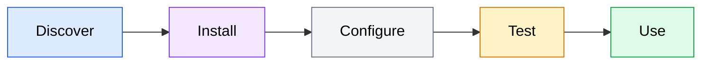

Before building your own skills, start with what already exists. The AI coding agent ecosystem includes a growing collection of pre-built skills that cover common development workflows. This section covers how to find skills, install them, configure them for your project, and customize them when they do not quite fit your needs.

## Discovering skills

The process of finding, installing, and using skills follows a predictable flow regardless of which agent you use.



*Flowchart showing the skill adoption flow: Discover a skill from built-in sources, community registries, or team libraries, then Install it into your agent's skills directory, Configure it for your project conventions, Test it on a temporary branch, and Use it in your daily workflow.*

Skills are distributed in several ways depending on the agent you use and the community around it.

### Built-in skills

Some AI coding agents ship with built-in skills that are available immediately after installation. These typically cover common workflows like:

- Project initialization and scaffolding
- Code generation from templates
- Test generation for existing code
- Documentation generation
- Git workflow automation (commit messages, changelogs, PR descriptions)

Check your agent's documentation for a list of built-in skills. In OpenCode, you can list available skills by looking at the `/` command menu or checking the skills directory in your agent configuration:

```bash
# List skills available in your OpenCode configuration
ls ~/.config/opencode/skills/
```

### Community skill registries

Agent skill communities publish skills through package registries, GitHub repositories, and curated directories. When evaluating a community skill, consider:

- **Maintenance status.** Is the skill actively maintained? When was it last updated?
- **Documentation quality.** Does the `SKILL.md` clearly describe triggers, inputs, outputs, and constraints? Poorly documented skills are unreliable.
- **Compatibility.** Is the skill designed for your agent (OpenCode, Codex, or agent-agnostic)?
- **Scope.** Does the skill do one thing well, or does it try to do too much? Skills that attempt to handle every edge case tend to be fragile.

### Team and organization skills

Many teams maintain internal skill libraries tailored to their specific stack, conventions, and workflows. These are often the most valuable skills because they encode hard-won knowledge about how things should be done in your specific codebase.

Internal skill libraries are typically stored in:

- A shared repository (e.g., `team-skills/` or `dev-tools/`)
- A directory within each project (e.g., `skills/` or `.agent/skills/`)
- A centralized configuration directory (e.g., `~/.config/opencode/skills/`)

## Installing skills

The installation process depends on your agent and how the skill is distributed.

### File-based installation

The simplest approach is copying skill files into your agent's skills directory. Most agents look for skills in one or more standard locations:

```bash
# Project-level skills (available only in this project)
cp -r path/to/downloaded-skill/ ./skills/

# User-level skills (available across all projects)
cp -r path/to/downloaded-skill/ ~/.config/opencode/skills/
```

After copying the files, verify the skill is recognized:

```bash
# Check that the skill directory contains SKILL.md
ls ./skills/downloaded-skill/
```

Expected output:

```text
SKILL.md    templates/    examples/
```

### Repository-based installation

Some skill collections are distributed as Git repositories. Clone the repository and symlink or copy the skills you need:

```bash
# Clone a skill collection
git clone https://github.com/example/agent-skills.git ~/agent-skills

# Symlink specific skills into your project
ln -s ~/agent-skills/generate-migration ./skills/generate-migration
ln -s ~/agent-skills/scaffold-component ./skills/scaffold-component
```

Symlinks keep your project's skill references up to date when the source repository is updated.

### Package manager installation

Some agent ecosystems provide package managers for skills. If your agent supports this, the installation is typically a single command:

```bash
# Example: installing a skill via a hypothetical agent package manager
opencode skill install @team/generate-api-endpoint
```

Check your agent's documentation for the specific installation mechanism it supports.

## Configuring skills

After installation, many skills work immediately. Others require configuration to match your project's specific conventions.

### Project-specific configuration

Skills that reference file paths, naming conventions, or tools may need adjustment for your project. The most common configuration approach is editing the skill's `SKILL.md` to match your project:

```diff
## Instructions

- 1. Create a new file at `src/routes/{resource}.routes.ts`
+ 1. Create a new file at `app/api/{resource}/route.ts`

- 6. Run `npm test` to verify tests pass
+ 6. Run `pnpm test` to verify tests pass
```

When you modify a skill, keep the changes minimal and focused on project-specific differences. Avoid rewriting the skill's core logic unless it fundamentally does not match your workflow.

### Environment-specific configuration

Some skills reference environment-specific values like database names, API endpoints, or tool paths. These should be configured through environment variables or a configuration file rather than hard-coded in the skill:

```markdown
## Inputs

- `db_name` (optional): Database name. Defaults to the value of `$DATABASE_NAME`
  environment variable, or "development" if not set.
```

## Customizing skills

When an existing skill is close to what you need but not quite right, you have three options for customization.

### Fork and modify

Copy the skill into your project's skills directory and modify it. This is the simplest approach and gives you full control:

```bash
# Copy the skill to your project
cp -r ~/.config/opencode/skills/generate-migration ./skills/generate-migration

# Edit the SKILL.md to match your conventions
# (your editor here)
```

The downside of forking is that you no longer receive updates from the original skill. If the upstream skill improves, you need to manually merge those changes.

### Wrap with a project skill

Create a thin project-level skill that invokes the original skill with your project-specific configuration. This approach preserves the original skill while adding your customizations:

```markdown
# Generate Project Migration

Create a database migration following our project conventions.
Wraps the standard generate-migration skill with project-specific settings.

## Trigger

Invoke this skill when the user asks to create a database migration.

## Instructions

1. Invoke the `generate-migration` skill with these overrides:
   - Use the `migrations/` directory (not `db/migrations/`)
   - Use TypeScript migration format (not raw SQL)
   - Include a migration test file in `migrations/__tests__/`
2. After the migration is created, update `migrations/index.ts` to export the new migration
```

### Extend with constraints

If the original skill is mostly correct but missing some guardrails, add a constraints file or extend the skill's constraints section:

```markdown
## Constraints

(In addition to the base skill constraints)
- All migrations must be reversible (include both up and down)
- Column additions must include a default value for existing rows
- Table drops must be preceded by a data migration skill
```

## Verifying skill behavior

After installing or customizing a skill, verify that it produces the expected output before relying on it in your workflow.

### Manual verification

Invoke the skill on a test case and inspect the output:

1. Create a temporary branch for testing: `git checkout -b test/skill-verification`
2. Invoke the skill with representative inputs
3. Review the generated files for correctness
4. Run your project's test suite to confirm nothing is broken
5. Delete the branch: `git checkout main && git branch -D test/skill-verification`

### Check against project conventions

Compare the skill's output against existing files in your codebase. The generated code should be indistinguishable from hand-written code in terms of:

- File naming and directory placement
- Code style and formatting
- Import ordering and module structure
- Error handling patterns
- Test structure and assertion style

If the skill's output does not match your project's conventions, go back and customize the skill until it does. The goal is that a code reviewer should not be able to tell whether code was generated by a skill or written by a developer.
