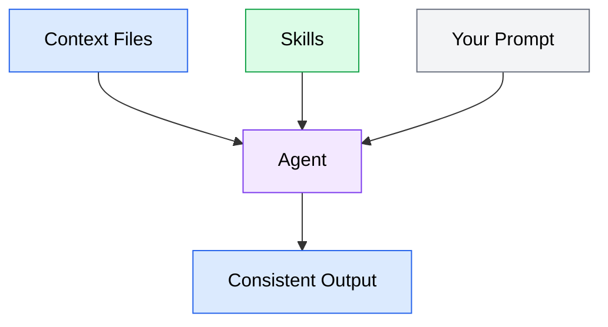

A skill is a reusable, self-contained capability module that teaches an AI coding agent how to perform a specific workflow. When you install a skill, you are giving your agent a new ability it can invoke on demand -- like adding a new tool to a toolbox.

Skills solve a problem that prompts and context files alone cannot: **consistent, repeatable execution of multi-step workflows.** A context file tells the agent about your project's conventions. A prompt tells the agent what to do right now. A skill tells the agent *how* to perform a specific kind of task, every time, the same way.

## The problem skills solve

Consider a common development workflow: generating a new API endpoint. Every time you ask your agent to create one, you write a prompt that includes:

- The route path and HTTP method
- Which authentication middleware to use
- Your project's error handling pattern
- The validation library and how to define schemas
- The test file structure and which test runner to use
- The naming conventions for files and functions

That prompt might be 30-40 lines long. You write a similar one next week for a different endpoint, and again the week after that. Some details slip through -- you forget to mention the error handling pattern one time, the agent uses a different validation approach, and now your codebase is inconsistent.

A skill encodes all of these instructions once:

```markdown
# Generate API Endpoint

Create a new REST API endpoint following project conventions.

## Inputs
- `route`: The URL path (e.g., `/api/users/:id`)
- `method`: HTTP method (GET, POST, PUT, DELETE)
- `description`: What the endpoint does

## Instructions

1. Create the route handler in `src/routes/` following the naming pattern `{resource}.routes.ts`
2. Use the `authMiddleware` from `src/middleware/auth.ts` for all non-public routes
3. Define request validation using Zod schemas in a co-located `{resource}.schema.ts` file
4. Implement error handling using the `AppError` class from `src/lib/errors.ts`
5. Create a test file at `src/routes/__tests__/{resource}.routes.test.ts`
6. Use the test helpers from `src/test/helpers.ts` for request mocking
```

Now, instead of rewriting that prompt every time, you invoke the skill:

```text
/generate-api-endpoint route=/api/orders method=POST description="Create a new order"
```

The agent receives the full set of instructions from the skill, fills in the specific details from your inputs, and executes the workflow consistently.

## How skills differ from prompts

A prompt is a one-time instruction you write in a conversation. A skill is a persistent, named capability the agent can discover and invoke.

| | Prompt | Skill |
|---|---|---|
| **Persistence** | Exists only in the current conversation | Stored as files on disk, available across sessions |
| **Discoverability** | The agent does not know about it until you type it | The agent can list available skills and read their descriptions |
| **Structure** | Freeform text | Defined format with manifest, triggers, inputs, outputs |
| **Consistency** | Varies each time you write it | Same instructions every invocation |
| **Shareability** | Copy-paste between conversations | Share as files across projects and teams |
| **Composability** | Standalone | Can reference other skills, templates, and supporting files |

The key insight is that skills sit at a different layer than prompts. A prompt says "do this specific thing right now." A skill says "here is how to do this category of thing, whenever you need to."

## How skills differ from context files

Context files (like `CLAUDE.md` or `AGENTS.md`) and skills serve complementary but distinct purposes:

- **Context files** describe your project: its architecture, conventions, stack, and patterns. They provide background knowledge the agent uses when reasoning about any task.
- **Skills** describe workflows: step-by-step procedures for accomplishing specific types of tasks. They provide instructions the agent follows when performing a particular action.

Think of it this way: a context file is like a team handbook that every new hire reads. A skill is like a standard operating procedure for a specific task. You need both -- the handbook so people understand the project, and the procedures so they execute tasks consistently.



*Diagram showing how context files, skills, and prompts all feed into the agent to produce consistent output. Context provides project knowledge, skills provide workflow instructions, and prompts provide the specific task.*

## How skills differ from MCP servers

Skills and MCP (Model Context Protocol) servers both extend an agent's capabilities, but they operate at different levels:

- **Skills** are instruction-based. They teach the agent *how* to perform a workflow using its existing tools (file reading, file writing, shell commands). A skill does not give the agent new tools -- it gives the agent a recipe for using its existing tools effectively.
- **MCP servers** are tool-based. They give the agent *new tools* it did not have before -- access to databases, external APIs, issue trackers, or other services. An MCP server provides capabilities the agent physically cannot access without it.

A practical example: a "deploy to staging" skill might instruct the agent to run a series of shell commands in the right order. A deployment MCP server might give the agent a `deploy()` tool that talks directly to your infrastructure API. The skill uses existing tools (shell commands); the MCP server provides a new tool.

Module 6 covers MCP servers in depth. For now, remember that skills and MCP servers are complementary: you might create a skill that uses MCP tools as part of its workflow.

| | Skill | MCP server |
|---|---|---|
| **What it provides** | Workflow instructions | New tools and data sources |
| **How it works** | Agent follows instructions using existing tools | Agent calls new tool functions |
| **Requires** | Markdown files | Running server process |
| **Scope** | Specific workflow or procedure | General-purpose capability |
| **Example** | "How to generate a migration file" | "Access to the database schema" |

## When to use skills

Skills are most valuable when you have a workflow that is:

1. **Repeatable.** You do it more than once. A one-off task is better handled with a direct prompt.
2. **Multi-step.** It involves several coordinated actions. A single-step task (like "format this file") does not benefit much from being a skill.
3. **Convention-dependent.** Getting it right requires knowing project-specific patterns. Skills encode those patterns so they are followed consistently.
4. **Delegatable.** The workflow can be fully described in written instructions. If it requires judgment calls that change every time, a skill may be too rigid.

Common examples of good skill candidates:

- Scaffolding new components, modules, or features following project conventions
- Running a release workflow (version bump, changelog, tag, publish)
- Setting up a new microservice with standard boilerplate
- Generating database migrations from schema changes
- Creating documentation from code (API docs, architecture diagrams)
- Running a code review checklist against a pull request

Workflows that are poor skill candidates:

- Debugging a production issue (too context-dependent)
- Designing a new system architecture (requires too much judgment)
- Writing a one-off script you will never use again (not repeatable)
