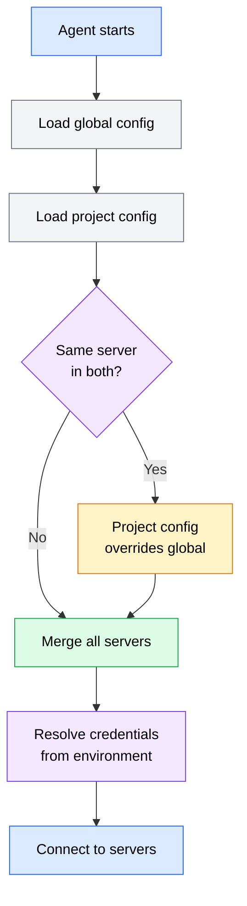

Once you have identified an MCP server to use, you need to configure your agent to connect to it. Configuration tells the agent where to find the server, how to launch or connect to it, and what credentials to provide. Both OpenCode and Codex support MCP servers, but their configuration formats and file locations differ.

## Configuration concepts

Regardless of which agent you use, MCP server configuration answers four questions:

1. **Which server?** A name that identifies the server in your configuration.
2. **How to connect?** The transport mechanism -- launching a local process (stdio) or connecting to a remote URL (HTTP).
3. **What arguments?** Command-line arguments or parameters the server needs at startup.
4. **What credentials?** API keys, tokens, or other authentication the server requires to access external services.



*Flowchart showing the MCP configuration loading flow: the agent loads global configuration first, then project-level configuration. When both define the same server, the project-level config takes precedence. All servers are merged, credentials are resolved from environment variables, and the agent connects.*

## OpenCode configuration

OpenCode reads MCP server configuration from JSON files. The configuration uses a `mcpServers` object where each key is a server name and the value describes how to connect.

### Configuration file locations

OpenCode checks multiple locations for MCP configuration, in order of precedence:

**Project-level** -- `.opencode/mcp.json` in your project root. Servers configured here are available only when working in this project.

```json
{
  "mcpServers": {
    "postgres": {
      "command": "npx",
      "args": ["-y", "@modelcontextprotocol/server-postgres", "postgresql://localhost:5432/myapp"]
    }
  }
}
```

**User-level** -- `~/.config/opencode/mcp.json` (or the equivalent XDG config path). Servers configured here are available in all projects.

```json
{
  "mcpServers": {
    "brave-search": {
      "command": "npx",
      "args": ["-y", "@modelcontextprotocol/server-brave-search"],
      "env": {
        "BRAVE_API_KEY": "${BRAVE_API_KEY}"
      }
    }
  }
}
```

When the same server name appears in both project-level and user-level configuration, the project-level configuration takes precedence. This lets you override global settings for specific projects.

### Stdio server configuration

Most local MCP servers use stdio transport. You specify the command to run and any arguments:

```json
{
  "mcpServers": {
    "filesystem": {
      "command": "npx",
      "args": ["-y", "@modelcontextprotocol/server-filesystem", "/home/user/projects"],
      "env": {
        "NODE_ENV": "development"
      }
    }
  }
}
```

| Field | Required | Description |
|-------|----------|-------------|
| `command` | Yes | The executable to run (e.g., `npx`, `uvx`, `node`, `python`) |
| `args` | No | Array of command-line arguments passed to the command |
| `env` | No | Environment variables set when launching the server process |

The `env` field supports environment variable interpolation using `${VAR_NAME}` syntax. This lets you reference credentials stored in your shell environment without hard-coding them in configuration files.

### HTTP server configuration

For remote servers, specify the URL and any required headers:

```json
{
  "mcpServers": {
    "remote-docs": {
      "url": "https://mcp.example.com/v1",
      "headers": {
        "Authorization": "Bearer ${API_TOKEN}"
      }
    }
  }
}
```

| Field | Required | Description |
|-------|----------|-------------|
| `url` | Yes | The HTTP(S) endpoint for the MCP server |
| `headers` | No | HTTP headers sent with every request (commonly used for authentication) |

## Codex configuration

Codex reads MCP server configuration from its own configuration format. Because Codex runs tasks in cloud sandboxes, MCP server setup has some differences from terminal-based agents like OpenCode.

### Configuration file locations

**Project-level** -- `codex.json` or `.codex/mcp.json` in your repository root. These servers are available for tasks run against this repository.

```json
{
  "mcpServers": {
    "context7": {
      "command": "npx",
      "args": ["-y", "@upstash/context7-mcp"]
    }
  }
}
```

**Organization-level** -- Configured through the Codex dashboard. These servers are available across all repositories in your organization.

### Cloud execution considerations

Codex runs tasks in sandboxed cloud environments, which affects MCP server configuration:

- **Stdio servers** are installed and run inside the sandbox. The server must be installable via npm, pip, or another package manager available in the sandbox environment.
- **Remote servers** work the same as with terminal-based agents, since the sandbox has network access to make HTTP requests.
- **Local-only servers** (those that need access to local hardware or services running on your machine) cannot be used with Codex. The sandbox does not have access to your local network.

:::caution
Codex's cloud sandbox means servers that depend on local resources (local databases, local file paths, hardware devices) will not work. Use remote/hosted alternatives when working with Codex.
:::

### Codex credential management

Codex handles credentials through its dashboard rather than local environment variables:

1. Navigate to your organization's settings in the Codex dashboard
2. Add secrets under the MCP configuration section
3. Reference secrets in your configuration using the dashboard's secret reference syntax

This approach keeps credentials out of your repository and manages them centrally for the team.

## Authentication and credential management

MCP servers frequently need credentials to access external services. How you manage those credentials affects both security and usability.

### Environment variables

The recommended approach for terminal-based agents is storing credentials as environment variables and referencing them in configuration:

```bash
# Add to your shell profile (~/.zshrc, ~/.bashrc, etc.)
export GITHUB_TOKEN="ghp_your_token_here"
export BRAVE_API_KEY="your_brave_api_key"
```

Then reference them in MCP configuration:

```json
{
  "mcpServers": {
    "github": {
      "command": "npx",
      "args": ["-y", "@modelcontextprotocol/server-github"],
      "env": {
        "GITHUB_PERSONAL_ACCESS_TOKEN": "${GITHUB_TOKEN}"
      }
    }
  }
}
```

**Advantages**: Credentials stay out of configuration files, are not committed to version control, and can be rotated without changing configuration.

**Disadvantages**: Requires managing shell profile variables, variables are visible to any process running as your user.

### Secret managers

For teams or security-sensitive environments, use a secret manager:

```bash
# Fetch credentials from a secret manager at shell startup
export GITHUB_TOKEN=$(op read "op://Development/GitHub Token/credential")  # 1Password CLI
export GITHUB_TOKEN=$(aws secretsmanager get-secret-value --secret-id github-token --query SecretString --output text)  # AWS
```

This keeps credentials encrypted at rest and provides audit trails for access.

### What not to do

:::caution
Never store credentials in places where they might be committed to version control or shared unintentionally:

- Do not put API keys directly in MCP configuration files that are committed to git
- Do not store tokens in context files (CLAUDE.md, AGENTS.md)
- Do not hard-code credentials in MCP server startup scripts
- Do not paste credentials into agent prompts

If a credential is accidentally committed, rotate it immediately -- removing it from git history is not sufficient since it may have been cached or cloned.
:::

## Per-project vs. global configuration

Choosing where to configure each server depends on how broadly it is used and what it accesses.

### When to use project-level configuration

Configure a server at the project level when:

- The server accesses project-specific resources (a database used only by this project)
- The server needs project-specific arguments (file paths, schema names)
- You want to version-control the configuration so team members get the same setup
- The server is only useful in the context of this specific project

```text
my-project/
  .opencode/
    mcp.json          # Project-specific servers
  src/
  package.json
```

### When to use global configuration

Configure a server globally when:

- The server provides general-purpose capabilities (web search, documentation lookup)
- You use it across many projects
- The configuration does not change between projects
- The credentials are personal (your own API keys, not shared team credentials)

### Combining both levels

A typical developer setup combines global and project-level configuration:

**Global** (`~/.config/opencode/mcp.json`):
```json
{
  "mcpServers": {
    "brave-search": {
      "command": "npx",
      "args": ["-y", "@modelcontextprotocol/server-brave-search"],
      "env": {
        "BRAVE_API_KEY": "${BRAVE_API_KEY}"
      }
    },
    "context7": {
      "command": "npx",
      "args": ["-y", "@upstash/context7-mcp"]
    }
  }
}
```

**Project** (`.opencode/mcp.json`):
```json
{
  "mcpServers": {
    "postgres": {
      "command": "npx",
      "args": ["-y", "@modelcontextprotocol/server-postgres", "postgresql://localhost:5432/myapp"]
    },
    "github": {
      "command": "npx",
      "args": ["-y", "@modelcontextprotocol/server-github"],
      "env": {
        "GITHUB_PERSONAL_ACCESS_TOKEN": "${GITHUB_TOKEN}"
      }
    }
  }
}
```

In this setup, every project gets web search and documentation lookup. The `myapp` project additionally gets database access and GitHub integration.

### Version control considerations

**Project-level configuration should be committed** to version control so team members share the same server setup. However, ensure credentials are referenced via environment variables, not hard-coded.

Add your project-level MCP configuration to git:

```bash
git add .opencode/mcp.json
git commit -m "feat: add MCP server configuration for database and GitHub"
```

**Global configuration should not be committed** -- it lives in your user config directory and is specific to your machine and credentials.

If your project-level configuration references environment variables that team members need to set, document them in your project's README or context file:

```markdown
## Required environment variables

The following environment variables are needed for MCP server access:

- `GITHUB_TOKEN` -- Personal access token with `repo` and `issues` scopes
- `DATABASE_URL` -- PostgreSQL connection string (default: `postgresql://localhost:5432/myapp`)
```
