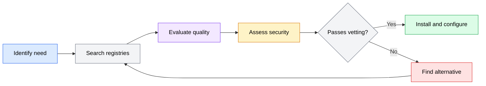
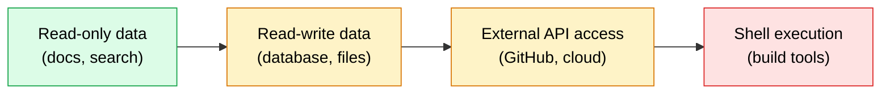

The MCP ecosystem is growing rapidly, with servers available for databases, cloud services, documentation systems, issue trackers, and dozens of other tools. Before you install a server, you need to find the right one for your use case and assess whether it is worth trusting with access to your development environment.

## Where to find MCP servers

MCP servers are published across several registries and repositories. No single registry is authoritative, so you may need to check multiple sources.

### Official and curated registries

**MCP Server Registry (mcp.so)** -- A community-maintained catalog of MCP servers with descriptions, categories, and links to source repositories. This is a good starting point for discovering what is available.

**Awesome MCP Servers** -- A curated list on GitHub that categorizes servers by function (databases, web, file systems, developer tools, etc.). Entries are community-contributed and reviewed through pull requests.

**npm / PyPI** -- Many MCP servers are published as npm packages (prefixed with `@modelcontextprotocol/` for official ones) or Python packages. Searching these registries with "mcp server" or "mcp-server" turns up both official and community servers.

### Agent vendor directories

Both OpenCode and Codex maintain lists of tested MCP servers in their documentation. These are servers the agent developers have verified work correctly with their tools. Starting with vendor-recommended servers reduces the risk of compatibility issues.

### Source repositories

Many MCP servers live in GitHub repositories. The official `modelcontextprotocol` GitHub organization maintains reference implementations. Community servers are scattered across individual repositories.

When evaluating a server found in a repository rather than a registry, look for:
- A clear README with setup instructions
- Published package on npm or PyPI (rather than requiring you to clone and build)
- Open issues and recent commits indicating active maintenance

## The discovery and evaluation process

Finding and vetting an MCP server follows a consistent process from identifying a need to installing a trusted server:

*Flowchart showing the MCP server discovery process: identify your need, search registries for candidates, evaluate code quality and maintenance status, assess security posture, and either install the server or loop back to find an alternative if it fails vetting.*

## Evaluating server quality

Not all MCP servers are production-ready. Before installing a server, assess it across four dimensions: functionality, code quality, maintenance, and documentation.

### Functionality assessment

Start by verifying the server actually does what you need:

- **Read the tool list.** Check what tools and resources the server exposes. A "GitHub server" might only support issue creation, not pull request management. Make sure the specific capabilities you need are implemented.
- **Check input schemas.** Well-defined input schemas with descriptions, required fields, and type constraints indicate a thoughtfully designed server. Vague schemas (everything is an optional string) suggest a rushed implementation.
- **Look for error handling.** Does the server return clear error messages when a tool call fails? Or does it crash silently? Check the source code for try/catch blocks and error response formatting.

### Code quality indicators

| Indicator | Good sign | Warning sign |
|-----------|-----------|--------------|
| Dependencies | Few, well-known libraries | Many dependencies or unmaintained packages |
| Type safety | TypeScript or typed Python | Untyped JavaScript with no validation |
| Input validation | Validates all inputs against schema | Passes raw input to external APIs |
| Error handling | Structured error responses | Uncaught exceptions, generic errors |
| Test coverage | Tests for core tools | No tests |

### Maintenance status

An unmaintained server is a liability. Check these signals:

- **Last commit date.** A server that has not been updated in 6+ months may have compatibility issues with current MCP protocol versions.
- **Open issues.** A healthy project has a mix of open and closed issues. All issues open with no responses suggests the maintainer has moved on.
- **Release frequency.** Regular releases (even if infrequent) indicate active maintenance. A single v0.1.0 release from a year ago is concerning.
- **Protocol version.** MCP is evolving. Verify the server supports the current protocol version used by your agent.

### Documentation quality

Good documentation is a proxy for overall quality:

- **Installation instructions** that actually work
- **Configuration examples** showing all required and optional settings
- **Tool descriptions** explaining what each tool does and what inputs it expects
- **Security notes** documenting what access the server requires and why

## Evaluating security posture

Every MCP server you install gets access to some part of your environment. Evaluating security posture before installation is essential.

### Permission scope analysis

Before installing a server, understand what access it requires:

**File system access.** Does the server need to read or write files? If so, which directories? A documentation server should only need read access. A scaffolding server might need write access to specific directories.

**Network access.** Does the server connect to external services? If so, which ones? A GitHub server needs to reach the GitHub API. A local database server should not need any network access.

**Credential access.** Does the server require API keys, tokens, or other credentials? Where are those credentials stored? Are they passed as environment variables or embedded in configuration?

**Shell execution.** Does the server run shell commands? This is the highest-risk permission. A server that executes arbitrary shell commands effectively has full access to your system.

### Red flags

Be cautious with servers that exhibit these characteristics:

- **Request broad permissions they should not need.** A documentation lookup server should not need file write access.
- **Embed credentials in source code.** API keys and tokens should be loaded from environment variables, not hard-coded.
- **Execute shell commands as a core feature.** Unless the server's explicit purpose is shell execution (like a build tool server), this is a warning sign.
- **Have no source code available.** Closed-source MCP servers mean you cannot audit what they do with your data and credentials.
- **Require running as root or with elevated privileges.** No MCP server should need administrative access.

### The trust spectrum

Not all servers require the same level of trust:

*Diagram showing the trust spectrum for MCP servers, from lowest risk (read-only data access) to highest risk (shell execution). Each step to the right requires more careful evaluation.*

**Low risk**: Servers that only read data -- documentation lookup, web search, read-only database access. These can leak information but cannot modify your environment.

**Medium risk**: Servers that read and write data -- file system access, database mutations, issue tracker updates. These can modify your environment if they malfunction or are compromised.

**High risk**: Servers that access external APIs with your credentials -- GitHub, cloud providers, deployment services. These can perform actions on your behalf that may be difficult to undo.

**Highest risk**: Servers that execute shell commands. These effectively have the same access as your user account.

### Vetting process

A practical vetting process before installing any server:

1. **Read the source code.** At minimum, skim the main server file to understand what tools are exposed and what they do.
2. **Check permissions.** Map out what access the server needs (files, network, credentials, shell).
3. **Verify the publisher.** Is the server from the official MCP organization, a well-known company, or an individual? Official servers have been reviewed. Individual servers require more scrutiny.
4. **Search for known issues.** Check the repository's issues and any security advisories.
5. **Test in isolation.** Install the server in a sandbox project before adding it to your main development environment.

:::tip
When in doubt, start with servers from the official `modelcontextprotocol` organization or from your agent's recommended list. These have been tested for compatibility and reviewed for basic security practices.
:::
