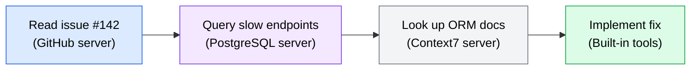

Understanding MCP architecture and configuration is the foundation. This section covers what you actually do with MCP servers in daily development: which servers are most useful, how to chain tools across servers for complex workflows, how to debug problems when things go wrong, and hands-on exercises to build your own MCP-powered workflow.

## Common development workflow servers

The MCP ecosystem includes servers for nearly every development tool. These are the categories most developers find useful first.

### Documentation and search

Documentation servers give your agent access to up-to-date library and framework documentation without relying on training data that may be outdated.

**Context7** -- Resolves library names to their documentation and provides query-based lookup. When you ask your agent to implement something using an external library, the agent can check the latest API before writing code.

```json
{
  "mcpServers": {
    "context7": {
      "command": "npx",
      "args": ["-y", "@upstash/context7-mcp"]
    }
  }
}
```

Typical workflow: "Add pagination to the user list endpoint using the prisma library" -- the agent looks up Prisma's current pagination API through Context7 before generating code.

**Brave Search** -- Provides web search capabilities. Useful when the agent needs to find information not available in documentation servers, like troubleshooting error messages or researching unfamiliar tools.

```json
{
  "mcpServers": {
    "brave-search": {
      "command": "npx",
      "args": ["-y", "@modelcontextprotocol/server-brave-search"],
      "env": {
        "BRAVE_API_KEY": "${BRAVE_API_KEY}"
      }
    }
  }
}
```

### Source control and project management

These servers connect your agent to the platforms where your team manages code and tracks work.

**GitHub** -- Create issues, read pull requests, manage labels, search code across repositories. The agent can file bugs it discovers, check existing issues before creating duplicates, and read PR comments for context.

```json
{
  "mcpServers": {
    "github": {
      "command": "npx",
      "args": ["-y", "@modelcontextprotocol/server-github"],
      "env": {
        "GITHUB_PERSONAL_ACCESS_TOKEN": "${GITHUB_TOKEN}"
      }
    }
  }
}
```

**Linear / Jira** -- Read and update project issues. The agent can check what is assigned, update status, and link code changes to tickets.

### Database access

Database servers let the agent query and understand your data layer without you having to copy-paste schema definitions or query results into prompts.

**PostgreSQL** -- Execute queries, inspect schemas, and understand table relationships.

```json
{
  "mcpServers": {
    "postgres": {
      "command": "npx",
      "args": ["-y", "@modelcontextprotocol/server-postgres", "${DATABASE_URL}"]
    }
  }
}
```

:::caution
Database MCP servers typically provide full query capabilities. If you connect to a production database, the agent can execute any query your connection string allows -- including writes and deletes. Use read-only connection strings or connect to development databases only.
:::

### File system and filesystem tools

The official filesystem server provides controlled access to directories outside your project:

```json
{
  "mcpServers": {
    "filesystem": {
      "command": "npx",
      "args": ["-y", "@modelcontextprotocol/server-filesystem", "/home/user/shared-configs"]
    }
  }
}
```

This is useful when your agent needs access to configuration files, shared templates, or reference projects in other directories.

## Chaining tools across servers

The real power of MCP emerges when you use multiple servers together. The agent can combine tools from different servers within a single workflow, each server contributing its piece.

### Example: bug investigation workflow

You ask the agent: "Investigate the performance regression reported in issue #142 and propose a fix."

The agent might chain tools across three servers:



*Diagram showing a multi-server workflow: the agent reads an issue from GitHub, queries the database for slow queries, looks up ORM documentation, and implements a fix using built-in file editing tools.*

1. **GitHub server**: Read issue #142 to understand the reported problem and any reproduction steps.
2. **PostgreSQL server**: Query the database to check for missing indexes or slow queries related to the reported endpoint.
3. **Context7 server**: Look up the ORM's documentation for query optimization techniques.
4. **Built-in tools**: Edit the code to add the missing index and optimize the query.

No single server could handle this workflow alone. The agent assembles the pieces by selecting the right tool from the right server at each step.

### Example: documentation-driven development

You ask the agent: "Create a webhook handler for Stripe checkout events using their latest API."

1. **Context7 server**: Look up Stripe's current webhook API, event types, and signature verification approach.
2. **Built-in tools**: Generate the handler code based on the documentation.
3. **GitHub server**: Check if there is an existing webhook handler in the codebase to follow its patterns.
4. **Built-in tools**: Write tests following the existing test patterns.

### Tips for effective chaining

- **Describe the outcome, not the tools.** Say "investigate the bug" rather than "use the GitHub tool to read the issue, then use the database tool to query." The agent selects the appropriate tools based on the task description.
- **Keep multiple relevant servers connected.** The agent cannot chain tools from servers it does not have access to. If your workflow involves documentation, source control, and databases, have all three configured.
- **Watch for circular dependencies.** If the agent enters a loop (reading a resource, then reading it again because the result was not what it expected), interrupt and provide more specific direction.

## Debugging MCP connections

MCP servers can fail in several ways: they may not start, not respond, return errors, or produce unexpected results. Here is how to diagnose and fix common problems.

### Server fails to start

**Symptom**: The agent reports it cannot connect to a server, or the server is not listed in available tools.

**Diagnosis steps**:

1. Run the server command manually in your terminal to check for startup errors:

   ```bash
   npx -y @modelcontextprotocol/server-filesystem /path/to/dir
   ```

   If the command fails, the issue is with the server installation or arguments, not with MCP.

2. Check that the command is installed and available:

   ```bash
   which npx  # or which uvx, which node, etc.
   ```

3. Verify the arguments are correct. A common mistake is providing a path that does not exist or a database URL that is not reachable.

### Server starts but tools are not available

**Symptom**: The server appears to connect, but the agent does not list the expected tools.

**Diagnosis steps**:

1. Check the server's documentation for the correct protocol version. Your agent may expect a newer protocol version than the server supports.
2. Verify your configuration file syntax. A missing comma or bracket in JSON configuration silently prevents the server from loading.

   ```bash
   # Validate JSON syntax
   cat .opencode/mcp.json | python3 -m json.tool
   ```

3. Check if the server requires specific environment variables to be set. Some servers expose different tools depending on their configuration.

### Tool calls return errors

**Symptom**: The agent tries to use a tool but gets an error response.

**Common causes**:

- **Missing credentials.** The server needs an API key or token that is not set. Check that environment variables referenced in your configuration are actually defined in your shell.

  ```bash
  echo $GITHUB_TOKEN  # Should print your token, not empty
  ```

- **Incorrect permissions.** The credential you provided may not have the required scopes. A GitHub token needs `repo` scope for repository operations and `issues` scope for issue management.

- **Network issues.** Remote servers require network access. If you are behind a firewall or VPN, the server may not be able to reach its backing service.

- **Rate limiting.** External APIs enforce rate limits. If the agent makes many tool calls in quick succession, the backing API may start rejecting requests.

### Server behaves unexpectedly

**Symptom**: The server connects and responds, but results are wrong, incomplete, or nonsensical.

**Diagnosis steps**:

1. **Check the server version.** You may be running an outdated version with known bugs. Update to the latest version:

   ```bash
   # For npx-based servers, clear the cache and reinstall
   npx -y @modelcontextprotocol/server-github@latest
   ```

2. **Test the tool manually.** If possible, call the tool's underlying API directly to verify the expected result:

   ```bash
   # If the GitHub server's search is returning wrong results, try the API directly
   curl -H "Authorization: token $GITHUB_TOKEN" "https://api.github.com/search/issues?q=repo:owner/repo+is:open"
   ```

3. **Check the server's issues.** The problem may be a known bug with a workaround.

### When an MCP server misbehaves

If a server is causing problems and you cannot resolve them:

1. **Disable it temporarily.** Remove or comment out the server from your MCP configuration. Your agent will continue working with its built-in tools and any remaining servers.
2. **Report the issue.** File an issue in the server's repository with reproduction steps, your configuration (with credentials redacted), and the error output.
3. **Find an alternative.** Check the MCP registries for another server that provides similar functionality.
4. **Fall back to built-in tools.** Many tasks that MCP servers simplify can also be accomplished with shell commands. If the database server is down, the agent can use `psql` directly via shell.

## Practical exercises

### Exercise: Set up your first MCP server

**Objective**: Configure a documentation lookup MCP server and verify your agent can use it.

**Prerequisites**: An installed AI coding agent (OpenCode or Codex) and Node.js with npm available.

**Steps**:

1. Create the MCP configuration file for your agent:

   For OpenCode, create `.opencode/mcp.json` in a project directory:
   ```json
   {
     "mcpServers": {
       "context7": {
         "command": "npx",
         "args": ["-y", "@upstash/context7-mcp"]
       }
     }
   }
   ```

   For Codex, create the equivalent configuration in your repository's `codex.json`.

2. Start your agent in the project directory.

3. Ask your agent to list its available tools. You should see tools from the Context7 server (like `resolve-library-id` and `query-docs`).

4. Ask your agent: "Look up the latest documentation for the Express.js middleware API using Context7."

5. Verify the agent uses the MCP tools to fetch documentation rather than relying on its training data.

**Verification**: The agent should invoke the Context7 tools and return current documentation content. You should see tool invocations in the agent's output showing it called the MCP server.

**Stretch goal**: Add a second server (Brave Search) to your configuration and ask the agent a question that requires combining documentation lookup with web search, such as: "What is the recommended way to handle CORS in Express 5? Check both the official docs and recent community discussions."

### Exercise: Chain multiple MCP servers

**Objective**: Configure two or more MCP servers and use them together in a single workflow.

**Prerequisites**: An installed AI coding agent, Node.js, and a GitHub account with a personal access token that has `repo` scope.

**Steps**:

1. Set your GitHub token as an environment variable:
   ```bash
   export GITHUB_TOKEN="ghp_your_token_here"
   ```

2. Configure both the GitHub and Context7 servers in your MCP configuration:
   ```json
   {
     "mcpServers": {
       "github": {
         "command": "npx",
         "args": ["-y", "@modelcontextprotocol/server-github"],
         "env": {
           "GITHUB_PERSONAL_ACCESS_TOKEN": "${GITHUB_TOKEN}"
         }
       },
       "context7": {
         "command": "npx",
         "args": ["-y", "@upstash/context7-mcp"]
       }
     }
   }
   ```

3. Start your agent in the project directory.

4. Ask the agent: "Check the open issues in [your-repo] and for any that mention a specific library, look up the latest documentation for that library."

5. Observe how the agent chains tools from the GitHub server (reading issues) with tools from the Context7 server (looking up documentation).

**Verification**: The agent should use tools from both servers in a single workflow, reading issues from GitHub and fetching documentation from Context7 based on the issue content.

**Stretch goal**: Ask the agent to create a summary issue on GitHub that lists which dependencies mentioned in open issues have breaking API changes in their latest versions, combining issue reading, documentation lookup, and issue creation across servers.
