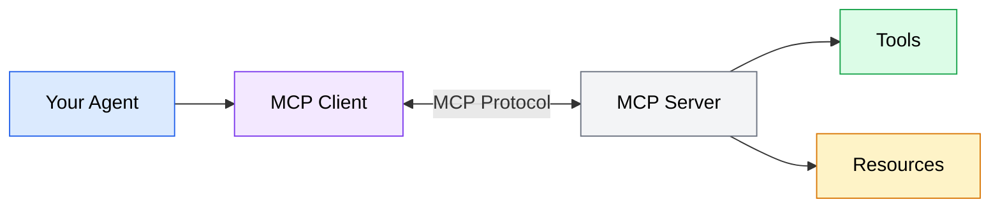

The Model Context Protocol (MCP) is an open standard that defines how AI coding agents communicate with external tools and data sources. It solves a fundamental integration problem: without a standard protocol, every agent-tool combination requires a custom integration. With MCP, any agent that implements the client side of the protocol can use any server that implements the server side -- no custom code needed.

Think of MCP the way you think about HTTP for the web. Before HTTP, every network application used its own protocol. After HTTP, any browser could talk to any web server. MCP does the same thing for AI agents: it standardizes the conversation between an agent and the external capabilities it uses.

## The MCP architecture

MCP follows a client-server architecture with four key concepts: clients, servers, tools, and resources.



*Diagram showing the MCP architecture: your AI coding agent contains an MCP client that communicates with an MCP server over the protocol. The server exposes tools (actions) and resources (data) to the agent.*

### Clients

The MCP client lives inside your AI coding agent. When you configure an MCP server in OpenCode or Codex, the agent's built-in client handles the connection, discovers available tools and resources, and translates the agent's requests into protocol messages.

You do not build or install the client separately -- it is part of the agent. Your role is configuring which servers the client should connect to, which is covered in the [configuration section](/06-mcp-servers/configuration/).

### Servers

An MCP server is a process that exposes tools, resources, or both over the MCP protocol. Servers can be:

- **Local processes** that run on your machine (e.g., a filesystem server, a database client)
- **Remote services** accessed over HTTP/HTTPS (e.g., a cloud API wrapper, a hosted documentation server)
- **Stdio-based** processes that communicate through standard input/output pipes (the most common transport for local servers)

Each server has a specific purpose. A GitHub MCP server provides tools for interacting with repositories, issues, and pull requests. A PostgreSQL MCP server provides tools for querying databases. A documentation MCP server provides resources containing API references and guides.

### Tools

Tools are actions the agent can perform through an MCP server. When an agent calls a tool, the server executes the action and returns a result. Tools are the "verbs" of MCP -- they do things.

Examples of tools:

| Server | Tool | What it does |
|--------|------|-------------|
| GitHub | `create_issue` | Creates a new issue in a repository |
| PostgreSQL | `query` | Executes a SQL query against a database |
| Filesystem | `read_file` | Reads a file from an allowed directory |
| Brave Search | `web_search` | Searches the web and returns results |
| Context7 | `query-docs` | Looks up library documentation |

A tool has a name, a description the agent reads to understand when to use it, and an input schema that defines what parameters it accepts. The agent decides when to use a tool based on the task at hand -- you do not call tools directly. Instead, you describe what you want, and the agent selects the appropriate tools from its available set.

```json
{
  "name": "create_issue",
  "description": "Create a new issue in a GitHub repository",
  "inputSchema": {
    "type": "object",
    "properties": {
      "repo": {
        "type": "string",
        "description": "Repository in owner/repo format"
      },
      "title": {
        "type": "string",
        "description": "Issue title"
      },
      "body": {
        "type": "string",
        "description": "Issue body in markdown"
      }
    },
    "required": ["repo", "title"]
  }
}
```

This is a tool definition the agent reads. It tells the agent what the tool is called, what it does, and what inputs it needs. The agent uses this information to decide when and how to call the tool.

### Resources

Resources are data the agent can read from an MCP server. Unlike tools, resources do not perform actions -- they provide information. Resources are the "nouns" of MCP.

Examples of resources:

| Server | Resource | What it provides |
|--------|----------|-----------------|
| PostgreSQL | `schema://public` | The database schema for the public schema |
| GitHub | `repo://owner/repo/README.md` | The contents of a repository's README |
| Documentation | `docs://react/hooks` | React hooks documentation |

Resources have a URI that identifies them and content that the agent reads. The agent can browse available resources and read the ones relevant to its current task.

The distinction matters because tools and resources serve different purposes in the agent's workflow:

- The agent reads a **resource** to gather information before making a decision
- The agent calls a **tool** to take an action based on that decision

In practice, many servers expose both. A GitHub server might provide resources for reading file contents (data) and tools for creating issues or pull requests (actions).

## How MCP communication works

When your agent interacts with an MCP server, the communication follows a structured sequence:

```mermaid
sequenceDiagram
    participant A as Agent
    participant C as MCP Client
    participant S as MCP Server

    A->>C: "What tools are available?"
    C->>S: initialize
    S-->>C: Server capabilities
    C->>S: tools/list
    S-->>C: Available tools
    C-->>A: Tool descriptions

    A->>C: Call create_issue
    C->>S: tools/call (create_issue)
    S-->>C: Result
    C-->>A: Issue created

    classDef primary fill:#dbeafe,stroke:#2563eb,color:#000
    classDef secondary fill:#f3e8ff,stroke:#7c3aed,color:#000
    classDef neutral fill:#f3f4f6,stroke:#6b7280,color:#000
```

*Sequence diagram showing MCP communication: the agent discovers available tools during initialization, then calls tools as needed during its workflow. Each tool call is a request-response cycle through the MCP client.*

1. **Initialization.** When the agent starts (or when you add a new server), the MCP client connects to the server and asks what capabilities it offers. The server responds with its list of tools and resources.
2. **Discovery.** The agent reads the tool descriptions and resource URIs. This information becomes part of the agent's available action set -- it now knows it can call `create_issue` or read `schema://public`.
3. **Invocation.** During a task, the agent decides it needs to use a tool. It sends a request through the MCP client with the tool name and input parameters. The server executes the action and returns the result.
4. **Result handling.** The agent reads the tool's response and incorporates it into its reasoning. The result might trigger additional tool calls, resource reads, or file edits.

This cycle happens transparently. You tell the agent "create an issue for the bug we just found," and the agent handles the MCP communication behind the scenes.

## Transport mechanisms

MCP servers connect to agents through one of two transport mechanisms:

### Stdio transport

The most common transport for local servers. The agent launches the server as a child process and communicates through standard input (stdin) and standard output (stdout). This is how most development tool servers work.

```json
{
  "mcpServers": {
    "filesystem": {
      "command": "npx",
      "args": ["-y", "@modelcontextprotocol/server-filesystem", "/path/to/allowed/dir"]
    }
  }
}
```

The agent runs `npx -y @modelcontextprotocol/server-filesystem /path/to/allowed/dir` as a subprocess. Messages flow through stdin/stdout in JSON-RPC format.

**Advantages**: No network configuration, works offline, fast communication, easy to set up.

**Disadvantages**: Server must be installed locally, runs with your user's permissions.

### HTTP transport

Used for remote or shared servers. The agent sends HTTP requests to a server URL. This is common for hosted services and team-shared servers.

```json
{
  "mcpServers": {
    "remote-docs": {
      "url": "https://mcp.example.com/docs",
      "headers": {
        "Authorization": "Bearer <your-token>"
      }
    }
  }
}
```

The agent sends MCP messages as HTTP requests to the specified URL.

**Advantages**: No local installation, server can be shared across team members, can leverage cloud infrastructure.

**Disadvantages**: Requires network access, introduces latency, needs authentication management.

## How MCP relates to skills

[Module 5](/05-agent-skills/overview/) introduced skills as reusable workflow instructions. MCP servers and skills are complementary -- they extend your agent's capabilities in different ways:

- **Skills** teach the agent *how* to perform workflows using existing tools. A skill is a set of instructions.
- **MCP servers** give the agent *new tools* it did not have before. An MCP server provides capabilities.

A skill might instruct the agent to "look up the latest documentation for this library, then update the code to match." If the agent has a documentation MCP server connected, it can use the server's tools to perform the documentation lookup. Without the server, the skill's instruction would be impossible to follow.

The most effective setups combine both: MCP servers provide the raw capabilities, and skills orchestrate how those capabilities are used in your specific workflows.

| Layer | What it provides | Example |
|-------|-----------------|---------|
| MCP server | A `query-docs` tool | Context7 documentation server |
| Skill | Instructions to look up docs before coding | "Always check Context7 for the latest API before implementing" |
| Context file | Project convention to use Context7 | "Use Context7 MCP tools for external library documentation" |
| Prompt | Specific task | "Add OAuth2 support using the latest passport.js API" |

Each layer builds on the ones below it. The MCP server makes the tool available. The skill defines when and how to use it. The context file establishes the convention. Your prompt triggers the workflow.

## What MCP does not do

Understanding MCP's boundaries helps set realistic expectations:

- **MCP does not replace your agent's built-in tools.** Your agent can still read files, write code, and run shell commands without any MCP servers. MCP extends these capabilities -- it does not replace them.
- **MCP does not make decisions for your agent.** Tools provide capabilities, but the agent decides when and how to use them based on your instructions.
- **MCP does not guarantee tool quality.** The protocol standardizes communication, but the quality, reliability, and security of individual servers varies widely. Evaluating servers is your responsibility (covered in the [next section](/06-mcp-servers/discovering-servers/)).
- **MCP does not handle authorization logic.** The protocol defines how to pass credentials, but access control decisions happen at the server level. If a server has a read-write database tool, MCP will not stop the agent from writing when you only wanted reads.
