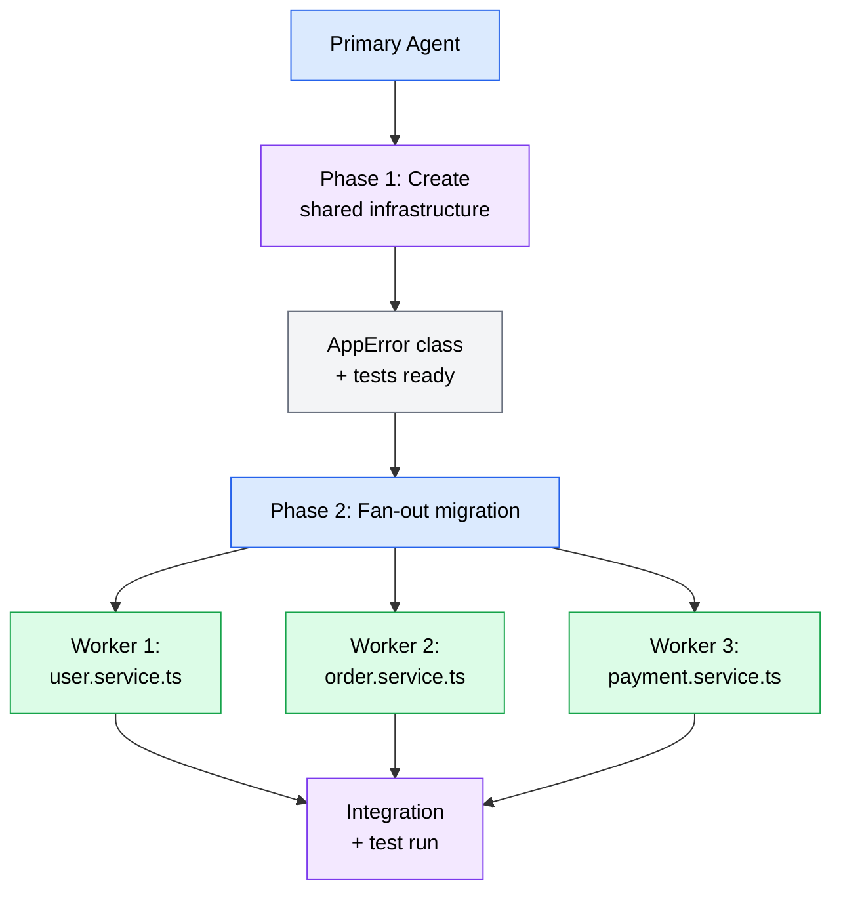

The patterns from the previous section become concrete when you apply them to real development workflows. This section walks through four practical scenarios where subagent delegation produces measurably better results than single-agent approaches, including the prompting strategies and context engineering that make each workflow reliable.

## Parallel code generation and testing

The most straightforward subagent workflow is generating implementation code and tests in parallel or in a short pipeline. This combines the fan-out/fan-in pattern (for multiple files) with the specialist pattern (different instructions for code versus tests).

### The scenario

You need to add input validation to six API endpoints. Each endpoint needs:

- A Zod validation schema
- Updated route handler that applies the schema
- Tests covering valid input, invalid input, and edge cases

Doing this sequentially with a single agent means the agent works through all six endpoints one at a time, accumulating context and potentially degrading in quality by the fifth or sixth endpoint.

### The delegation approach

Split the work into six independent subagent tasks, one per endpoint. Each subagent receives:

1. The specific endpoint file to modify
2. A reference to one completed example (so all subagents follow the same pattern)
3. The validation conventions to follow

```text
Prompt for parallel validation work:

"Add input validation to these six endpoints. Handle each endpoint
as a separate task. For each endpoint:

1. Read the existing endpoint at the specified path
2. Read src/schemas/user.schema.ts as a reference for validation patterns
3. Create a Zod schema in src/schemas/{resource}.schema.ts
4. Update the route handler to validate request bodies using the schema
5. Add tests in src/routes/__tests__/{resource}.routes.test.ts covering:
   - Valid input passes validation
   - Missing required fields returns 400
   - Invalid field types return 400
   - Boundary values (empty strings, negative numbers)

Endpoints to process:
- src/routes/orders.routes.ts
- src/routes/products.routes.ts
- src/routes/invoices.routes.ts
- src/routes/customers.routes.ts
- src/routes/payments.routes.ts
- src/routes/shipments.routes.ts"
```

### Why this works

Each subagent gets a fresh context focused on a single endpoint. It reads the reference schema once, understands the pattern, and applies it consistently. Because the subagents work in parallel, all six endpoints are processed in roughly the time it would take to do one.

The reference file (`user.schema.ts`) is the key to consistency. Without it, each subagent might invent its own validation approach. With it, they all follow the same pattern.

### Watch for

- **Import conflicts.** If multiple subagents modify a shared index file (like `src/schemas/index.ts`), the integrations may conflict. Instruct subagents to create their files but leave index updates to the primary agent.
- **Test runner interference.** If subagents each run `npm test`, parallel test executions can interfere with each other. Either skip the test run in subagents and run tests once after integration, or instruct each subagent to run only its own test file.

## Documentation delegation

Documentation is a natural candidate for subagent delegation because it is inherently decomposable -- each documentation page or section can be written independently -- and it benefits from specialization because good documentation requires different instructions than good code.

### The scenario

You have completed a major feature with 12 new source files across three modules (data models, services, and API routes). Each module needs API documentation, and you need an architecture overview document that describes how the modules work together.

### The delegation approach

Use the specialist pattern: one subagent per documentation type, each with instructions tuned for its audience and format.

```text
Prompt for documentation delegation:

"Write documentation for the new order management feature.
Delegate this to specialized documentation tasks:

Task 1 - API reference documentation:
Read every file in src/routes/orders/ and generate API reference
docs at docs/api/orders.md. Include: endpoint paths, HTTP methods,
request/response schemas with examples, error codes, and
authentication requirements. Follow the format in docs/api/users.md
as a reference.

Task 2 - Data model documentation:
Read every file in src/models/orders/ and generate data model
docs at docs/models/orders.md. Include: entity descriptions, field
definitions with types and constraints, relationships between
entities, and example JSON representations. Follow the format in
docs/models/users.md.

Task 3 - Architecture overview:
Read the following files to understand the feature's architecture:
- src/models/orders/
- src/services/orders/
- src/routes/orders/
Generate an architecture document at docs/architecture/order-management.md.
Include: a system overview, component interaction diagram (using
Mermaid), data flow description, and design decisions. Audience is
developers onboarding to the codebase."
```

### Why this works

Each documentation subagent focuses entirely on its domain. The API reference subagent does not need to understand the data model's design rationale. The architecture subagent can focus on the big picture without getting lost in endpoint parameter details.

Providing a reference document for each type (e.g., `docs/api/users.md`) ensures consistent formatting across the generated documentation. This is the documentation equivalent of the "reference schema" technique from the code generation workflow.

### Watch for

- **Stale cross-references.** If the architecture document references specific API endpoints by name, and the API reference subagent uses different naming, the cross-references break. Include a naming specification in the shared context.
- **Inconsistent terminology.** Define key terms in the shared instructions. If one subagent calls it "order" and another calls it "purchase," the documentation reads as though two different people wrote about two different systems.

## Multi-file refactoring

Refactoring across many files is where subagent delegation shines -- and where it is most dangerous. The same parallelism that makes it fast can produce inconsistent changes if the subagents are not carefully coordinated.

### The scenario

You are migrating your error handling from scattered try/catch blocks with string error messages to a centralized `AppError` class with error codes. This change touches 15 service files and their corresponding test files.

### The delegation approach

Use a two-phase approach combining the pipeline and fan-out patterns:



*Flowchart showing a two-phase refactoring workflow: phase 1 uses a single agent to create shared infrastructure (the AppError class), then phase 2 fans out the migration across multiple workers that each update one service file in parallel, followed by integration and testing.*

**Phase 1 (single agent):** Define the error handling interface and create the shared infrastructure.

```text
Phase 1 prompt:

"Create the error handling infrastructure for our migration:

1. Create src/lib/errors.ts with an AppError class that includes:
   - errorCode (string enum)
   - message (string)
   - statusCode (number)
   - Standard error codes: VALIDATION_ERROR, NOT_FOUND, UNAUTHORIZED,
     INTERNAL_ERROR, CONFLICT

2. Create src/lib/errors.test.ts with tests for the AppError class

3. Run tests to verify the infrastructure works"
```

**Phase 2 (fan-out):** Delegate the migration of each service file to a subagent.

```text
Phase 2 prompt:

"Migrate error handling in these service files to use the new
AppError class. Handle each file as a separate task.

For each service file:
1. Read the file and identify all error-throwing patterns
2. Read src/lib/errors.ts for the AppError interface and error codes
3. Replace string error throws with AppError instances using
   appropriate error codes
4. Update the corresponding test file to assert on error codes
   instead of error messages
5. Do NOT modify any files outside the assigned service and its tests

Files to migrate:
- src/services/user.service.ts
- src/services/order.service.ts
- src/services/payment.service.ts
(... additional files ...)"
```

### Why this works

Phase 1 establishes the shared foundation that all subagents depend on. By completing this first, every Phase 2 subagent can read the actual `AppError` class rather than working from a description of it. This eliminates interpretation differences.

The explicit constraint -- "Do NOT modify any files outside the assigned service and its tests" -- prevents subagents from making conflicting changes to shared files.

### Watch for

- **Shared file conflicts.** If multiple services import from the same utility file and the subagent decides to "helpfully" update that utility, you get merge conflicts. Constrain each subagent to its assigned files.
- **Inconsistent error code mapping.** Subagent A might map a "user not found" error to `NOT_FOUND`, while subagent B maps the same concept to `VALIDATION_ERROR`. Include a mapping table in the shared instructions.

```text
Error code mapping for all subagents:

- Resource not found (404) → NOT_FOUND
- Invalid input data (400) → VALIDATION_ERROR
- Authentication failure (401) → UNAUTHORIZED
- Duplicate resource (409) → CONFLICT
- Unexpected errors (500) → INTERNAL_ERROR
```

## Validation subagents

Validation subagents are a lightweight application of the specialist pattern where you spawn a subagent specifically to verify work -- either your own or another subagent's. This is distinct from having the primary agent run tests; the validation subagent gets a fresh context and a focused mandate to find problems.

### The scenario

You have implemented a complex database migration that restructures three tables and updates all queries that reference them. You want to verify the migration is correct before running it against production.

### The delegation approach

After the implementation is complete, spawn a validation subagent with adversarial instructions:

```text
Validation subagent prompt:

"You are a code reviewer focused on database migration correctness.
Review the migration at src/migrations/20260315-restructure-orders.ts
and the updated query files.

Check for:
1. Data loss: Are all columns from the old schema preserved or
   explicitly dropped with justification?
2. Referential integrity: Do all foreign key relationships remain
   valid after the migration?
3. Query compatibility: Read every file in src/repositories/ and
   verify that all queries work with the new schema
4. Rollback safety: Does the down migration correctly reverse all
   changes from the up migration?
5. Index coverage: Are all columns used in WHERE clauses and JOIN
   conditions indexed?

Report findings as a list of issues with severity (critical,
warning, info) and the specific file and line reference."
```

### Why this works

The validation subagent approaches the code with fresh eyes and a specific mandate to find problems. It does not have the "curse of knowledge" that comes from having just written the code. Its instructions are framed as a checklist of failure modes, not a list of features, which produces more thorough reviews.

### Variations

- **Security validation.** A subagent that reviews code specifically for security vulnerabilities: injection points, authentication bypasses, data exposure.
- **Performance validation.** A subagent that reviews queries for N+1 patterns, missing indexes, and unbounded result sets.
- **Style validation.** A subagent that reviews code against project conventions when automated linters do not cover all your rules.
- **Cross-file consistency.** A subagent that reads all modified files and checks for naming inconsistencies, conflicting interfaces, or missing imports.

:::tip
Validation subagents are the cheapest and lowest-risk form of delegation. Even if you do not use subagents for any other workflow, consider using them for code review. The cost is one additional agent session, and the benefit is a fresh perspective that catches issues before they reach production.
:::

## Practical exercises

### Exercise: Design a subagent delegation

**Objective**: Practice decomposing a task into delegatable subtasks and choosing the right delegation pattern.

**Prerequisites**: Understanding of the four delegation patterns from the previous section.

**Steps**:

1. Choose a real task from your recent work (or use this example: "add comprehensive input validation and error handling to a REST API with eight endpoints").
2. Identify whether the task is decomposable. List the independent subtasks.
3. For each subtask, write the key context the subagent would need to receive.
4. Choose a delegation pattern (fan-out/fan-in, pipeline, supervisor, or specialist) and explain why it fits.
5. Identify the shared context or conventions that all subagents need to produce consistent results.
6. List the potential integration challenges and how you would mitigate them.

**Verification**: Your delegation plan has: clearly defined subtask boundaries, a chosen pattern with rationale, shared context that ensures consistency, and identified risks with mitigations.

**Stretch goal**: If you have an AI coding agent available, try executing your delegation plan on a small project. Start with just two or three subtasks rather than the full decomposition. Compare the results to what a single agent produces for the same task.

### Exercise: Run a validation subagent

**Objective**: Use a validation subagent to review code you or your agent has recently written.

**Prerequisites**: An installed AI coding agent (OpenCode or Codex) and a recent code change that has not been reviewed.

**Steps**:

1. Identify a recent code change in your project -- ideally something with 2-5 modified files.
2. Write a validation prompt that focuses on a specific concern (security, performance, correctness, or style consistency).
3. Run the validation prompt as a separate agent session (not in the same conversation where the code was written).
4. Review the validation findings and classify them as: genuine issues, false positives, or style preferences.
5. Fix any genuine issues the validator found.

**Verification**: The validation subagent produced at least one finding you would not have caught on your own, or confirmed that the code has no issues in the area you checked.
