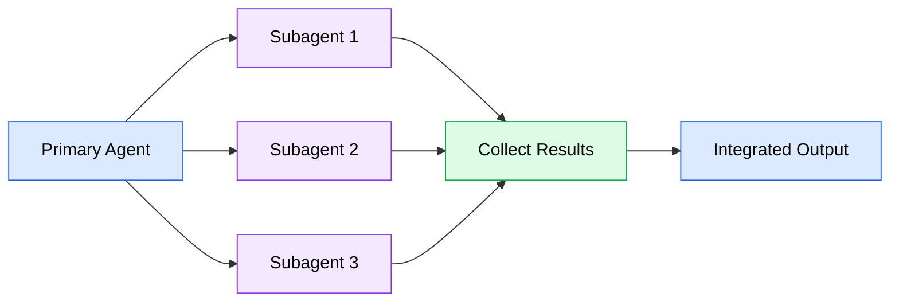
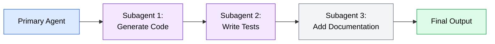
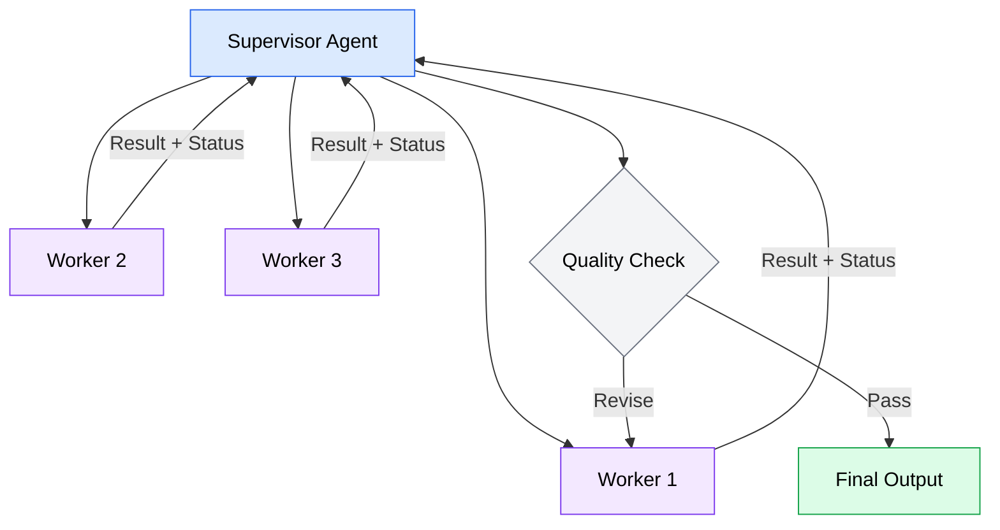
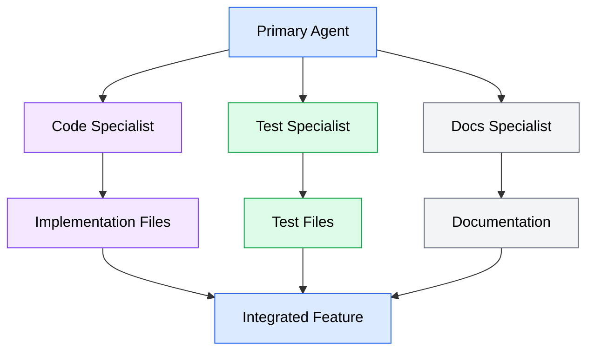

Subagent delegation follows predictable patterns, just as software architecture does. Understanding these patterns helps you structure delegations that produce reliable results and avoid the common pitfalls of ad hoc task splitting. This section covers the four core patterns: fan-out/fan-in, pipeline, supervisor, and specialist.

## Fan-out/fan-in

Fan-out/fan-in is the most common delegation pattern. The primary agent splits a task into independent subtasks (fan-out), delegates each to a subagent running in parallel, and then collects and integrates the results (fan-in).



*Flowchart showing the fan-out/fan-in pattern: the primary agent distributes work to three subagents in parallel, then collects and integrates their results into a single output.*

### When to use fan-out/fan-in

This pattern works well when:

- The task decomposes into pieces that share no dependencies on each other
- Each piece requires roughly the same amount of work
- The results can be combined without complex merge logic
- Speed is the primary motivation for delegation

### Examples

- **Generating tests for multiple modules.** Each test file depends only on its corresponding source file, not on the other test files.
- **Updating configuration across multiple services.** Each service's config change is independent.
- **Writing documentation for multiple API endpoints.** Each endpoint's documentation stands alone.

### Key considerations

The fan-in step -- collecting and integrating results -- is where this pattern can go wrong. If the subagents produce inconsistent naming, conflicting imports, or contradictory design decisions, the integration requires manual cleanup. Mitigate this by including explicit conventions in each subagent's instructions:

```text
Instructions for each subagent:

"Follow these conventions in your output:
- Use camelCase for function names
- Import shared types from src/types/index.ts
- Use the AppError class for all error handling
- Follow the existing test patterns in __tests__/"
```

Consistent instructions across subagents are the single most important factor in producing results that integrate cleanly.

## Pipeline

The pipeline pattern chains subagents in sequence, where each subagent's output feeds into the next subagent's input. Unlike fan-out/fan-in, pipeline subtasks are dependent -- each step builds on the previous one.



*Flowchart showing the pipeline pattern: the primary agent initiates a chain where subagent 1 generates code, subagent 2 writes tests based on that code, and subagent 3 adds documentation based on both, producing the final output.*

### When to use pipelines

This pattern is appropriate when:

- Each stage requires a different focus or set of instructions
- Later stages need to validate or build on earlier stages' output
- The overall workflow has a natural sequential progression
- You want each stage to operate with a fresh, focused context

### Examples

- **Code generation followed by testing.** The test-writing subagent receives the generated code and writes tests that validate it. The implementation and testing are separate concerns with different quality criteria.
- **Implementation followed by documentation.** The documentation subagent reads the implemented code and writes docs that accurately describe what was built.
- **Scaffolding followed by customization.** One subagent creates boilerplate from a template, and the next customizes it for the specific use case.

### Key considerations

Pipelines trade parallelism for sequential quality -- each stage can validate the previous stage's work. The tradeoff is speed: a three-stage pipeline takes three times as long as a single-stage process, compared to fan-out/fan-in where all stages run simultaneously.

Context passing between pipeline stages is critical. Each subagent needs to receive not just the previous stage's output files, but also enough context about the original requirements to make good decisions. Without this, later stages may "drift" from the original intent.

:::caution
Pipelines longer than three or four stages often indicate that the task should be redesigned rather than delegated. Each handoff point loses context, and errors compound through the chain. If you find yourself building a five-stage pipeline, consider whether a single well-prompted agent could do the job better.
:::

## Supervisor

The supervisor pattern uses a controlling agent that delegates work to subagents, reviews their output, and may request revisions or redistribute work based on results. The supervisor maintains the overall plan and makes decisions about quality and completeness.



*Flowchart showing the supervisor pattern: the supervisor agent delegates work to three workers, collects their results with status reports, runs a quality check, and either accepts the output or sends specific workers back for revision.*

### When to use the supervisor pattern

This pattern is valuable when:

- The task requires quality control beyond what a single pass can guarantee
- Different subtasks may need different numbers of iterations to get right
- The primary agent needs to make decisions based on intermediate results
- You want the ability to redirect or reassign work mid-execution

### Examples

- **Code review across multiple files.** The supervisor delegates review of each file to a subagent, examines the findings, and may request deeper analysis of specific areas.
- **Multi-file refactoring with validation.** The supervisor delegates refactoring to workers and validates that the changes compile and pass tests before accepting them.
- **Iterative improvement.** The supervisor sends initial implementations to workers, reviews the output, and sends specific feedback for a second pass on pieces that need improvement.

### Key considerations

The supervisor pattern is the most complex delegation pattern and has the highest coordination overhead. The supervisor agent needs to:

1. Maintain a mental model of the overall task progress
2. Evaluate each subagent's output against quality criteria
3. Formulate specific feedback for revisions
4. Decide when the work is "done enough"

This works best when you build quality criteria into the supervisor's instructions explicitly. Without clear acceptance criteria, the supervisor may iterate endlessly or accept subpar work.

```text
Supervisor instructions example:

"For each worker's output, verify:
1. The code compiles without errors
2. All existing tests still pass
3. New code follows the patterns in CLAUDE.md
4. No unrelated files were modified

If any check fails, send the specific failure back to the worker
with instructions to fix only that issue. Accept the output after
at most 2 revision rounds."
```

## Specialist

The specialist pattern assigns different types of subtasks to subagents with role-specific instructions. Unlike fan-out/fan-in where all subagents do the same kind of work on different inputs, specialist subagents each perform a different kind of work.



*Flowchart showing the specialist pattern: the primary agent delegates to three specialists -- one for implementation code, one for tests, and one for documentation. Each produces its focused output, and all three are integrated into the final feature.*

### When to use the specialist pattern

This pattern works well when:

- Different parts of the task require fundamentally different expertise or instructions
- Each specialist's output has different quality criteria
- You want to optimize each subagent's prompt for its specific role
- The subtasks can run in parallel despite being different types of work

### Examples

- **Feature development.** One specialist writes the implementation, another writes tests, and a third writes documentation. Each gets instructions tailored to their role.
- **Security-focused development.** A code specialist implements the feature while a security specialist reviews the implementation for vulnerabilities, and a compliance specialist checks against policy requirements.
- **Cross-platform work.** Different specialists handle iOS, Android, and web implementations of the same feature, each with platform-specific instructions.

### Key considerations

The specialist pattern produces the highest-quality individual outputs because each subagent's instructions are precisely tuned for its role. The challenge is integration: specialists working independently may make incompatible assumptions about interfaces, naming, or data structures.

Mitigate this by providing shared context to all specialists:

```text
Shared context for all specialists:

"You are implementing the user profile feature.
- Data model: User { id: string, name: string, email: string, avatar?: string }
- API path: /api/users/:id/profile
- Error handling: Use AppError from src/lib/errors.ts
- Naming: camelCase for variables, PascalCase for types"
```

This shared context acts as a contract between specialists, ensuring their outputs are compatible even though they work independently.

## Choosing the right pattern

The patterns are not mutually exclusive. Real-world delegations often combine elements of multiple patterns. Use this comparison to select a starting point:

| Pattern | Best for | Parallelism | Complexity | Context needs |
|---------|----------|-------------|------------|---------------|
| **Fan-out/fan-in** | Same task across many inputs | High | Low | Same instructions per subagent |
| **Pipeline** | Sequential stages with validation | None | Medium | Each stage needs previous output |
| **Supervisor** | Quality-controlled iterative work | Medium | High | Supervisor needs full picture |
| **Specialist** | Different expertise per subtask | High | Medium | Shared interface contract |

When in doubt, start with the simplest pattern that fits your task. Fan-out/fan-in handles the majority of parallelizable work. Only reach for supervisor or specialist patterns when the task specifically requires quality iteration or role differentiation.

:::tip
You can nest patterns. A supervisor might fan-out work to multiple specialists, or a pipeline stage might fan-out its work across multiple subagents. Start simple, and add nesting only when you have evidence that the simpler approach is insufficient.
:::
