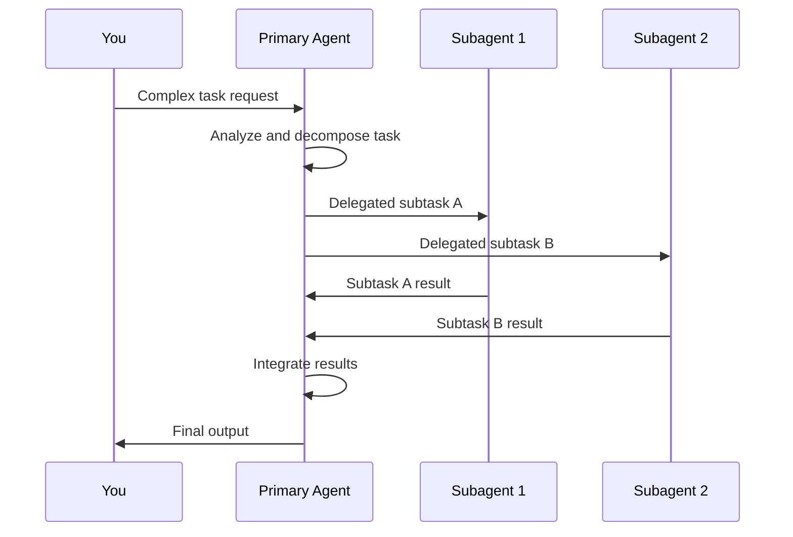
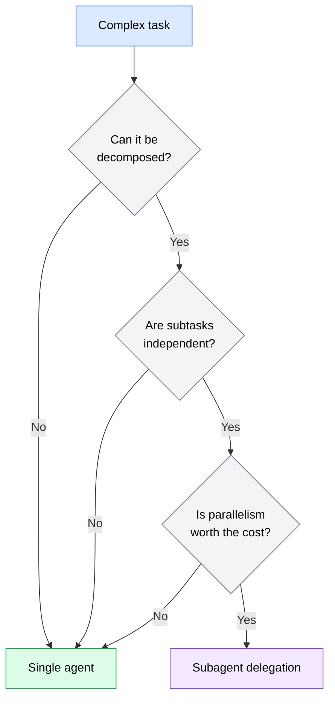

A subagent is a secondary AI coding agent instance spawned by a primary agent to handle a delegated portion of a larger task. The primary agent decides what work to delegate, creates one or more subagents with focused instructions, waits for them to complete, and then integrates their results.

This is not a new concept in software engineering. Process forking, thread pools, microservices, and task queues all follow the same principle: break a large job into smaller pieces, hand each piece to a dedicated worker, and combine the results. Subagent delegation applies that principle to AI-assisted development.

## How delegation works

When an AI coding agent encounters a task that would benefit from delegation, the process follows a predictable sequence:

1. **The primary agent analyzes the task** and determines which portions can be handled independently.
2. **The primary agent creates subagent instructions** -- a prompt for each subtask that includes enough context for the subagent to work without further guidance.
3. **Subagents execute their work** in isolated contexts. Each subagent has its own conversation, its own token budget, and its own set of tool calls. Subagents do not share memory or state with each other.
4. **The primary agent collects results** from each subagent and integrates them into the final output.



*Sequence diagram showing the subagent delegation flow: you send a complex task to the primary agent, which decomposes it, delegates subtasks to subagents running in parallel, collects their results, and delivers the integrated output back to you.*

The critical detail is step 3: subagents operate in isolated contexts. A subagent does not have access to the primary agent's full conversation history, the other subagents' work, or any state accumulated earlier in the session. It receives only what the primary agent explicitly passes to it. This isolation is both the strength and the limitation of the subagent model -- it enables parallelism but requires careful context engineering for each delegation.

## Specialization versus delegation

Delegation and specialization are related but distinct concepts:

- **Delegation** is about workload distribution. The primary agent hands off work to reduce its own load or enable parallel execution. The subagent performs the same kind of work the primary agent could do -- just separately.
- **Specialization** is about capability matching. Different subtasks may require different instructions, constraints, or focus areas. A subagent tasked with writing tests needs a different set of instructions than one tasked with writing implementation code.

In practice, effective subagent usage combines both. You delegate work for efficiency *and* specialize each subagent's instructions for quality. A subagent that generates test files gets instructions about test conventions, assertion patterns, and coverage expectations. A subagent that writes documentation gets instructions about tone, audience, and formatting. Each subagent is both a delegate (handling a portion of the work) and a specialist (operating with task-specific instructions).

## When a single agent is enough

Before reaching for subagents, consider whether a single agent can handle the task effectively. Most coding tasks do not need delegation. A single agent is sufficient when:

- **The task fits within a single context.** If the agent can hold all the relevant files, requirements, and conversation history in one session, delegation adds overhead without benefit.
- **Steps are sequential.** If each step depends on the output of the previous step, there is nothing to parallelize. A single agent working through steps in order is simpler and produces more consistent results.
- **The scope is narrow.** Implementing a single feature, fixing a bug, or refactoring a function -- these are tasks where context continuity matters more than parallelism.
- **Consistency matters more than speed.** A single agent maintains a unified understanding of decisions made throughout the task. Subagents do not share that understanding, which can lead to inconsistent choices across subtasks.

:::tip
A useful rule of thumb: if you can describe the task in a single, focused prompt and the agent can complete it in one session without running out of context, keep it in a single agent.
:::

## When subagents help

Subagent delegation becomes valuable when specific conditions are met:

### The task is naturally decomposable

Some tasks break cleanly into independent pieces. Generating implementations for five unrelated API endpoints, writing tests for four different modules, or updating documentation across eight files -- these tasks have natural boundaries where each piece can be handled independently.

### The task exceeds a single context window

Large codebases and complex tasks can exhaust an agent's context window. When the agent needs to hold too many files, too much history, or too many constraints in memory at once, quality degrades. Splitting the work across subagents gives each one a fresh, focused context.

### Speed matters more than coordination cost

Subagents can run in parallel, which is their primary speed advantage. If you have five independent tasks that each take 2 minutes sequentially, parallel subagents can complete them in roughly 2 minutes total instead of 10. The tradeoff is coordination overhead: the primary agent spends time decomposing the task and integrating results.

### The subtasks benefit from different instructions

When different parts of a task need fundamentally different approaches -- implementation code follows different conventions than test code, documentation has different quality standards than configuration files -- specialized subagent instructions can improve each piece's quality.

## The delegation decision

Use this framework to decide whether a task warrants subagent delegation:



*Flowchart showing the delegation decision process: if the task can be decomposed into independent subtasks and the parallelism benefit outweighs coordination cost, use subagent delegation. Otherwise, use a single agent.*

The key question at each decision point is whether adding complexity produces a proportional benefit. Subagent delegation is a tool, not a goal. Use it when it makes the outcome better or faster, and skip it when a single agent does the job well enough.

## How agents trigger subagent delegation

In current AI coding agents, subagent delegation is typically initiated through specific mechanisms:

### OpenCode

OpenCode supports subagent delegation through its Task tool. When the primary agent determines that a portion of work can be handled independently, it invokes the Task tool with a focused prompt. The Task tool creates a new agent instance with its own context, executes the delegated work, and returns the result to the primary agent.

The primary agent decides when to delegate based on its assessment of the task. You can influence this decision through your prompt -- explicitly asking the agent to "handle each file in parallel" or "delegate the test writing to a separate task" gives the agent a signal that delegation is appropriate.

```text
Example prompt encouraging delegation:

"Refactor these five service files to use the new error handling
pattern. Handle each file as a separate task so they can be
processed independently."
```

### Codex

Codex operates as a cloud-based agent that executes tasks asynchronously. Its delegation model is different from OpenCode's: rather than spawning subagents within a session, Codex tasks themselves function as independent work units. You can create multiple Codex tasks that run in parallel, each handling a different piece of work.

The delegation in Codex is more explicit and user-driven. Instead of the agent deciding to spawn subagents, you decompose the work yourself by creating separate tasks. Each task runs in its own sandboxed environment with its own context.

```text
Example: creating parallel Codex tasks

Task 1: "Add input validation to the user registration endpoint
following the Zod patterns in src/schemas/"

Task 2: "Add input validation to the order creation endpoint
following the Zod patterns in src/schemas/"

Task 3: "Add input validation to the payment processing endpoint
following the Zod patterns in src/schemas/"
```

The tradeoff is control versus automation. OpenCode's agent-driven delegation is more autonomous -- the agent decides what to parallelize. Codex's user-driven delegation gives you more control over the decomposition but requires more upfront effort.

:::note
The specific mechanisms for subagent delegation vary across agents and evolve as tools mature. The patterns and principles in this module apply regardless of the specific implementation. Focus on understanding *when* and *why* to delegate, and adapt the *how* to your particular agent's capabilities.
:::
