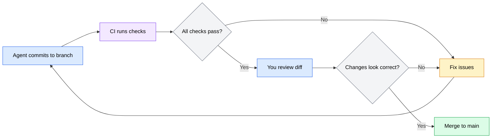

An AI coding agent produces code, and code needs review -- regardless of who or what wrote it. The review process for agent-generated code should be at least as rigorous as the process for human contributions, and in some areas more so. Agents are faster than human developers but less aware of broader system context, more likely to introduce subtle behavior changes under the guise of "cleanup," and unable to self-assess whether their output actually achieves the goal.

This section covers how to integrate agent output into your code review workflow: treating it as a pull request, running automated checks, structuring your git workflow for safety, and reviewing diffs effectively.

---

## Treating agent output as code contributions

The most effective mental model for agent output is to treat it as a contribution from a junior developer who is very fast, very literal, and has no institutional knowledge beyond what you put in the context file. This means:

- **Every change gets reviewed.** Do not merge agent output without reading it.
- **Every change goes through CI.** Automated tests, linters, and type checks run against agent output the same way they run against human contributions.
- **Changes are not automatically correct.** The agent producing code that looks right is not the same as the code being right. Verify behavior, not just syntax.

### What agents get right (and what they miss)

Agents are generally good at:

- Following patterns they can see in the codebase
- Writing syntactically correct code that matches the project's style
- Generating boilerplate and repetitive code quickly
- Applying well-documented conventions from context files

Agents commonly miss:

- **Broader system effects.** Changing a function signature without updating all callers across the codebase.
- **Business logic nuances.** The agent does not know that deleting "inactive" users also cancels their pending invoices in a separate service.
- **Performance implications.** Adding an N+1 query inside a loop because the agent optimizes for correctness at the function level, not efficiency at the system level.
- **Security subtleties.** Generating code that works correctly but introduces a timing attack vulnerability or an open redirect.

---

## Automated checks

Automated checks are your first line of defense. They catch issues before you even look at the diff, and they apply consistently -- they do not get tired, distracted, or rushed.

### Essential automated checks

Run these checks on every agent-generated change:

| Check | What it catches | Tool examples |
|-------|----------------|---------------|
| **Linting** | Style violations, potential errors, anti-patterns | ESLint, Ruff, Clippy |
| **Type checking** | Type mismatches, missing return types, incorrect interfaces | TypeScript (`tsc --noEmit`), mypy, Pyright |
| **Unit tests** | Behavioral regressions, broken functions | Jest, Vitest, pytest |
| **Integration tests** | Cross-module breakage, API contract violations | Playwright, supertest, pytest |
| **Secret scanning** | Accidentally committed credentials | gitleaks, truffleHog |
| **Security scanning** | Known vulnerabilities in dependencies | `npm audit`, `pip-audit`, Snyk |

### Running checks before committing

Before committing agent-generated code, run the full check suite locally:

```bash
# Example: Node.js project check suite
npm run lint          # Linting
npm run typecheck     # Type checking
npm test              # Unit and integration tests
npx gitleaks protect --staged  # Secret scanning
```

```bash
# Example: Python project check suite
ruff check .          # Linting
mypy .                # Type checking
pytest                # Tests
gitleaks protect --staged  # Secret scanning
```

If any check fails, fix the issues before committing. You can ask the agent to fix the failures, but review the fixes -- the agent may "fix" a test failure by changing the test assertion to match the wrong behavior.

### CI/CD integration

Your CI pipeline should run the same checks that you run locally, ensuring nothing slips through:

```yaml
# .gitlab-ci.yml example
lint:
  script:
    - npm run lint
    - npm run typecheck

test:
  script:
    - npm test

security:
  script:
    - npx gitleaks detect --source .
    - npm audit --audit-level=moderate
```

:::caution
Do not let the agent modify CI/CD configuration files without careful review. An agent that disables a test step or loosens a linting rule to make its code pass has technically "fixed" the failure while actually removing your safety net.
:::

---

## Git workflow for agent safety

Git is your undo mechanism. Every branching strategy, commit practice, and merge rule you follow amplifies your ability to catch and reverse problems from agent output.

### Branch-based development

Always have the agent work on a branch, never directly on main:

```bash
# Create a branch for the agent's work
git checkout -b feat/add-user-search

# Let the agent do its work on this branch
# Review, test, and merge when satisfied
```

This gives you:

- **Isolated changes.** Agent modifications do not affect main until you are ready.
- **Easy rollback.** If the agent produces unusable output, delete the branch and start over.
- **Diff review.** You can see exactly what the agent changed relative to main.
- **CI validation.** CI runs against the branch before any merge to main.

### Commit granularity

Encourage the agent to make small, focused commits rather than one large commit with all changes:

```markdown
# Context file: git workflow

## Commit practices
- Make one commit per logical change (one feature, one bug fix, one refactor)
- Write descriptive commit messages explaining what changed and why
- Do not combine unrelated changes in a single commit
- Commit after each step of a multi-step task so I can review incrementally
```

Small commits are easier to review, easier to revert, and make `git bisect` effective if you need to track down when a regression was introduced.

### The review-before-merge pattern

The safest workflow for agent output:

1. **Agent works on a feature branch** and commits changes
2. **CI runs automatically** on the branch (lint, type check, test, security scan)
3. **You review the diff** between the branch and main
4. **You merge** only after review and CI pass
5. **If issues are found**, fix on the branch or ask the agent to fix them, then re-review

This is the same pull request workflow used by development teams. The agent is the author, you are the reviewer.



*Flowchart showing the review-before-merge workflow: the agent commits, CI validates, you review, and only then does the code reach main.*

---

## Reviewing agent diffs effectively

Reading an agent-generated diff requires a different focus than reviewing human code. Humans typically explain their reasoning in PR descriptions and respond to review comments. Agents do not have that context, so you need to extract it from the code itself.

### What to look for

**Scope check: did the agent stay within bounds?**

The first thing to verify is whether the agent modified only the files you expected. Check the file list in the diff:

```bash
# See which files the agent changed
git diff main --name-only
```

If files appear that you did not expect, investigate why. Common issues:

- The agent refactored files adjacent to the ones you asked it to change
- The agent updated imports or exports in unrelated modules
- The agent "fixed" issues it noticed in other files while passing through

**Behavioral correctness: does the code do what you asked?**

Read through the core changes and verify they implement the intended behavior. Pay attention to:

- Control flow: are conditions and loops correct?
- Edge cases: what happens with empty inputs, null values, or boundary conditions?
- Return values: are the right values returned in all code paths?

**Side effects: what else changed?**

Look for changes that are not directly related to the task:

- Formatting changes mixed in with functional changes
- Dependency updates that were not requested
- Configuration changes
- Removed code that was "unused" but actually needed by another module

**Security: any new risks?**

Scan for patterns that indicate security issues:

- Hard-coded strings that look like credentials
- New API endpoints without authentication
- SQL queries built with string concatenation
- User input passed directly to shell commands
- Disabled security features (CORS settings, CSRF protection)

### Review commands

```bash
# Full diff with context
git diff main

# Diff for specific files only
git diff main -- src/auth/ src/middleware/

# Show only changed file names and stats
git diff main --stat

# Show changes within functions (improved context)
git diff main -W
```

### The five-minute review

For routine agent output, use this quick review process:

1. **File list** (30 seconds): Check `git diff --stat` for unexpected files or suspiciously large changes.
2. **Tests** (1 minute): Read new or modified tests. Do they test the right behavior? Are edge cases covered?
3. **Core logic** (2 minutes): Read the main functional changes. Does the implementation match what you asked for?
4. **Side effects** (1 minute): Scan for unrelated changes, formatting noise, or removed code.
5. **Security** (30 seconds): Quick scan for hard-coded secrets, missing auth, or unsafe patterns.

This is a minimum review, not a replacement for thorough review on critical changes. Scale your review depth to the risk level of the change.
