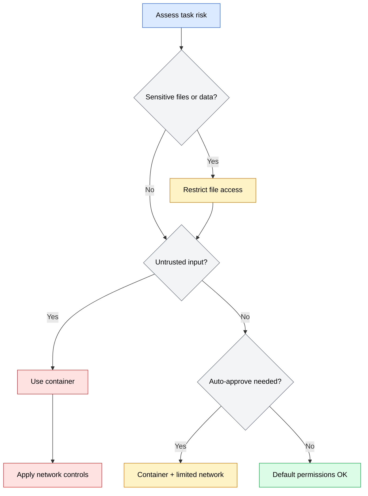

The most effective way to reduce risk from an AI coding agent is to limit what it can do in the first place. Even if an agent misunderstands your instructions or processes malicious input, a well-configured permission model ensures the damage is contained. This is the principle of least privilege: give the agent access to what it needs for the current task and nothing more.

Different agents implement permissions differently. OpenCode runs locally with a permission approval model, while Codex executes in a cloud sandbox with network-level isolation. Both approaches have strengths, and understanding how they work helps you configure them effectively.

---

## Permission models

Permission models control what actions an agent can take: which files it can read and write, which commands it can execute, and which tools it can invoke.

### OpenCode

OpenCode runs in your terminal with your user permissions. By default, it asks for approval before executing commands or modifying files. This interactive approval model gives you a checkpoint before every potentially risky action.

OpenCode's permission system works in tiers:

| Permission level | What the agent can do | When to use |
|-----------------|----------------------|-------------|
| **Ask every time** | Agent requests approval for each file edit and command | Unfamiliar tasks, working with sensitive code |
| **Auto-approve safe operations** | File reads and non-destructive commands run without prompts; writes still require approval | Routine development where you trust the read operations |
| **Full auto-approve** | All operations run without prompts | Only in sandboxed environments with no access to sensitive resources |

Configure OpenCode's permission behavior in your project's context file:

```markdown
# Permission preferences

- Always ask before modifying files outside of `src/` and `tests/`
- Never run commands that modify the database without explicit approval
- Auto-approve read operations and linter commands
```

:::caution
Full auto-approve mode removes your last line of defense against unintended actions. Use it only inside containers or disposable environments where the agent cannot cause lasting damage.
:::

### Codex

Codex takes a different approach. Each task runs in a cloud sandbox -- an isolated container with its own file system and controlled network access. The sandbox is created fresh for each task, so there is no persistent state that can accumulate risk across tasks.

Codex provides three autonomy levels that control what the agent can do without asking:

| Autonomy level | Behavior | When to use |
|---------------|----------|-------------|
| **Suggest** | Agent proposes changes as a diff but does not apply them | Code review, exploratory tasks, sensitive repositories |
| **Auto-edit** | Agent applies file changes automatically but requires approval for shell commands | Standard development tasks |
| **Full auto** | Agent applies changes and runs commands without approval | Well-tested workflows with CI/CD validation downstream |

Because each Codex task runs in isolation, the risk profile differs from OpenCode. The agent cannot accidentally affect other projects, access your local file system, or run commands outside its sandbox. However, the sandbox has access to your repository contents, so credential exposure within files is still a risk.

---

## File system boundaries

Controlling which parts of the file system an agent can access is one of the most practical security measures you can apply.

### Limiting scope with context files

Your context file can explicitly tell the agent what it should and should not touch:

```markdown
# File boundaries

## Allowed directories
- `src/` - Application source code
- `tests/` - Test files
- `docs/` - Documentation

## Off-limits
- `infrastructure/` - Terraform and deployment configs (managed by the platform team)
- `scripts/deploy/` - Deployment scripts (manual review required)
- `.env*` - Environment files containing secrets
- `*.pem`, `*.key` - Certificate and key files
```

This is an advisory boundary, not a technical enforcement mechanism. The agent follows these instructions because they are in its context, but it can still access other files if it decides to. For hard enforcement, use containerization.

### Working directory isolation

Keep the agent focused on the relevant project directory. When you start an agent session, make sure the working directory is the project root, not your home directory or a parent directory that contains multiple projects.

```bash
# Good: agent starts in the project directory
cd ~/projects/my-app && opencode

# Risky: agent starts in a directory containing many projects
cd ~/projects && opencode
```

If the agent starts in `~/projects/`, it can see and modify files in any project under that directory -- not just the one you are working on.

### Using .gitignore as a signal

Your `.gitignore` file already lists files that should not be tracked. Some agents respect `.gitignore` as a signal for what to avoid reading or modifying. Even when the agent does not enforce this automatically, you can reference it in your context file:

```markdown
# Files the agent should ignore

Respect `.gitignore` patterns. In particular:
- Do not read or reference files matching `*.env*`
- Do not include contents from `node_modules/` in your analysis
- Do not modify files in `dist/` or `build/` (generated output)
```

---

## Network controls

Network access determines whether the agent can reach external services: package registries, APIs, web pages, or MCP servers.

### OpenCode network access

OpenCode runs with your network access. It can reach anything your machine can reach: npm registries, GitHub APIs, internal services on your VPN. This is useful for tasks that require installing packages or fetching documentation, but it also means the agent can make requests you did not intend.

To restrict OpenCode's network access:

- **Use a firewall or proxy** to limit outbound connections when running in auto-approve mode
- **Run OpenCode inside a container** with restricted network policies (see containerization below)
- **Disable unnecessary MCP servers** that connect to external services when you do not need them

### Codex network access

Codex sandboxes restrict network access by default. Each sandbox only allows connections to the services explicitly configured for the task. This is a significant security advantage: even if the agent tries to reach an unauthorized endpoint (due to prompt injection or a misbehaving MCP server), the network policy blocks the request.

When configuring Codex tasks that need network access, follow these principles:

- Allow only the specific endpoints the task requires (e.g., `registry.npmjs.org` for package installation)
- Avoid blanket internet access unless the task genuinely needs it
- Review the network policy before launching tasks that involve external services

---

## Containerization

Running your agent inside a container provides the strongest isolation. The container acts as a boundary between the agent's actions and your host system. Even if the agent runs a destructive command, the damage is contained within the container.

### When to use containers

- When running agents in full auto-approve mode
- When the task involves untrusted input (reviewing external PRs, processing third-party code)
- When the agent needs to run commands you are not confident about
- When working with sensitive repositories where accidental modifications are costly

### Setting up a containerized environment

You can run OpenCode inside a Docker container that maps only the project directory:

```bash
# Run OpenCode in a container with limited access
docker run -it \
  -v $(pwd):/workspace \
  -w /workspace \
  --network=host \
  your-opencode-image \
  opencode
```

For stronger isolation, restrict the network and add read-only mounts for files the agent should read but not modify:

```bash
# Stronger isolation: restricted network, read-only config
docker run -it \
  -v $(pwd)/src:/workspace/src \
  -v $(pwd)/tests:/workspace/tests \
  -v $(pwd)/package.json:/workspace/package.json:ro \
  -v $(pwd)/tsconfig.json:/workspace/tsconfig.json:ro \
  -w /workspace \
  --network=none \
  your-opencode-image \
  opencode
```

This configuration gives the agent write access to `src/` and `tests/` but read-only access to configuration files, and no network access at all.

### Container tradeoffs

| Approach | Isolation | Convenience | Best for |
|----------|-----------|-------------|----------|
| No container (direct execution) | Low | High | Trusted tasks, interactive development |
| Container with host network | Medium | Medium | Running untrusted commands safely |
| Container with no network | High | Lower | Processing untrusted input, auto-approve mode |
| Codex cloud sandbox | High | High | Any Codex task (built-in) |

:::tip
You do not need containers for every task. Most interactive development sessions with OpenCode are safe with the default permission approval model. Reserve containers for situations where you are running in auto-approve mode, processing untrusted input, or working on tasks where the consequences of an error are high.
:::

---

## Building a permission strategy

Rather than applying every security measure to every task, match your security posture to the risk level:



*Flowchart showing a decision tree for choosing the right permission strategy based on task risk factors: sensitive files, untrusted input, and auto-approve mode.*

### Quick reference by scenario

| Scenario | Permission model | File boundaries | Network | Container |
|----------|-----------------|-----------------|---------|-----------|
| Interactive development on your own code | Ask/auto-approve reads | Context file boundaries | Full | No |
| Automated batch task (auto-approve) | Auto-approve with guardrails | Strict directory limits | Restricted | Recommended |
| Reviewing external PR | Ask for everything | Read-only mount | None or restricted | Yes |
| Running on sensitive repo | Ask for everything | Explicit allow-list | As needed | Optional |
| Codex task (any type) | Built-in sandbox | Repository scope | Configured per task | Built-in |
