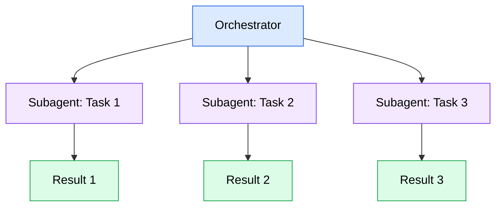
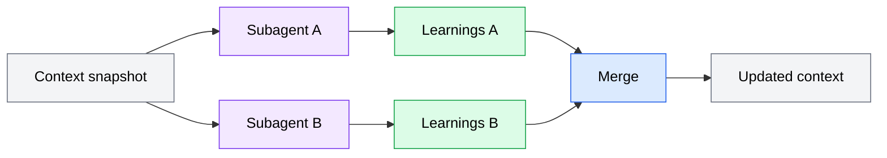
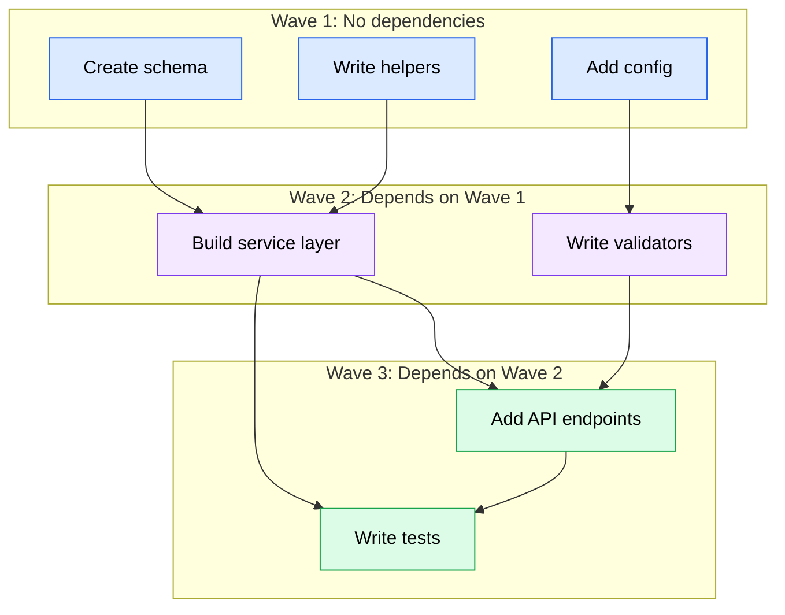
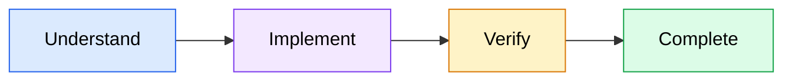
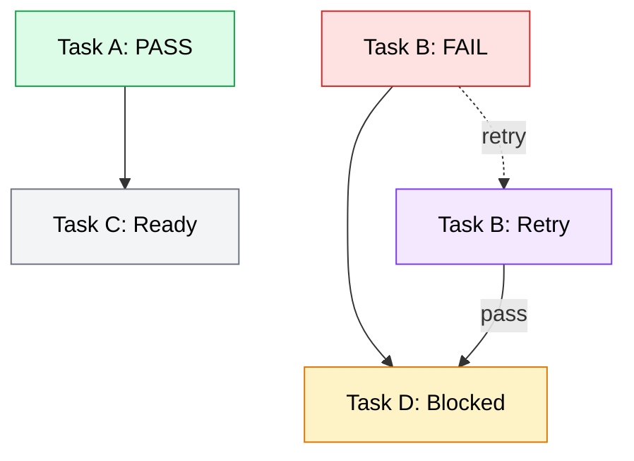

With a specification decomposed into dependency-ordered tasks, each carrying its own acceptance criteria, you are ready for the final phase of the SDD pipeline: execution. This phase is where tasks become working code -- but unlike ad-hoc prompting where you feed everything to a single agent in one long conversation, SDD delegates each task to an independent subagent. These subagents work in isolation, share learnings through markdown files, and prove their work is done by verifying against the acceptance criteria that were defined during decomposition.

This separation of concerns is what makes SDD scale. A single agent trying to implement an entire feature accumulates context, makes compromises, and loses track of requirements as the conversation grows. Independent subagents start fresh, execute one atomic task, verify their output, and exit. The result is predictable, verifiable, and parallelizable.

## The subagent execution model

In SDD execution, each task from the decomposition phase is assigned to its own independent subagent. The subagent receives the task description, its acceptance criteria, and a snapshot of shared context -- then works autonomously to complete it.

This is a fundamental architectural choice with specific advantages over a monolithic agent approach:

- **Isolation prevents cross-contamination.** When a single agent works on multiple tasks sequentially, errors in one task can cascade. A wrong assumption about a data model in task 3 might silently affect how the agent writes tasks 4, 5, and 6. Independent subagents cannot make this mistake because they do not share runtime state.
- **Context stays focused.** An agent working on a 20-task feature accumulates thousands of tokens of context as it progresses. By task 15, early decisions may have scrolled out of the context window entirely. A subagent receives only what it needs: the task description, acceptance criteria, and relevant shared context.
- **Failures are contained.** If a subagent fails to complete its task, the failure is isolated. Other subagents working on unrelated tasks are unaffected. The failed task can be retried without restarting the entire feature.
- **Parallelism becomes possible.** Independent subagents with no shared state can run concurrently. Two tasks that do not depend on each other can execute at the same time, reducing total wall-clock time.

*Diagram showing an orchestrator delegating three tasks to independent subagents, each producing its own result. Subagents work in isolation with no direct communication between them.*

The orchestrator is responsible for launching subagents, providing them with the right context, collecting results, and deciding what to do when tasks succeed or fail. Subagents never communicate with each other directly -- all coordination flows through the orchestrator and the shared context mechanism described in the next section.

### Why not one agent for everything?

It is tempting to think a single, long-running agent conversation would be more efficient. After all, the agent already "knows" what it did in previous tasks. But this intuition breaks down in practice:

| Factor | Single agent | Independent subagents |
|--------|-------------|----------------------|
| Context window | Fills up as tasks accumulate; early context may be lost | Each subagent starts with only what it needs |
| Error isolation | One mistake can propagate through all subsequent tasks | Failures are contained to the affected task |
| Retry cost | Retrying means restarting from the beginning or complex rollback | Retry the specific failed task only |
| Parallelism | Sequential by nature; one task at a time | Independent tasks run concurrently |
| Verification | Hard to attribute results to specific requirements | Each subagent verifies against its own acceptance criteria |
| Reproducibility | Outcome depends on the accumulated conversation state | Each task is a self-contained unit with deterministic inputs |

The tradeoff is that subagents need an explicit mechanism for sharing what they learn. They cannot rely on conversational memory. This is where markdown-based context sharing comes in.

## Shared context through markdown files

When subagents work in isolation, they need a way to pass learnings to subsequent tasks without direct communication. SDD solves this with a simple, persistent mechanism: markdown files that accumulate context across task boundaries.

The pattern works as follows:

1. Before a subagent starts, the orchestrator provides it with a **context snapshot** -- a markdown file containing the accumulated learnings from all previously completed tasks.
2. The subagent reads this context before beginning work. It learns what files were modified, what patterns were established, what conventions were discovered, and what issues were encountered by earlier tasks.
3. After completing its task, the subagent writes its own learnings to a **per-task context file**: which files it modified, what it discovered, and any issues it encountered.
4. The orchestrator collects per-task context files and merges them into the shared context, making those learnings available to the next round of subagents.

*Diagram showing how two subagents read from the same context snapshot, each write their learnings, and the orchestrator merges both sets of learnings into an updated context file for subsequent tasks.*

### What goes into shared context

A shared context file typically tracks several categories of information:

- **Project patterns**: Coding conventions, naming patterns, framework-specific behaviors discovered during execution. If subagent A discovers that the project uses a specific test framework or import pattern, subagent B can follow the same convention.
- **Key decisions**: Architecture choices made during execution. If one subagent decides to use a particular data structure or API design, later subagents should be aware of that decision.
- **Known issues**: Problems encountered and workarounds applied. If a dependency has a quirk that required a workaround, subsequent subagents avoid rediscovering the same issue.
- **File map**: A running list of which files were created or modified, so subagents working on related areas know where to look.
- **Task history**: A log of completed tasks with their outcomes, giving later subagents an understanding of what has already been done.

### Why markdown?

Markdown is a deliberate choice over more structured formats like JSON or databases:

- **Agents read markdown natively.** AI coding agents are trained on vast amounts of markdown content. A markdown context file requires no special parsing -- the agent reads it the same way it reads any documentation.
- **Humans can read it too.** When something goes wrong, you can open the context file and understand exactly what each subagent learned. There is no opaque binary format to decode.
- **It is append-friendly.** New learnings are appended to the file as plain text. There are no schema migrations, no merge conflicts on structured fields, and no serialization overhead.
- **It works with any tooling.** Markdown files are just text files. Any agent framework that can read and write files can participate in markdown-based context sharing.

## Wave-based parallelism

Not all tasks can run at the same time. Some tasks depend on others -- you cannot write the API endpoints before the data models exist, and you cannot write integration tests before the features they test are implemented. Wave-based parallelism groups tasks by their dependency level and executes each group concurrently.

### How waves are formed

The orchestrator analyzes the dependency graph from the decomposition phase and assigns tasks to waves:

- **Wave 1** contains all tasks with no dependencies. These are the foundation: data models, schemas, utility functions, configuration.
- **Wave 2** contains tasks that depend only on Wave 1 tasks. Once all of Wave 1 is complete, these can start.
- **Wave 3** contains tasks that depend on Wave 2 tasks. And so on until all tasks are assigned.

Within each wave, all tasks are independent of each other and can run concurrently.

*Diagram showing three waves of task execution. Wave 1 has three independent foundation tasks (create schema, add config, write helpers). Wave 2 has two tasks that depend on Wave 1. Wave 3 has two tasks that depend on Wave 2. Tasks within each wave run concurrently; waves execute sequentially.*

### The execution cycle

For each wave, the orchestrator follows a consistent cycle:

1. **Snapshot context.** Capture the current shared context so all subagents in this wave read the same baseline.
2. **Launch subagents.** Start one subagent per task in the wave, up to a concurrency limit.
3. **Collect results.** Wait for all subagents to complete, recording which tasks passed and which failed.
4. **Merge learnings.** Collect per-task context files and merge them into the shared context.
5. **Form next wave.** Check the dependency graph for newly unblocked tasks. If failed tasks block downstream work, handle them before proceeding.

This cycle repeats until all tasks are complete or all remaining tasks are blocked by failures.

### Context accumulation across waves

A critical benefit of the wave-based approach is **progressive context enrichment**. Each wave adds to the shared context:

- Wave 1 subagents discover project patterns, establish conventions, and map out the file structure. Their learnings form the foundation of the shared context.
- Wave 2 subagents read Wave 1's learnings and build on them. They know which files exist, what patterns to follow, and what issues to avoid. Their own learnings add to the context.
- Wave 3 subagents benefit from everything Waves 1 and 2 discovered. By this point, the shared context contains a comprehensive picture of the project's current state.

This means later tasks are executed with significantly better context than earlier ones. A subagent implementing an API endpoint in Wave 3 knows exactly which data models were created in Wave 1, which service functions exist from Wave 2, and what naming patterns the project follows -- all without needing to rediscover any of it.

## The agent workflow: understand, implement, verify, complete

Each subagent follows a consistent four-step workflow regardless of what the task involves. This standardized process ensures every task is approached methodically and verified before it is considered done.

*Diagram showing the four-step subagent workflow as a linear pipeline: Understand the task and context, Implement the code changes, Verify against acceptance criteria, and Complete by reporting results.*

### Step 1: Understand

Before writing any code, the subagent builds a complete picture of what the task requires and what already exists:

- **Read the shared context.** Review learnings from previous tasks -- project patterns, key decisions, known issues, and the file map.
- **Parse acceptance criteria.** Extract each criterion by category (functional, edge cases, error handling, performance) so they can be verified individually later.
- **Explore the codebase.** Read the files that will be modified, adjacent files for consistency, and test files for patterns.
- **Plan the approach.** Determine which files to create or modify, what the expected behavior change is, and what tests to write.

This phase prevents the most common failure mode: jumping straight into code without understanding the task context and producing output that technically works but does not fit the existing codebase.

### Step 2: Implement

The subagent writes the code, following the project's established patterns:

- **Read before writing.** Always read a file before modifying it. Never edit a file the subagent has not opened and reviewed.
- **Follow dependency order.** Implement data layer changes first, then service logic, then interfaces, then tests. This ensures each layer can build on the previous one.
- **Match existing patterns.** Follow the project's coding style, naming conventions, error handling approach, and module organization. The shared context typically documents these patterns.
- **Run mid-implementation checks.** After the core changes, run the linter and existing tests to catch regressions before writing new tests. Fixing a linter error is much cheaper than discovering it during verification.

### Step 3: Verify

This is the phase that distinguishes SDD from ad-hoc development. The subagent does not assume its implementation is correct -- it proves it by checking each acceptance criterion:

- **Walk through functional criteria.** For each functional criterion, locate the code that satisfies it, confirm the logic is correct, and run relevant tests.
- **Check edge cases.** Verify boundary conditions are handled, guard clauses exist where needed, and edge case tests pass.
- **Confirm error handling.** Check that error paths produce clear messages and the system recovers gracefully.
- **Run the full test suite.** Execute all tests (not just new ones) to confirm no regressions.

The subagent records PASS or FAIL for each criterion. This structured verification is what makes SDD results auditable -- you can trace every task's outcome back to specific acceptance criteria.

### Step 4: Complete

The subagent reports its results and shares what it learned:

- **Determine status.** If all functional criteria pass and tests pass, the task is PASS. If non-critical criteria (edge cases, error handling) have issues but the core works, it is PARTIAL. If any functional criterion or test fails, it is FAIL.
- **Write learnings.** Record which files were modified, what patterns were discovered, and any issues encountered. These learnings flow into the shared context for subsequent tasks.
- **Report results.** Provide a structured result including the verification outcome, files changed, and any issues. The orchestrator uses this to decide whether to proceed or retry.

## Verification against acceptance criteria

Verification is the mechanism that makes SDD reliable. Without it, you are back to subjective assessment of whether code "looks right." With acceptance criteria, verification becomes a concrete checklist.

### How verification works in practice

Each task from the decomposition phase carries categorized acceptance criteria. During verification, the subagent evaluates each criterion and records its assessment:

| Category | What to check | Impact of failure |
|----------|--------------|-------------------|
| **Functional** | Core behavior works as specified | Blocks completion -- all must pass |
| **Edge cases** | Boundary conditions handled correctly | Flagged but does not block |
| **Error handling** | Error paths produce clear messages and recover gracefully | Flagged but does not block |
| **Performance** | Implementation uses efficient approach, no obvious bottlenecks | Flagged but does not block |

The distinction between blocking and non-blocking criteria is important. Functional criteria represent the core purpose of the task -- if they fail, the task is not done. Edge cases, error handling, and performance criteria are quality improvements that should be tracked but should not prevent progress on the rest of the feature.

### The pass/fail decision

The subagent determines task status using clear rules:

- **PASS**: All functional criteria pass and all tests pass. The task is complete and its learnings are shared.
- **PARTIAL**: All functional criteria pass, but some edge case, error handling, or performance criteria have issues. The core work is done, but quality gaps exist.
- **FAIL**: Any functional criterion fails, or any test fails. The task needs to be fixed.

This three-tier status gives the orchestrator precise information about what happened. A PASS means proceed confidently. A PARTIAL means the feature works but has known gaps to address later. A FAIL means something needs to be fixed before dependent tasks can proceed.

## Handling failures, retries, and context accumulation

In any execution involving multiple tasks, some will fail. SDD handles failures as an expected part of the process, not an exceptional condition.

### Retry strategies

When a task fails, the orchestrator can retry it with additional context from the failure:

1. **The first attempt fails.** The subagent reports what went wrong: which criteria failed, what errors occurred, and what approach was tried.
2. **The orchestrator provides failure context.** On retry, the new subagent receives the previous attempt's failure details along with the standard shared context.
3. **The retry subagent adapts.** It reads the failure report, understands what did not work, and tries a different approach. It might fix a bug in the previous attempt's code, or it might take an entirely different strategy.
4. **Retries are limited.** After a configurable number of attempts (commonly 2-3), the orchestrator stops retrying and leaves the task in a failed state. This prevents infinite retry loops.

Each retry attempt adds its learnings to the shared context, so even failed attempts contribute knowledge. If a retry discovers that a dependency has a specific quirk, that discovery is available to all subsequent tasks.

### When failures block downstream tasks

Some failures have consequences beyond the failed task itself. If a task in Wave 2 fails and a task in Wave 3 depends on it, the downstream task cannot execute.

The orchestrator handles this by:

- **Continuing with unblocked tasks.** If Wave 2 has three tasks and one fails, the other two still complete. Wave 3 tasks that depend on the successful Wave 2 tasks can proceed.
- **Holding blocked tasks.** Wave 3 tasks that depend on the failed Wave 2 task wait until the failure is resolved (either through retry or manual intervention).
- **Reporting the chain.** The orchestrator tracks which downstream tasks are blocked by which failures, giving you a clear picture of the impact.

*Diagram showing how a failed task (B) blocks a downstream task (D) while a passing task (A) allows its dependent (C) to proceed. Task B can be retried, and if the retry passes, task D becomes unblocked.*

### Context accumulation across the full execution

The shared context file grows throughout execution, building a progressively richer picture of the project:

- **After Wave 1**: The context contains foundational patterns -- file structure, naming conventions, framework behaviors, basic configuration.
- **After Wave 2**: The context adds service-layer patterns, integration points, and any issues discovered when building on the Wave 1 foundation.
- **After retries**: Failed attempts add information about what did not work, edge cases in dependencies, and alternative approaches. This "negative knowledge" is often as valuable as positive learnings.
- **By completion**: The context represents a comprehensive log of every decision, discovery, and workaround across the entire feature development. This is valuable both as a debugging resource if issues arise later and as documentation of how the feature was built.

This accumulation means the quality of execution improves as it progresses. Early tasks navigate with minimal context, but later tasks benefit from the accumulated wisdom of every task that came before them.
