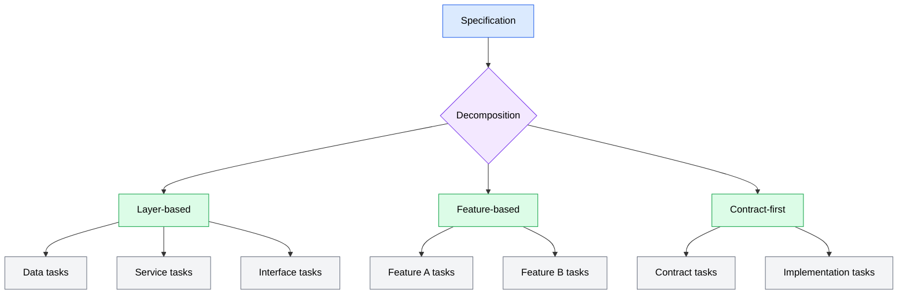
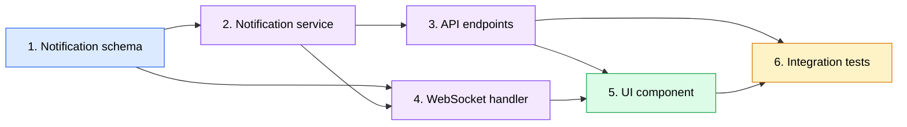

A specification describes *what* you want to build. Task decomposition is where you figure out *how* to break that description into units of work that agents can execute independently. This is the third phase of the SDD pipeline, and it bridges the gap between a human-readable specification and a set of machine-executable tasks.

Decomposition is not just about splitting work into smaller pieces. It is about creating tasks that are *atomic* (each one does a single, well-defined thing), *ordered* (each task knows what it depends on), and *verifiable* (each task has criteria you can check when it is done). Get these three properties right, and the execution phase becomes straightforward. Get them wrong, and you end up with tasks that conflict, depend on work that has not been done yet, or produce results that cannot be verified.

## From spec to tasks: decomposition patterns

The first challenge is deciding where to draw the lines between tasks. A specification describes features, requirements, and acceptance criteria -- but it does not tell you how to divide the implementation work. You need decomposition patterns: repeatable strategies for turning spec sections into tasks.

### Layer-based decomposition

The most common pattern splits work along architectural layers. Most software has a natural layering: data models and schemas at the bottom, business logic in the middle, and user-facing interfaces at the top. Each layer becomes a task or group of tasks.

Consider a specification for a user notification feature. Layer-based decomposition produces tasks like:

1. **Data layer**: Define the notification schema (database table, data types, indexes)
2. **Service layer**: Implement notification creation, retrieval, and mark-as-read logic
3. **API layer**: Create endpoints for listing notifications and updating read status
4. **Interface layer**: Build the notification display component and real-time update handler

Each task targets a single architectural layer, making it self-contained enough for an independent agent to implement without needing to touch the entire codebase.

### Feature-based decomposition

When a specification covers multiple distinct features, you split along feature boundaries first, then decompose each feature further if needed. A specification for "user settings" might break down into:

1. **Profile settings**: Name, email, avatar management
2. **Notification preferences**: Channel selection, frequency, quiet hours
3. **Security settings**: Password change, two-factor authentication setup
4. **Account management**: Export data, deactivate account

Each feature can be implemented independently, and within each feature you can apply layer-based decomposition if the feature is complex enough to warrant it.

### Contract-first decomposition

For features involving multiple components that interact, you decompose by defining contracts (interfaces, API schemas, data formats) first, then implementing each side of the contract separately.

1. **Define the API contract**: Request/response schemas, endpoint paths, error formats
2. **Implement the backend**: Server-side logic that fulfills the contract
3. **Implement the frontend**: Client-side code that consumes the contract
4. **Integration verification**: Confirm both sides work together

This pattern is especially useful when different agents will work on different sides of the contract. The contract definition task produces a shared artifact that subsequent tasks can reference.

### Handling non-standard features

Not every feature fits neatly into these patterns. Some common exceptions:

- **Cross-cutting concerns** (logging, authentication, error handling) touch multiple layers and features. Decompose them as standalone tasks that other tasks depend on rather than trying to fold them into layer-specific work.
- **Configuration and infrastructure** (environment variables, CI/CD changes, deployment configuration) are often separate from application code. Create distinct tasks for them rather than bundling them with feature tasks.
- **Migrations and data changes** need careful ordering and should be isolated into their own tasks, since other tasks often depend on the data layer being in place before they can run.

When a feature does not fit any standard pattern, fall back to the core principle: each task should produce a verifiable artifact and depend only on things that exist before it runs.

*Flowchart showing three decomposition patterns: a specification splits into layer-based, feature-based, or contract-first strategies, each producing different types of tasks*

## Dependency inference and ordering

Once you have a set of tasks, you need to determine the order they should execute in. Some tasks can run in parallel (they do not depend on each other), while others must wait for prerequisites to finish. This ordering is what transforms a flat list of tasks into an execution plan.

### What is a dependency

A dependency exists when one task requires the output of another. This is not just about code compilation -- it includes any situation where a task needs something that another task creates:

- A service layer task depends on the data layer task that defines the schema it operates on
- An API endpoint task depends on the service function it calls
- A test task depends on the code it tests being written first
- A configuration task might depend on knowing the structure of the feature it configures

### Building a directed acyclic graph

Dependencies between tasks form a directed acyclic graph (DAG). Each task is a node, and each dependency is an edge pointing from the prerequisite to the dependent task. "Directed" means the relationship flows one way (A must come before B). "Acyclic" means there are no loops -- you cannot have A depending on B while B depends on A.

Here is a DAG for a user notification feature:

*Dependency graph for a notification feature: the schema task has no dependencies and can start first, the service and WebSocket tasks depend on the schema, the API and UI tasks follow, and integration tests depend on multiple completed tasks*

In this graph, Task 1 (notification schema) has no dependencies -- it can start immediately. Tasks 2 and 4 both depend on Task 1, so they can run in parallel once Task 1 completes. Task 5 must wait for both Tasks 3 and 4. Task 6 depends on the most tasks and runs last.

### Three types of dependencies

When analyzing a specification for dependencies, look for three categories:

**Layer-based dependencies** follow the natural architecture stack. Data layer tasks come before service layer tasks, which come before API layer tasks, which come before interface tasks. These dependencies are almost always present and easy to identify.

**Cross-feature dependencies** occur when one feature relies on another. A notification preferences feature depends on the notification system existing first. A user dashboard depends on the individual widgets that populate it. These dependencies require reading the spec holistically rather than looking at each feature in isolation.

**Explicit dependencies** are stated directly in the specification. The spec might say "this feature requires the authentication system to be in place" or "this component consumes the API defined in Section 3." Treat these as hard dependencies that must be reflected in the task graph.

### Waves and parallel execution

A DAG naturally divides into waves (also called topological levels). Wave 1 contains all tasks with no dependencies. Wave 2 contains tasks whose dependencies are all in Wave 1. Wave 3 contains tasks whose dependencies are all in Waves 1 and 2, and so on.

Using the notification example:

| Wave | Tasks | Why |
|------|-------|-----|
| Wave 1 | 1. Notification schema | No dependencies |
| Wave 2 | 2. Notification service, 4. WebSocket handler | Both depend only on Task 1 |
| Wave 3 | 3. API endpoints | Depends on Task 2 |
| Wave 4 | 5. UI component | Depends on Tasks 3 and 4 |
| Wave 5 | 6. Integration tests | Depends on Tasks 3 and 5 |

Tasks within the same wave can execute in parallel because they have no dependencies on each other. This wave structure is what enables the subagent execution model discussed in the next section of this module -- independent agents can work on Wave 2 tasks simultaneously without conflicts.

### Detecting and resolving circular dependencies

A circular dependency means Task A depends on Task B, and Task B depends on Task A (directly or through a chain). Circular dependencies are a signal that your decomposition has a problem -- you have two tasks that each need the other to be done first, which is impossible.

Common causes and fixes:

- **Shared interfaces**: Two tasks both define and consume the same interface. Fix by extracting the interface definition into its own task that both depend on.
- **Bidirectional feature coupling**: Feature A calls Feature B, and Feature B calls Feature A. Fix by introducing an abstraction layer (an interface or event system) as a separate task, then have both features depend on the abstraction rather than on each other.
- **Test-implementation coupling**: A task includes both writing code and writing tests for code from another task. Fix by keeping each task's tests focused on its own output, and creating a separate integration test task that depends on both.

If you find a circular dependency, it almost always means one of the tasks is too broad and includes responsibilities that should be split into separate tasks.

## Task granularity by spec depth

The appropriate size for a task depends on how detailed your specification is. The three spec depth levels -- high-level overview, detailed design, and full technical specification -- each produce different kinds of tasks.

### High-level overview: coarse-grained tasks

A high-level specification describes features and goals without detailed technical requirements. Tasks derived from this level are broad:

- "Implement the notification system" (entire feature as one task)
- "Add user settings page" (full page with multiple sections)
- "Set up authentication" (complete auth flow)

Each task has significant room for the executing agent to make design decisions. This is appropriate when you trust the agent to make good technical choices and the feature is well-understood enough that a single agent can hold the full scope in context.

**Trade-offs**: Fewer tasks mean less coordination overhead, but each task is harder to verify. If a broad task fails, it is difficult to identify which part went wrong. Broad tasks also cannot run in parallel since they encompass multiple layers.

### Detailed design: medium-grained tasks

A detailed specification includes specific components, data structures, and interaction patterns. Tasks map to individual components or interfaces:

- "Create the notification database schema with fields for recipient, message, type, read status, and timestamps"
- "Implement the notification service with create, list, and markAsRead methods"
- "Build the notification dropdown component showing unread count and message list"

Each task is scoped to a single concern but still requires the agent to make some implementation decisions (exact function signatures, internal data handling, error recovery strategies).

**Trade-offs**: Good balance between parallelism and coordination overhead. Tasks are specific enough to verify against concrete criteria but broad enough that you do not drown in task management.

### Full technical specification: fine-grained tasks

A full technical specification includes schemas, API contracts, algorithms, and exact behaviors. Tasks map to individual functions, endpoints, or data transformations:

- "Create the notifications table with columns: id (UUID, PK), user_id (UUID, FK, indexed), message (TEXT, NOT NULL), type (ENUM: info/warning/error), read (BOOLEAN, DEFAULT false), created_at (TIMESTAMPTZ, DEFAULT now())"
- "Implement POST /api/notifications with request validation, duplicate detection, and rate limiting (max 100 per user per hour)"
- "Write unit tests for the notification service markAsRead method covering: single notification, batch update, already-read notification, non-existent ID"

Each task has minimal ambiguity -- the agent knows exactly what to build and how to verify it.

**Trade-offs**: Maximum parallelism and precise verification, but the task count is high. A feature that might be 3 tasks at the high level becomes 15-25 tasks at the full technical level. This is appropriate for complex or high-stakes features where precision matters more than speed.

| Spec depth | Tasks per feature | Agent autonomy | Verification precision | Parallelism |
|-----------|-------------------|----------------|----------------------|-------------|
| High-level overview | 3-5 | High | Low | Limited |
| Detailed design | 8-15 | Medium | Medium | Moderate |
| Full technical | 15-30 | Low | High | Maximum |

## Acceptance criteria categorization

Every task needs acceptance criteria -- concrete conditions that determine whether the task is done. Without criteria, you are back to subjective assessment ("does this look right?"), which is exactly what SDD is designed to replace.

Acceptance criteria fall into four categories, each serving a different purpose in verification.

### Functional criteria

Functional criteria describe what the task must accomplish -- the core behavior that makes the task "done." These are the non-negotiable requirements that every task must satisfy.

Examples for a notification service task:

- The `createNotification` function accepts a user ID, message, and type, and persists a new notification record
- The `listNotifications` function returns all notifications for a given user, ordered by creation date (newest first)
- The `markAsRead` function updates the read status of a notification and returns the updated record

Functional criteria answer the question: *does the core feature work?* If any functional criterion fails, the task is not done.

### Edge case criteria

Edge case criteria describe boundary conditions and unusual inputs that the implementation must handle. These are situations that do not occur in the happy path but will occur in production.

Examples:

- `createNotification` rejects empty messages with a validation error
- `listNotifications` returns an empty array (not an error) when the user has no notifications
- `markAsRead` handles the case where the notification ID does not exist by returning a clear "not found" response
- The system handles a user with 10,000+ notifications without degraded response times

Edge case criteria answer the question: *does it still work when inputs are unusual or extreme?*

### Error handling criteria

Error handling criteria describe how the implementation should behave when things go wrong -- not unusual inputs (those are edge cases), but actual failures in the system.

Examples:

- If the database connection fails during `createNotification`, the function returns a descriptive error without crashing the process
- If the notification type is not a valid enum value, the error message specifies which values are accepted
- Failed notification deliveries are logged with enough context (user ID, notification ID, error details) to diagnose the issue

Error handling criteria answer the question: *does it fail gracefully and provide enough information to diagnose problems?*

### Performance criteria

Performance criteria set expectations for speed, resource usage, and scalability. Not every task needs performance criteria, but tasks involving data access, computation, or user-facing response times often do.

Examples:

- `listNotifications` responds in under 200ms for users with up to 1,000 notifications
- Database queries use indexes -- no full table scans for standard operations
- The WebSocket notification push adds less than 50ms latency to the notification creation flow

Performance criteria answer the question: *does it run fast enough and use resources efficiently?*

### How the categories work together

During execution, all four categories are checked, but they have different levels of criticality:

| Category | Criticality | What happens if it fails |
|----------|------------|-------------------------|
| Functional | Blocking | Task is marked as failed; must be fixed |
| Edge cases | Non-blocking | Task is flagged; issue is logged for follow-up |
| Error handling | Non-blocking | Task is flagged; issue is logged for follow-up |
| Performance | Non-blocking | Task is flagged; issue is logged for follow-up |

Functional criteria are pass/fail gates -- the task cannot be considered complete unless all functional criteria pass. Edge cases, error handling, and performance criteria are important but do not block completion. They are tracked and reported so you know what needs attention, but they do not prevent the overall feature from progressing.

This tiered approach prevents perfectionism from blocking progress. A task that handles all the core functionality correctly but misses an obscure edge case is more valuable done than stuck in a retry loop. The edge case can be addressed in a follow-up task or the next iteration.

### Writing effective acceptance criteria

Good acceptance criteria share several properties:

- **Testable**: Each criterion describes an observable outcome, not an internal implementation detail. "Returns a 404 response" is testable. "Uses an efficient algorithm" is vague.
- **Independent**: Each criterion can be verified on its own without relying on the outcome of another criterion. This makes it possible to identify exactly which requirement failed.
- **Specific**: Each criterion includes concrete values, types, or behaviors. "Handles errors" is too vague. "Returns a 400 status code with a JSON body containing an `error` field describing the validation failure" is specific.
- **Complete**: Together, the criteria for a task should cover the full scope of what the task is supposed to do. If there is expected behavior not covered by any criterion, add one.

:::tip
When writing acceptance criteria, start with the functional criteria (the core "what does it do?"), then work outward to edge cases (unusual inputs), error handling (system failures), and performance (speed and resources). This natural progression helps you cover the full scope without overthinking.
:::
