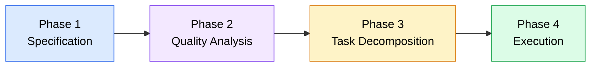
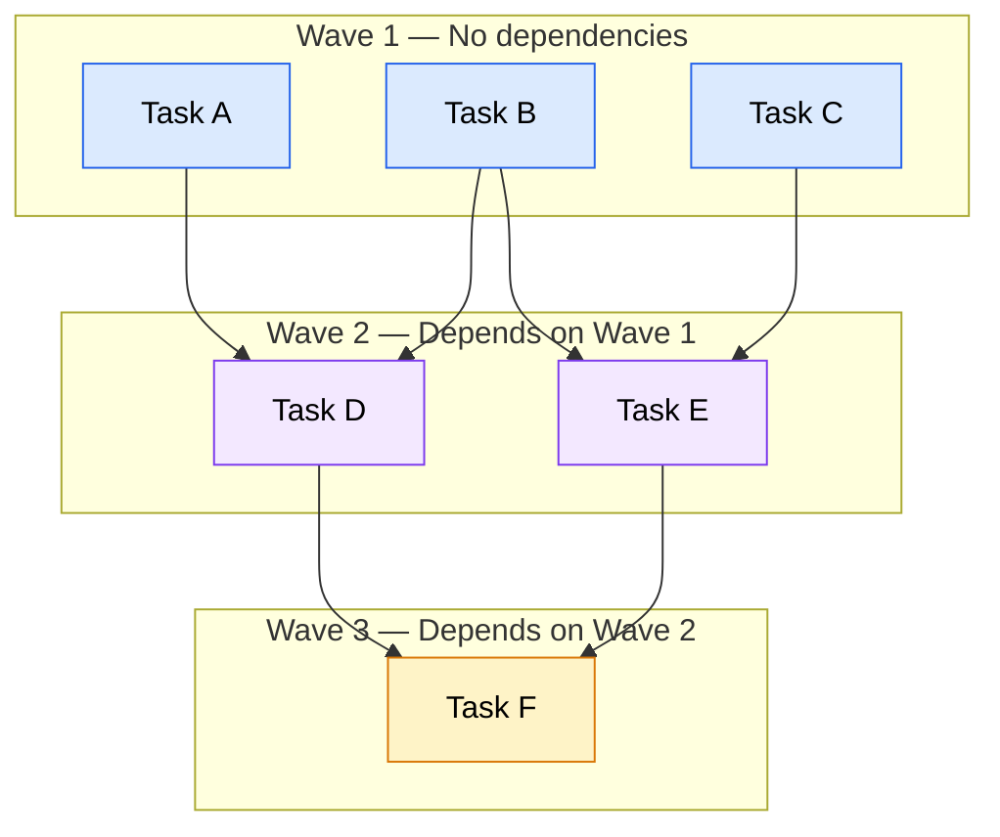

When you ask an AI coding agent to build something small -- a utility function, a bug fix, a single component -- a plain-language prompt is usually enough. The agent reads your request, makes changes, and you verify the result. But when you move to features that span multiple files, involve cross-cutting concerns, and carry specific acceptance criteria, this ad-hoc approach starts to fail in predictable ways.

Spec-Driven Development (SDD) is a methodology designed for exactly these situations. It replaces freeform prompting with a structured pipeline that turns an idea into a specification, breaks that specification into verifiable tasks, and executes those tasks through independent subagents that share context with each other. This page covers the full methodology: what problems it solves, how the pipeline works, the principles that make it effective, and when you should (and should not) use it.

## The problem with ad-hoc agent development

Ad-hoc prompting -- describing what you want in natural language and letting the agent figure out the rest -- works well within a narrow scope. The breakdown happens when scope grows. Here are the failure patterns that show up repeatedly:

**Requirements drift.** Without a written specification, requirements exist only in your head and in the conversation history. Over multiple prompts, details get lost. The agent implements what you said in the latest prompt, not what you meant across all of them. Edge cases you mentioned early in the conversation get dropped by later iterations.

**Inconsistent implementation.** When you prompt an agent multiple times for related parts of a feature, each prompt starts with a slightly different context. The agent makes different assumptions each time -- different error handling patterns, different naming conventions, different approaches to the same problem. The result is code that works in pieces but does not cohere as a whole.

**No verification criteria.** Ad-hoc prompts rarely include concrete acceptance criteria. You ask for a feature, the agent produces code, and you eyeball it to decide if it is done. This works for simple tasks but falls apart for complex ones. Without explicit criteria, you cannot systematically verify that the implementation covers all requirements, handles edge cases, and follows project conventions.

**Compounding rework.** When an agent misses a requirement in an ad-hoc workflow, the fix often introduces new issues because the agent does not have a complete picture of all the requirements. Each round of fixes creates more context for the agent to track, and the conversation becomes increasingly fragile. By the time you finish, you have spent as much time fixing agent output as you would have spent writing the code yourself.

These are not agent-quality problems -- they are workflow problems. The agent is doing exactly what you asked; the issue is that ad-hoc prompting does not provide the structure needed for complex work.

## The four-phase SDD pipeline

SDD addresses these problems with a structured pipeline. Every feature flows through four phases, each producing an artifact that feeds the next.

*Flowchart showing the four-phase SDD pipeline: Specification, Quality Analysis, Task Decomposition, and Execution, flowing left to right.*

### Phase 1: Specification

You write a structured document that captures what you want to build. This is not a freeform description -- it is a specification with defined sections: problem statement, proposed solution, functional requirements, acceptance criteria, scope boundaries, and success metrics. The specification becomes the single source of truth for the entire feature.

The key difference from ad-hoc prompting is that the spec exists as a persistent, reviewable artifact. It does not disappear after a conversation turn. Every subsequent phase references back to it, and every task can trace its requirements to a specific section of the spec.

Writing a good specification takes effort, but that effort pays for itself. Problems discovered during spec writing cost a fraction of what they cost during implementation.

### Phase 2: Quality analysis

Before breaking the spec into tasks, an optional review pass examines the specification for completeness, clarity, and feasibility. This phase acts as a quality gate -- catching ambiguities, missing edge cases, and unrealistic requirements before they become implementation problems.

:::note
Quality analysis is optional. For well-understood features or experienced teams, you may skip directly from specification to task decomposition. The value of this phase scales with the complexity and ambiguity of the feature.
:::

Quality analysis checks for specific issues:

- **Ambiguous requirements** -- statements that could be interpreted multiple ways
- **Missing acceptance criteria** -- requirements without concrete, testable criteria for success
- **Scope gaps** -- scenarios or edge cases the spec does not address
- **Feasibility concerns** -- requirements that may conflict or be impractical to implement
- **Completeness** -- whether all sections of the spec template are filled in with sufficient detail

The output is either a revised specification or a set of questions and suggestions for the spec author to address. The pipeline does not proceed to task decomposition until the spec meets quality thresholds.

### Phase 3: Task decomposition

The specification is broken down into atomic, implementable tasks. Each task targets a specific, narrow piece of work -- a single file, a single function, a single test suite. Tasks are ordered by their dependencies: if task B needs the output of task A, task A comes first.

Each task inherits its acceptance criteria from the specification. A task is not a vague instruction like "implement the user service." It is a concrete unit of work with:

- A clear description of what to implement
- Acceptance criteria (functional requirements, edge cases, error handling)
- Dependencies on other tasks
- Testing requirements

Good decomposition is the bridge between a human-readable spec and agent-executable work. The tasks should be small enough that a single agent can complete one without needing the full context of the entire feature, but large enough that they represent meaningful progress.

### Phase 4: Execution

Tasks are executed by independent subagents. Each subagent receives its task description, acceptance criteria, and shared context, then follows a workflow: understand the task, implement the code, verify against acceptance criteria, and report results.

The execution model has several important properties:

- **Independent agents** -- Each task is handled by a separate agent instance. This isolates failures and allows tasks to run concurrently.
- **Shared context via markdown** -- Agents share learnings and discoveries through markdown files. When one agent discovers a project convention or encounters an issue, that information flows to subsequent agents through the shared context.
- **Dependency-ordered execution** -- Tasks run in waves based on their dependency graph. Tasks with no dependencies run first. Once they complete, tasks that depended on them become eligible.
- **Verification-based completion** -- A task is only complete when it passes verification against its acceptance criteria. An agent does not simply report "done" -- it checks each criterion and reports pass or fail.

*Diagram showing wave-based execution: three independent tasks run concurrently in Wave 1, two dependent tasks run in Wave 2 after their dependencies complete, and a final task runs in Wave 3.*

## Core principles

Five principles underpin the SDD methodology. Understanding them helps you apply SDD effectively and adapt it to your own projects.

### Spec as single source of truth

The specification is the authoritative document for the feature. Every task, every acceptance criterion, and every verification check traces back to the spec. If a requirement is not in the spec, it is not part of the feature. If a task contradicts the spec, the task is wrong.

This principle eliminates the requirements drift problem. Instead of requirements living in a conversation history that grows and becomes inconsistent, they live in a single document that can be reviewed, revised, and referenced. When an agent needs to make a judgment call during implementation, it consults the spec -- not a chain of previous prompts.

### Testable requirements

Every requirement in the specification must have a concrete acceptance criterion that can be verified programmatically or through specific, observable behavior. "The API should be fast" is not testable. "The API responds in under 200ms for indexed queries" is testable. "The form should handle errors gracefully" is not testable. "The form displays a specific error message when the email field contains an invalid format" is testable.

Testable requirements serve two purposes. First, they force you to think through what "done" actually means before implementation starts. Many requirements that seem clear in natural language turn out to be ambiguous when you try to write a test for them. Second, they give the executing agent a concrete target. Instead of deciding on its own whether the implementation is "good enough," the agent checks each criterion and reports a definitive pass or fail.

### Dependency-driven execution

Tasks are ordered by their actual dependencies, not by an arbitrary sequence. If two tasks are independent of each other, they can execute concurrently. If task B reads from a database table that task A creates, task B must wait for task A.

This principle enables parallelism. Instead of running tasks one at a time in a fixed order, the execution engine groups independent tasks into waves and runs them simultaneously. The dependency graph determines the execution order, and tasks at the same dependency level run in parallel.

Dependency-driven execution also makes failures easier to handle. If a task fails, only the tasks that depend on it are blocked. Independent tasks continue running unaffected.

### Subagent-based parallelism with shared context

Each task is delegated to a separate subagent that operates independently but contributes to a shared knowledge base. When a subagent completes a task, it records what it learned: files it discovered, patterns it identified, issues it encountered, conventions it followed. The next wave of subagents reads this accumulated context before starting their own work.

This creates a ratcheting effect. The first wave of agents starts with only the project context and the spec. The second wave starts with that plus the learnings from the first wave. By the third wave, agents have a detailed understanding of what has been built, what conventions are in place, and what issues to watch for.

The shared context mechanism is simple: markdown files. There is no complex state synchronization or database. Agents read context from markdown files and write their learnings back to markdown files. This keeps the mechanism transparent, debuggable, and tool-agnostic.

### Verification-based completion

A task is not complete when the agent says it is complete. A task is complete when it passes verification against its acceptance criteria. This is a fundamental difference from ad-hoc workflows, where "done" is whatever the agent outputs.

Verification happens at the task level, not the feature level. Each subagent verifies its own task against the criteria it was given. Functional criteria must all pass for the task to be marked complete. Edge case and error handling criteria are tracked but may not block completion. This granular verification catches problems early -- at the individual task level -- before they compound into feature-level issues.

When verification fails, the task can be retried with context about what went wrong. The retry agent receives the previous attempt's results, including which criteria failed and why, so it can take a different approach.

## When to use SDD

SDD adds structure, and structure has a cost. Writing a specification, decomposing tasks, and running a multi-agent execution pipeline takes more upfront effort than typing a prompt. The question is whether that effort pays off for the work you are doing.

### SDD is a good fit when

- **The feature spans multiple files or components.** If the work touches more than two or three files, ad-hoc prompting becomes increasingly fragile. SDD keeps all the requirements in one place and ensures nothing gets lost.
- **There are specific acceptance criteria.** If you can articulate concrete pass/fail conditions for the feature, SDD gives you a framework to verify them systematically. If success is subjective ("make it look better"), SDD adds overhead without much benefit.
- **The feature has dependencies between parts.** When component A needs to work with component B, and both need to be implemented, SDD's dependency-driven execution ensures they are built in the right order with consistent assumptions.
- **Multiple edge cases and error scenarios matter.** SDD's acceptance criteria categories (functional, edge cases, error handling, performance) ensure that these often-forgotten concerns are captured in the spec and verified during execution.
- **You want repeatable results.** Because SDD produces a specification and task decomposition that can be reviewed and reused, the process is repeatable. Running the same spec through the pipeline again should produce similar results.

### Simpler approaches are better when

- **The task is a single, isolated change.** Fixing a typo, adding a CSS class, updating a dependency version -- these do not benefit from a specification. A direct prompt is faster and sufficient.
- **The scope is a single file.** If the entire change lives in one file, the coordination overhead of SDD is not justified. Prompt the agent directly, review the output, and move on.
- **Requirements are exploratory.** If you do not yet know what you want -- you are prototyping, experimenting, or exploring an API -- SDD's upfront specification effort works against you. Explore first, then specify once you understand the problem.
- **Time pressure outweighs quality.** SDD takes longer upfront in exchange for fewer rework cycles later. If you need something working in the next ten minutes and can tolerate imperfections, a direct prompt is the right choice.

### A simple decision rule

Ask yourself: *Would I write a ticket or a design document for this work if I were assigning it to another developer?* If the answer is yes, SDD is likely worthwhile. If the answer is no -- if you would just walk over and explain it in thirty seconds -- a direct prompt is fine.

The following table summarizes the tradeoffs:

| Factor | Ad-hoc prompting | SDD |
|--------|-----------------|-----|
| Setup time | None | Moderate (spec + decomposition) |
| Scope | Single file or small change | Multi-file features |
| Requirements clarity | Informal, conversational | Structured, testable |
| Verification | Manual review | Criteria-based, per-task |
| Rework likelihood | Higher for complex features | Lower due to upfront spec |
| Parallelism | Sequential prompts | Concurrent subagent execution |
| Reproducibility | Low (depends on conversation) | High (spec is reusable) |

---

## Key takeaways

- Ad-hoc prompting breaks down for complex features because requirements drift, implementation becomes inconsistent, and there are no concrete verification criteria
- SDD is a four-phase pipeline: Specification, Quality Analysis (optional), Task Decomposition, and Execution
- The specification is the single source of truth -- every task and acceptance criterion traces back to it
- Testable requirements force you to define what "done" means before implementation starts
- Tasks execute in dependency-ordered waves, enabling parallel execution by independent subagents
- Subagents share learnings through markdown files, so each wave builds on the context accumulated by previous waves
- Verification happens at the task level against concrete acceptance criteria, not through subjective review
- Use SDD for multi-file features with specific requirements; use direct prompting for small, isolated changes

## Next steps

- **Next section**: [Writing specifications](/08-spec-driven-development/writing-specifications/) -- Learn how to write structured specifications with clear requirements and testable acceptance criteria.
- **Related**: [Context engineering](/04-context-engineering/overview/) -- Specifications are a specialized form of context; the principles of writing effective context apply directly to writing specs.
- **Related**: [Subagents and task delegation](/07-subagents/overview/) -- The subagent execution model in SDD Phase 4 builds on the delegation patterns from Module 7.
