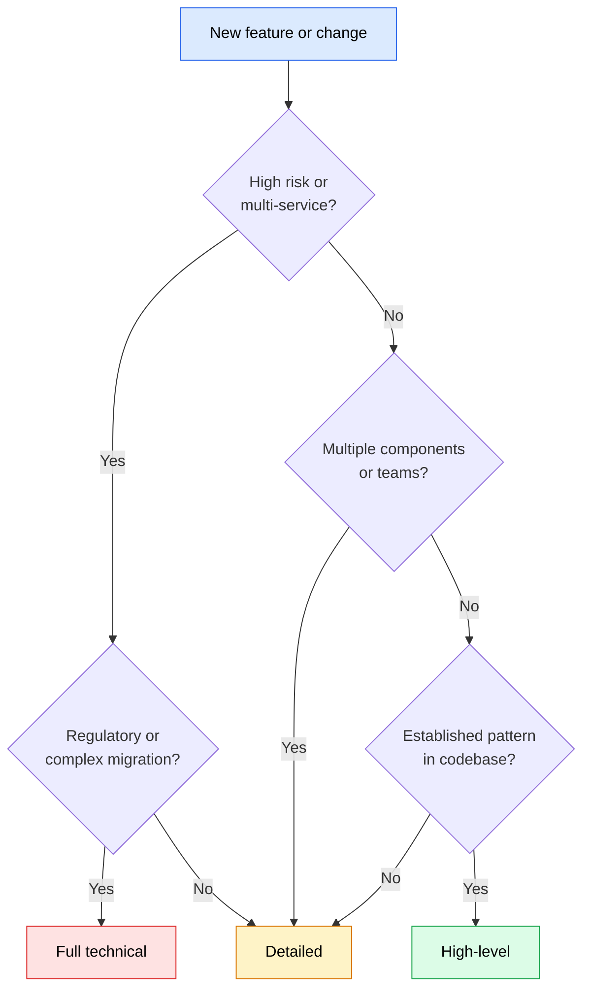
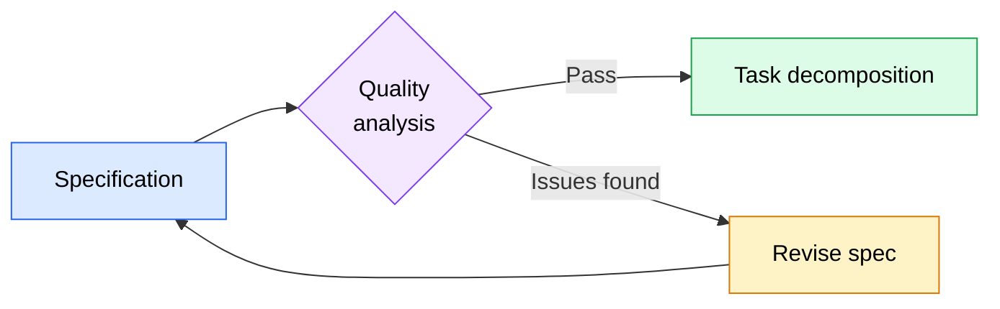

A specification is the foundation of the entire SDD pipeline. Everything downstream — task decomposition, execution, verification — depends on what you write in the spec. A vague spec produces vague tasks, which produce code that may or may not match what you intended. A precise spec produces atomic tasks with testable criteria, which produce code you can verify against concrete expectations.

This section covers the anatomy of an effective specification, how to capture requirements at the right level of detail, how to write acceptance criteria that are actually testable, and how to choose the appropriate depth level for different project situations. It also covers quality analysis — an optional review gate that can catch spec problems before they propagate into tasks and code.

## Anatomy of a good specification

A specification is a structured document that captures what you want to build, why it matters, and how to verify it was built correctly. The specific format varies, but effective specifications share a common anatomy.

### Problem statement

Every spec starts with the problem. This is the "why" — the reason this feature exists. A good problem statement answers three questions:

- **What is broken or missing?** Describe the current state and its shortcomings.
- **Who is affected?** Identify the users, developers, or systems that experience the problem.
- **What is the cost of not solving it?** Explain why this matters enough to build a feature for it.

Here is a strong problem statement:

```markdown
## Problem statement

Users currently have no way to recover their accounts when they forget their
password. They must contact support and wait 24-48 hours for a manual reset.
This generates approximately 30 support tickets per week and creates friction
that causes 15% of affected users to abandon their accounts entirely.
```

Compare that with a weak one:

```markdown
## Problem statement

We need a password reset feature.
```

The weak version tells you *what* to build but not *why*. Without understanding the problem, the person decomposing the spec into tasks cannot make informed tradeoffs — should the reset be instant or can it take a few hours? Should it work via email, SMS, or both? The problem statement provides the context that informs those decisions.

### Goals

Goals describe the desired outcome — what the world looks like after the feature is built. They are not implementation details; they are success criteria at the feature level.

Good goals are:
- **Outcome-focused.** "Users can reset their password within 2 minutes" rather than "Build a password reset form."
- **Measurable when possible.** "Reduce password-related support tickets by 80%" gives a clear target to evaluate against.
- **Bounded.** Listing what is *not* a goal is as important as listing what is. "Non-goal: single sign-on integration" prevents scope creep during implementation.

```markdown
## Goals

- Users can reset their password without contacting support
- The reset flow completes in under 2 minutes from initiation to new password
- Support ticket volume for password issues drops by at least 80%

## Non-goals

- Social login or single sign-on integration
- Two-factor authentication changes
- Admin-initiated password resets (existing admin flow is sufficient)
```

### Functional requirements

Functional requirements describe what the system must do. Each requirement should be a concrete capability that can be independently verified.

Write requirements as specific behaviors, not vague wishes:

| Weak requirement | Strong requirement |
|-----------------|-------------------|
| "The system should handle password resets" | "The system sends a password reset email containing a unique, time-limited token when a user submits a valid email address" |
| "Make it secure" | "Reset tokens expire after 30 minutes and are invalidated after a single use" |
| "It should work on mobile" | "The reset flow renders correctly on viewports 320px wide and above" |

Notice the pattern: strong requirements specify observable behavior and concrete constraints. They answer "what exactly happens?" rather than "what general area should this cover?"

### Acceptance criteria

Acceptance criteria are the bridge between requirements and verification. They define exactly how you determine whether a task was completed correctly. This section is so important to the SDD pipeline that it gets its own dedicated coverage later in this page.

### Scope boundaries

A spec should explicitly state what is in scope and what is out of scope. This prevents the common problem where implementation expands to cover adjacent features that were never part of the plan.

```markdown
## In scope

- Email-based password reset flow
- Token generation and validation
- New password form with strength requirements
- Rate limiting on reset requests

## Out of scope

- SMS-based reset (future iteration)
- Password history enforcement
- Account lockout after failed reset attempts
```

Without scope boundaries, a task like "implement password reset" can easily expand into building an entire authentication overhaul. Explicit boundaries give both humans and agents a clear stopping point.

## Requirements capture

Capturing requirements is the process of translating an idea — "we need feature X" — into a structured specification. The goal is to extract enough detail to build the feature correctly without over-specifying the implementation.

### Start with the problem, not the solution

A common mistake is jumping straight to implementation details. Instead of writing "build a REST API with endpoints for creating and listing invoices," start with the problem: "Customers need to track and manage invoices for their orders. Currently, invoice data only exists in the payment processor's dashboard, which customers cannot access."

Starting with the problem lets you:
- **Evaluate alternative solutions.** Maybe the right answer is an integration with the payment processor rather than a custom invoice system.
- **Prioritize requirements.** Understanding the problem reveals which requirements are essential (viewing invoices) versus nice-to-have (editing invoices after creation).
- **Set success criteria.** You can measure whether the feature solves the stated problem, not just whether the code works.

### Gather requirements incrementally

You do not need to capture every requirement upfront. Start with the core requirements that define the feature, then layer in detail as needed:

1. **Core requirements**: What must the feature do at minimum? What is the smallest version that solves the problem?
2. **Edge cases**: What happens at boundaries? Empty states, maximum values, concurrent access, network failures.
3. **Error handling**: What can go wrong, and how should the system respond?
4. **Performance constraints**: Are there response time, throughput, or resource limits?

This incremental approach prevents the "spec paralysis" that happens when you try to think of every possible scenario before writing anything. Get the core requirements right first, then expand.

### Requirements across project types

Different project types emphasize different aspects of requirements capture:

**API or backend service**: Focus on data models, endpoint behaviors, validation rules, error responses, and authentication requirements. Edge cases around concurrent access, rate limiting, and data consistency are especially important.

**User interface or frontend feature**: Focus on user workflows, state transitions, responsive behavior, accessibility requirements, and loading/error states. Visual specifications (wireframes or descriptions of layout behavior) complement textual requirements.

**Library or framework component**: Focus on the public API surface, input/output contracts, configuration options, and backward compatibility. Document what the component does *not* do as clearly as what it does.

**Data pipeline or integration**: Focus on data formats, transformation rules, error recovery, idempotency, and monitoring requirements. Edge cases around malformed data, missing fields, and partial failures are critical.

**Infrastructure or configuration change**: Focus on the desired state, rollback plan, affected systems, and validation steps. Requirements should describe the "before" and "after" states explicitly.

## Writing testable acceptance criteria

Acceptance criteria are the most operationally important part of a specification. They determine whether each task produced the correct result. In the SDD pipeline, acceptance criteria flow directly into task definitions — each task includes the specific criteria it must satisfy, and verification checks those criteria after execution.

### What makes criteria testable

A testable criterion has three properties:

1. **Observable**: You can see or measure the result. "The response includes a `created_at` timestamp" is observable. "The system is well-designed" is not.
2. **Binary**: It either passes or fails. There is no "sort of passes." "The API returns a 404 status code when the resource does not exist" is binary. "The API handles errors gracefully" is not.
3. **Independent**: You can verify it without relying on the result of another criterion. "The list endpoint returns items sorted by creation date" can be tested independently. "The feature works correctly" depends on everything else.

### Good versus poor criteria

Here are examples showing the difference between testable and non-testable criteria, drawn from different types of projects:

**API feature**:

| Poor criterion | Good criterion |
|---------------|---------------|
| "The API works correctly" | "POST /api/invoices returns 201 with the created invoice when given a valid payload" |
| "Handle invalid data" | "POST /api/invoices returns 422 with field-level error messages when required fields are missing" |
| "Performance should be acceptable" | "GET /api/invoices responds in under 200ms for result sets of 100 items or fewer" |

**UI component**:

| Poor criterion | Good criterion |
|---------------|---------------|
| "The form looks good on mobile" | "The form renders in a single-column layout on viewports below 640px" |
| "Show loading state" | "A skeleton placeholder appears within 100ms of initiating a data fetch and persists until data loads or an error occurs" |
| "Handle errors" | "When the API returns a 500 error, the form displays an inline error message and preserves the user's input" |

**Data pipeline**:

| Poor criterion | Good criterion |
|---------------|---------------|
| "Transform the data correctly" | "Records with a null `email` field are written to the dead-letter queue with a `MISSING_EMAIL` error code" |
| "Handle duplicates" | "Duplicate records (matching on `order_id`) are deduplicated, keeping the record with the latest `updated_at` timestamp" |
| "Make it fast" | "The pipeline processes a batch of 10,000 records in under 60 seconds" |

### Categorizing acceptance criteria

Acceptance criteria naturally fall into categories that map to different verification priorities:

**Functional criteria** define the core behavior. These must all pass for a task to be considered complete. They answer: "Does the feature do what it is supposed to do?"

```markdown
_Functional:_
- [ ] POST /api/invoices creates a new invoice and returns 201 with the invoice object
- [ ] GET /api/invoices returns a paginated list of invoices for the authenticated user
- [ ] GET /api/invoices/:id returns 404 when the invoice does not belong to the authenticated user
```

**Edge case criteria** cover boundary conditions and unusual inputs. They are important for robustness but a failure here does not necessarily mean the core feature is broken.

```markdown
_Edge Cases:_
- [ ] GET /api/invoices returns an empty array (not an error) when the user has no invoices
- [ ] POST /api/invoices handles concurrent creation requests without duplicate invoice numbers
```

**Error handling criteria** define how the system responds to failures. They ensure the feature degrades gracefully rather than crashing.

```markdown
_Error Handling:_
- [ ] POST /api/invoices returns 422 with field-level error messages for invalid input
- [ ] The system returns 503 with a retry-after header when the database is unavailable
```

**Performance criteria** set quantitative bounds on response time, throughput, or resource usage. They prevent implementations that technically work but are unacceptably slow.

```markdown
_Performance:_
- [ ] GET /api/invoices responds in under 200ms for result sets of 100 items or fewer
- [ ] Batch invoice generation processes 1,000 invoices in under 30 seconds
```

This categorization matters during execution: functional criteria are mandatory pass requirements, while edge case, error handling, and performance criteria are flagged as important but may not block completion if they fail.

## Spec depth levels

Not every feature needs the same level of specification detail. A two-line bug fix does not need a 10-page spec, and a complex multi-service feature cannot be adequately described in a few bullet points. SDD defines three depth levels that guide how much detail to include.

### High-level overview

A high-level spec captures the what and why without prescribing the how. It defines the problem, goals, core requirements, and success criteria, but leaves implementation details to the person or agent decomposing the spec into tasks.

**When to use it**:
- The feature is well-understood and uses established patterns in the codebase
- The implementing team or agent has strong domain knowledge
- You want to allow maximum flexibility in the implementation approach
- Time constraints make a detailed spec impractical

**What it includes**:
- Problem statement and goals
- Core functional requirements (5-15 bullet points)
- Scope boundaries (in/out of scope)
- High-level acceptance criteria (focused on outcomes, not implementation steps)

**What it omits**:
- Data model details
- API endpoint specifications
- Detailed error handling for every scenario
- Performance benchmarks for individual operations

**Example use cases**: Adding a feature that mirrors an existing pattern (a new CRUD resource similar to ones already in the codebase), building a simple integration with a well-documented API, refactoring code to improve structure without changing behavior.

**Tradeoff**: Faster to write, but the task decomposition phase requires more judgment to fill in the details. If the implementing agent lacks context about the codebase patterns, it may make suboptimal decisions in the gaps the spec leaves open.

### Detailed specification

A detailed spec covers the what, why, and much of the how. It includes data models, interface definitions, error handling requirements, and specific acceptance criteria for each major component.

**When to use it**:
- The feature touches multiple parts of the codebase or multiple services
- There are important constraints (security, performance, compatibility) that must be explicitly stated
- Multiple people or agents will work on different parts and need a shared reference
- The feature involves non-obvious design decisions that should be documented

**What it includes**:
- Everything in a high-level spec, plus:
- Data models with field definitions and types
- API or interface contracts
- Error handling for each major operation
- Categorized acceptance criteria (functional, edge cases, error handling, performance)
- Dependencies between components

**What it omits**:
- Implementation-level details (specific algorithms, internal function signatures)
- Step-by-step implementation instructions
- Test code or test setup details

**Example use cases**: Building a new feature with both frontend and backend components, implementing a feature that requires coordination between multiple services, creating a feature with significant security or compliance requirements.

**Tradeoff**: Takes more time to write, but task decomposition becomes more straightforward because most decisions are already made. The spec serves as a reliable reference throughout implementation.

### Full technical specification

A full technical spec is comprehensive. It includes everything a detailed spec covers, plus implementation guidance, specific algorithms or data structures, migration plans, and operational considerations like monitoring and rollback procedures.

**When to use it**:
- The feature is highly complex with many interacting components
- It involves risky changes (data migrations, breaking API changes, infrastructure modifications)
- Regulatory or compliance requirements demand thorough documentation
- The implementation will be done by agents with limited domain context

**What it includes**:
- Everything in a detailed spec, plus:
- Implementation guidance for complex algorithms or non-obvious approaches
- Database migration strategy and rollback plan
- Monitoring and alerting requirements
- Deployment considerations (feature flags, gradual rollout)
- Risk assessment with mitigation strategies

**What it omits**:
- Actual code (the spec describes the approach; the implementation produces the code)
- Internal implementation details that have no external impact

**Example use cases**: Rebuilding a core system component, implementing a new payment or billing system, making breaking changes to a public API, performing a large-scale data migration.

**Tradeoff**: Most time-intensive to write, but leaves the least room for misinterpretation. Appropriate when the cost of getting implementation wrong is high.

### Choosing the right depth

Use this decision framework to select the appropriate spec depth:



*Flowchart showing the decision process for choosing a spec depth level: start with the feature, evaluate risk and complexity, and select the appropriate depth — high-level for established patterns, detailed for multi-component work, full technical for high-risk or regulated changes.*

Some features do not fit neatly into a single depth level. A feature might need detailed specs for its data model and API layer but only a high-level overview for its UI components (because the UI follows an established pattern). In these cases, mix depths within the same spec: write detailed sections for the parts that need precision and high-level sections for the parts that follow known patterns. Label each section's depth explicitly so that the person or agent decomposing the spec knows where they have room to make decisions and where they need to follow the spec exactly.

## Quality analysis as an optional review gate

Quality analysis is a review step that evaluates a specification before it enters the task decomposition phase. It checks whether the spec is complete enough, clear enough, and consistent enough to produce good tasks. In the SDD pipeline, quality analysis sits between specification and task decomposition.



*Flowchart showing quality analysis as a gate between specification and task decomposition. If the spec passes, it moves to decomposition. If issues are found, the spec is revised and reviewed again.*

### Why quality analysis is optional

Quality analysis adds value, but it also adds time. Not every spec needs a formal review:

- **Skip it** for simple features using established patterns, when the spec author has deep domain knowledge, or when speed matters more than completeness (prototypes, experiments, internal tools).
- **Use it** for complex features touching multiple systems, when the spec will be decomposed by someone (or some agent) other than the author, when the feature has significant risk (data loss, security implications, breaking changes), or when the spec is at the detailed or full technical depth level.

The key question is: "Would a mistake in this spec be expensive to discover during implementation?" If yes, the upfront cost of quality analysis is worth it. If the worst case is a quick fix and redeploy, skip the review and iterate faster.

### What to check

Quality analysis examines the spec along several dimensions:

**Completeness**: Are all the necessary sections present? Does the spec define the problem, goals, requirements, acceptance criteria, and scope boundaries? Are there gaps where requirements reference other requirements that do not exist?

**Clarity**: Can each requirement be interpreted in only one way? Are there ambiguous terms that different implementers might read differently? A requirement like "the system should respond quickly" fails the clarity test because "quickly" means different things to different people.

**Testability**: Does each acceptance criterion pass the three-property test (observable, binary, independent)? Can you imagine writing a test for each criterion? If a criterion is not testable, it is not useful for verification.

**Consistency**: Do requirements contradict each other? Does the scope section match the requirements section? If the goals mention a specific metric, do the acceptance criteria include a way to measure it?

**Feasibility**: Are the requirements technically achievable within the stated constraints? Are there implicit dependencies on systems or capabilities that do not exist yet?

### Quality analysis in practice

You can perform quality analysis yourself by reviewing the spec against the dimensions above, or you can use an AI coding agent to assist. An agent can systematically check each requirement for testability, flag ambiguous language, and identify missing sections. The agent does not need to understand the business domain — it checks the structural quality of the spec.

When the review identifies issues, revise the spec before moving to task decomposition. This is cheaper than discovering problems during implementation, where a single ambiguous requirement can cascade into multiple tasks that need rework.

---

## Key takeaways

- A good specification includes a problem statement, goals, functional requirements, acceptance criteria, and scope boundaries — each serving a distinct purpose in the SDD pipeline
- Strong requirements describe observable, concrete behavior rather than vague qualities
- Testable acceptance criteria must be observable, binary, and independent — if you cannot imagine a test for a criterion, rewrite it
- Categorize acceptance criteria into functional, edge cases, error handling, and performance — functional criteria are mandatory, others inform quality but do not block completion
- Choose spec depth based on risk and complexity: high-level for established patterns, detailed for multi-component features, full technical for high-risk changes
- Mix depth levels within a spec when different parts of a feature have different complexity levels
- Quality analysis catches spec problems before they become implementation problems, but skip it when speed matters more than completeness

## Next steps

- **Next section**: [Task decomposition](/08-spec-driven-development/task-decomposition/) -- Learn how to break a specification into atomic, dependency-ordered tasks that agents can execute independently.
- **Previous section**: [The SDD methodology](/08-spec-driven-development/the-sdd-methodology/) -- Review the four-phase SDD pipeline and its core principles.
- **Related**: [Writing effective context files](/04-context-engineering/writing-effective-context/) -- The principles of writing clear, structured context for agents apply directly to writing specifications.
